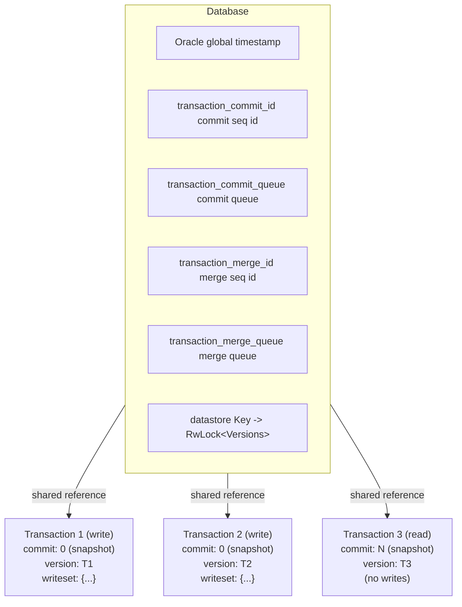
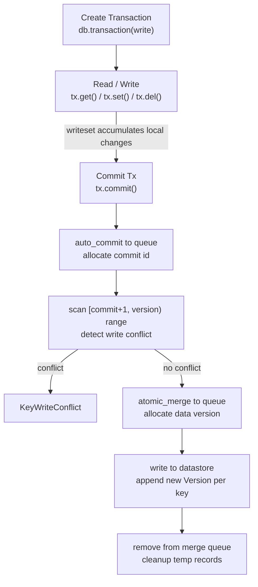
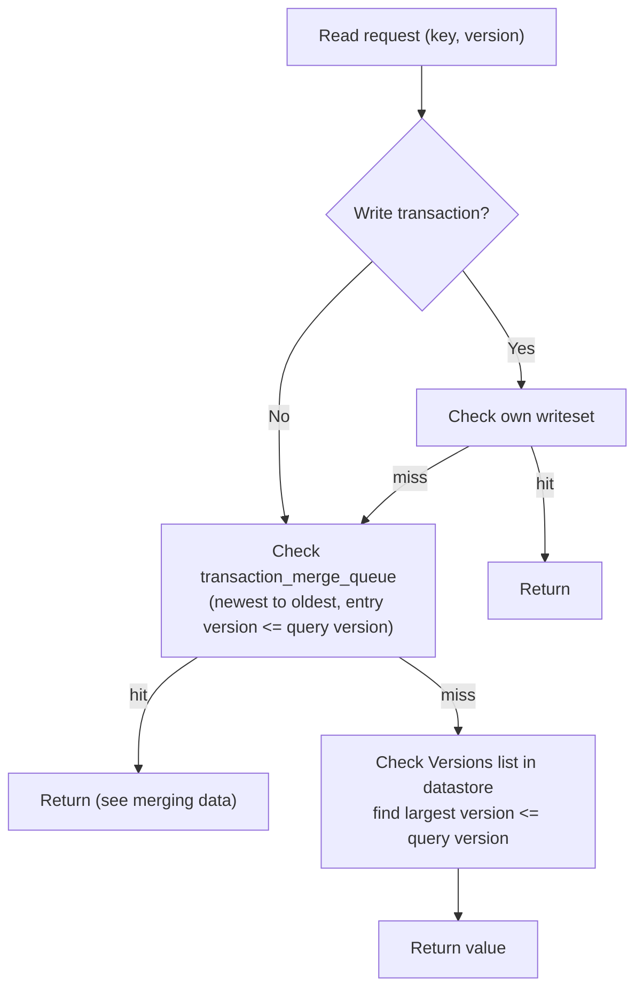
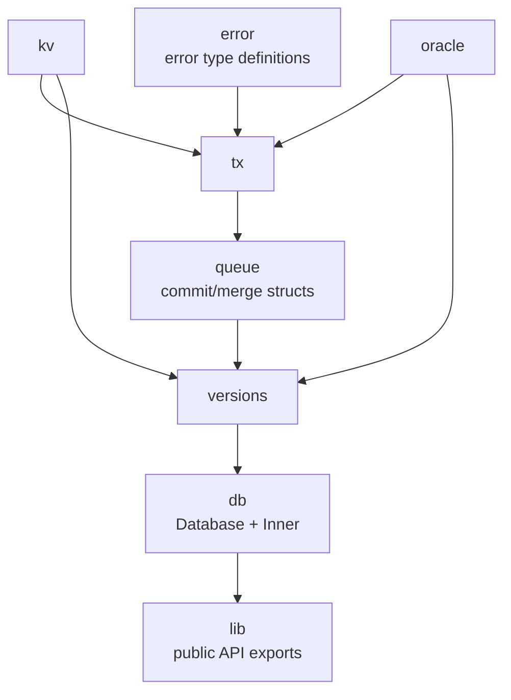

# Stupid-KV 教程：第一节 — 实现一个支持 MVCC 的基本 KV 数据库

## 1. 概述

Stupid-KV 是一个纯内存的键值数据库，核心特性是基于 **MVCC（Multi-Version Concurrency Control，多版本并发控制）** 实现的事务隔离。它通过维护每个 key 的多个版本数据，使读操作无需加锁，写操作在提交时通过乐观冲突检测来确保隔离性。

**关键设计目标：**

- **读写不阻塞**：读操作使用事务创建时的快照读取，不需要与写操作互不干扰
- **快照隔离（Snapshot Isolation）**：事务看到的是其创建时刻的数据视图
- **写冲突检测**：提交时检测并发事务是否修改了相同的 key
- **纯 Rust 实现**：利用 Rust 的类型系统和并发原语

---

## 2. 整体架构



---

## 3. 核心数据结构

### 3.1 Database (`src/db/db.rs`)

```rust
pub struct Database {
    inner: Arc<Inner>
}
```

`Database` 是对外的入口。`Arc<Inner>` 是数据库的核心状态，被所有事务共享。

### 3.2 Inner (`src/db/inner.rs`)

`Inner` 是数据库的核心共享状态，包含以下关键组件：

| 字段 | 类型 | 用途 |
|------|------|------|
| `oracle` | `Arc<Oracle>` | 时间戳生成器，为事务分配数据版本号 |
| `transaction_commit_id` | `AtomicU64` | 全局提交ID，事务提交队列的键 |
| `transaction_queue_id` | `AtomicU64` | 事务在提交队列中的唯一ID |
| `transaction_commit_queue` | `SkipMap<u64, Arc<Commit>>` | 提交队列，存储已提交事务的写集合，用于冲突检测 |
| `transaction_merge_id` | `AtomicU64` | 合并队列中的事务ID |
| `transaction_merge_queue` | `SkipMap<u64, Arc<Merge>>` | 合并队列，存储待持久化的事务数据 |
| `datastore` | `SkipMap<Bytes, RwLock<Versions>>` | 数据存储，每个 key 对应一个版本列表 |

### 3.3 Oracle (`src/oracle/oracle.rs`)

Oracle 是一个单调递增的全局时钟，用于生成版本号：

- `timestamp` 是一个 `AtomicU64`，初始值为系统启动时的 UNIX 时间戳（纳秒）
- `current_timestamp()` 返回当前时间戳
- `current_time_ns()` 基于参考时间点 + elapsed time 计算新时间戳

版本号保证单调递增，确保 MVCC 的版本顺序正确。

### 3.4 Transaction (`src/tx/transaction.rs`)

每个事务包含：

| 字段 | 类型 | 意义 |
|------|------|------|
| `mode` | `IsolationLevel` | 隔离级别（当前仅 SnapshotIsolation） |
| `done` | `bool` | 事务是否已关闭（提交/取消） |
| `write` | `bool` | 是否为写事务 |
| **`commit`** | `u64` | **事务创建时的 `db.transaction_commit_id` 的快照值，用作冲突检测的起点** |
| **`version`** | `u64` | **事务创建时 Oracle 时间戳，用作读取数据的快照版本** |
| `writeset` | `BTreeMap<Bytes, Option<Bytes>>` | 事务内的写操作集合，`None` 表示删除 |
| `database` | `Arc<Inner>` | 对数据库核心状态的引用 |

**`commit` vs `version` 的区别是理解整个系统的关键：**

- **`commit`** 是事务提交队列的序列ID（单调递增的整数 0, 1, 2, ...），用于**提交时的冲突检测**
- **`version`** 是 Oracle 生成的**时间戳**（基于系统时间的纳秒值），用于**数据版本的时间维度**

两个 ID 在提交时会被用作数据的版本号

---

## 4. MVCC 实现机制

### 4.1 事务生命周期



### 4.2 读取路径

读操作遵循以下优先级：



**关键代码 `src/tx/transaction_inner.rs:318-348`：**

```rust
fn fetch_in_datastore<K>(&self, key: K, version: u64) -> Option<Bytes> {
    // 1. 先从合并队列倒序扫描，确保读到刚提交但还在合并的数据
    for entry in self.database.transaction_merge_queue.range(..=version).rev() {
        if !entry.is_removed() {
            if let Some(v) = entry.value().writeset.get(key) {
                return v.clone();
            }
        }
    }
    // 2. 再从 datastore 的版本列表查询
    self.database.datastore.get(key).and_then(|e| {
        match e.value().read().fetch_version(version)
    })
}
```

### 4.3 写入路径

写操作只修改本地 `writeset`，**不会立即写入** datastore：

- `set(key, value)` → `writeset.insert(key, Some(value))`
- `put(key, value)` → 检查 key 是否已存在（读自己 writeset + 读 datastore），不存在则写入
- `del(key)` → `writeset.insert(key, None)`

### 4.4 冲突检测（写-写冲突）

提交时的核心逻辑 `src/tx/transaction_inner.rs:76-87`：

```rust
// 当前事务的 commit 是其创建时 db.transaction_commit_id 的快照值
// 扫描 (commit, version] 区间内的所有其他已提交事务
for tx in self.database.transaction_commit_queue.range(self.commit + 1..version) {
    // 如果有任何一个事务和当前事务修改了相同的 key，则冲突
    if !tx.value().is_disjoint_writeset(&entry) {
        return Err(Error::KeyWriteConflict);
    }
}
```

**`is_disjoint_writeset`** 使用双指针法比较两个 `BTreeMap` 的 keys 是否有交集（`src/queue/commit.rs:18-37`）。

这实现了 **First-Committer-Wins（FCW）** 策略：第一个提交的事务成功，之后提交的并发事务如果修改了相同的 key，则失败。

### 4.5 版本管理 (`src/versions/versions.rs`)

每个 key 的数据存储在 `Versions` 结构中：

```rust
pub struct Versions {
    inner: SmallVec<[Version; 4]>,  // 栈上预分配 4 个元素
}

pub struct Version {
    version: u64,        // 版本号（由 Oracle 分配）
    value: Option<Bytes>    // 数据：Some 表示存在，None 表示删除
}
```

**版本查询逻辑：**

- `fetch_version(version)`: 找到 `<= version` 的最大版本号对应的值
- `exists_version(version)`: 检查 `<= version` 的版本是否存在（且值不为 None）
- 小列表（≤4 元素）用线性搜索，大列表用二分搜索 (`partition_point`)

**版本插入逻辑：**

- 新版本号 > 最后一个版本号：追加（或跳过如果值相同）
- 新版本号 == 最后一个版本号：更新（如果值不同）
- 新版本号 < 最后一个版本号：插入到正确位置（乱序提交的处理）

**删除处理：** 删除不是物理删除，而是写入 `value = None` 的墓碑（tombstone）版本。

---

## 5. 并发安全设计

### 5.1 SkipMap 的使用

- `crossbeam_skiplist::SkipMap` 是一个无锁并发跳表
- 支持并发读写，无需外部锁
- `transaction_commit_queue` 和 `datastore` 都是 SkipMap，确保高并发访问

### 5.2 RwLock 的使用

- `datastore` 中每个 key 的 `Versions` 由 `parking_lot::RwLock` 保护
- 读操作：共享读锁
- 写操作：独占写锁

### 5.3 AtomicU64 的使用

- `transaction_commit_id`, `transaction_queue_id`, `transaction_merge_id` 都是原子计数器
- Oracle 的 `timestamp` 也是 `AtomicU64`

### 5.4 原子提交 (`auto_commit`)

`src/tx/transaction_inner.rs:231-250`：

```rust
fn auto_commit(&self, updates: Commit) -> (u64, Arc<Commit>) {
    let id = updates.id;           // 本事务的队列ID
    let updates = Arc::new(updates);
    loop {
        // 尝试获取下一个提交版本号
        let version = self.database.transaction_commit_id.load(Ordering::Acquire) + 1;
        // 尝试插入到提交队列（CAS 风格：如果该 version 已被其他事务占用，则重试）
        let entry = queue.get_or_insert_with(version, || Arc::clone(&updates));
        if id == entry.value().id {
            // 确认是自己写入的，更新全局 commit_id
            self.database.transaction_commit_id.fetch_add(1, Ordering::Release);
            return (version, Arc::clone(&updates));
        }
        // 被其他事务抢占，重试
    }
}
```

### 5.5 原子合并 (`atomic_merge`)

`src/tx/transaction_inner.rs:254-279`：

类似 `auto_commit`，但版本号来自 Oracle 的时间戳而非简单的递增整数。

---

## 6. 示例：三个并发事务的完整流程

### 场景：两个写事务 + 一个读事务

**初始状态：** `db.transaction_commit_id = 0`，`db.oracle.timestamp = T0`

### T1 时刻：创建事务

| 事务 | write | commit (起点) | version (快照) |
|------|-------|--------------|---------------|
| tx1 | true | 0 | T1 |
| tx2 | true | 0 | T1 |
| tx3 | false | 0 | T1 |

### T2 时刻：事务执行

``` shell
tx1.set("key1", "v1")  → writeset = {"key1": Some("v1")}
tx2.set("key1", "v2")  → writeset = {"key1": Some("v2")}
tx3.get("key1")         → None（datastore 中无 key1）
```

### T3 时刻：tx1 提交

1. **auto_commit**: 写入提交队列，分配 `version = 1`
   - `transaction_commit_id` 从 0 → 1
   - `transaction_commit_queue[1] = Commit{id: qid1, writeset: {"key1": "v1"}}`

2. **冲突检测**: 扫描 `(0, 1)` → 空范围，无冲突

3. **atomic_merge**: 写入合并队列，分配数据版本 `version = T_merge1`
   - `transaction_merge_queue[T_merge1] = Merge{id: mid1, writeset: {...}}`

4. **写入 datastore**: `datastore["key1"] = Versions[Version{version: T_merge1, value: "v1"}]`

5. **清理**: 从合并队列删除 `T_merge1`

### T4 时刻：tx2 提交

1. **auto_commit**: 写入提交队列，分配 `version = 2`
   - `transaction_commit_id` 从 1 → 2
   - `transaction_commit_queue[2] = Commit{id: qid2, writeset: {"key1": "v2"}}`

2. **冲突检测**: 扫描 `(0, 2)` → 找到 tx1 的提交记录！
   - tx1.writeset 和 tx2.writeset 都包含 "key1" → **KeyWriteConflict!**

3. **回滚**: 从提交队列删除 version=2，清空 writeset

### T5 时刻：tx3 读取

``` shell
tx3.get("key1") → 查找 ≤ T1 的版本 → 找到 T_merge1 > T1？不，T_merge1 > T1，
```

**问题**：tx3 的 version 是 T1，而 tx1 写入的数据版本是 T_merge1。因为 T_merge1 > T1，所以 tx3 看不到 tx1 的修改。

这是**快照隔离**的核心：每个事务看到的是其创建时刻的数据视图。

---

## 7. 隔离级别分析

### 7.1 当前实现：Snapshot Isolation

- **写-写冲突**：已实现（提交时检测 writeset 交集）
- **读不阻塞写，写不阻塞读**：已实现（读取使用 version 快照）
- **幻读**：可能出现（同一事务两次范围查询结果不一致）
- **写偏斜（Write Skew）**：可能出现（两个事务读不同 key，但各自修改自己读的 key）

### 7.2 读自己读集检测

当前实现**不检测读-写冲突**（Read-Write Conflict），只检测写-写冲突。这意味着：

- tx1 读了 keyA，tx2 修改 keyA 并提交，tx1 再读 keyA 仍然看到旧值 ✓
- 但 tx1 如果也修改了 keyA，会在提交时检测到冲突 ✓
- tx1 读了 keyA 和 keyB，tx2 修改 keyA，tx1 修改 keyB —— 两者都能提交（写偏斜）✗

要实现 **Serializable Snapshot Isolation (SSI)**，需要额外追踪 readset 并在提交时检查。

---

## 8. 核心 API

### 8.1 Database

```rust
impl Database {
    pub fn new() -> Self
    pub fn transaction(&self, write: bool) -> Transaction
}
```

### 8.2 Transaction

```rust
impl Transaction {
    pub fn with_snapshot_isolation(self) -> Self
    pub fn version(&self) -> u64
    pub fn closed(&self) -> bool
    pub fn cancel(&mut self) -> Result<(), Error>
    pub fn commit(&mut self) -> Result<(), Error>
    pub fn exists<K: IntoBytes>(&self, key: K) -> Result<bool, Error>
    pub fn get<K: IntoBytes>(&self, key: K) -> Result<Option<Bytes>, Error>
    pub fn set<K: IntoBytes, V: IntoBytes>(&mut self, key: K, value: V) -> Result<(), Error>
    pub fn put<K: IntoBytes, V: IntoBytes>(&mut self, key: K, value: V) -> Result<(), Error>
    pub fn del<K: IntoBytes>(&mut self, key: K) -> Result<(), Error>
}
```

### 8.3 错误类型

| 错误 | 含义 |
|------|------|
| `TxClosed` | 事务已关闭（已提交或取消） |
| `KeyWriteConflict` | 写冲突，需要重试事务 |
| `TxNotWritable` | 只读事务尝试写入 |
| `KeyAlreadyExists` | `put` 操作时 key 已存在 |

---

## 9. 示例代码

参考 `examples/basic.rs`：

```rust
use stupid_kv::Database;

fn main() {
    let db = Database::new();

    // 创建写事务
    let mut tx = db.transaction(true);
    tx.set("key1", "value1").unwrap();
    tx.set("key2", "value2").unwrap();

    println!("exists(key1) = {}", tx.exists("key1").unwrap());
    println!("get(key1) = {:?}", tx.get("key1").unwrap());

    tx.commit().unwrap();

    // 只读事务验证数据已持久化
    let tx = db.transaction(false);
    println!("after commit, get(key1) = {:?}", tx.get("key1").unwrap());
}
```

---

## 10. 关键设计权衡

| 决策 | 优点 | 缺点 |
|------|------|------|
| **BTreeMap 作为 writeset | 有序，便于双指针法比较 keys | 内存开销略高 |
| **SkipMap 作为提交队列 | 无锁并发，范围扫描高效 | 内存开销 |
| **SmallVec<[Version; 4]>** | 小列表栈上分配，无堆分配 | 大列表仍需堆分配 |
| **墓碑删除（None 版本）** | 保留历史版本，支持时间旅行查询 | 历史版本永不删除，内存随写操作持续增长 |
| **提交队列永不清理** | 保留完整的冲突检测历史 | 内存泄漏风险 |
| **First-Committer-Wins** | 简单，无需复杂的锁机制 | 高冲突场景下重试率高 |
| **乐观并发控制 | 读写不阻塞，读性能极佳 | 写冲突场景下性能下降 |

---

## 11. 模块依赖图


