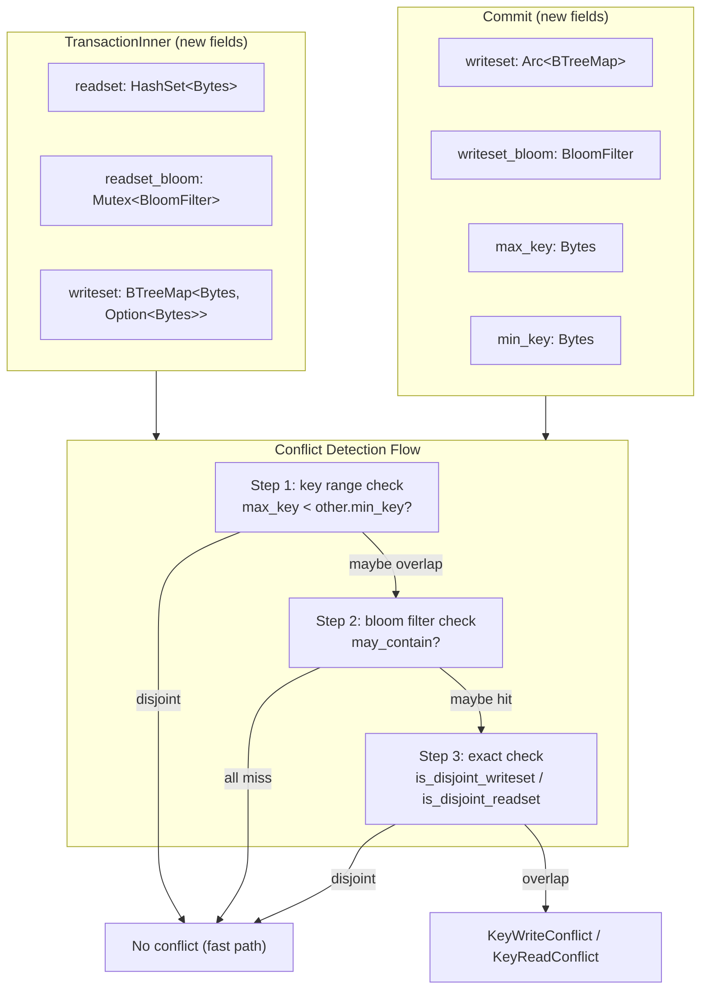
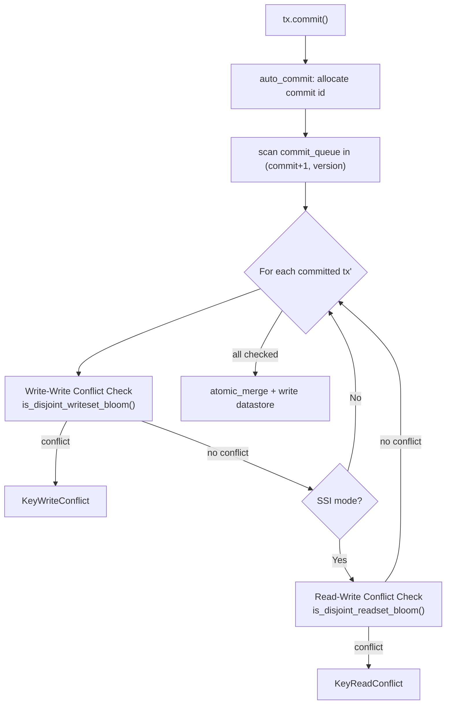
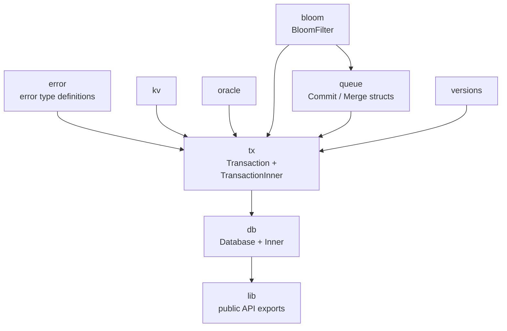

# Stupid-KV 教程：第二节 — 实现 SSI 隔离级别与 Bloom 过滤器加速冲突检测

## 1. 概述

第一节中，我们实现了基于 MVCC 的基本 KV 数据库，支持 **Snapshot Isolation (SI)** 隔离级别。SI 通过写-写冲突检测（First-Committer-Wins）保证了并发事务的写隔离性，但它有一个已知的缺陷——**Write-Skew（写偏斜）**：两个事务各自读取了相同的数据，然后修改不同的 key，SI 不会检测到冲突，两者都能提交，但结果可能违反业务约束。

本节在此基础上实现两个关键改进：

- **Serializable Snapshot Isolation (SSI)**：在 SI 的基础上增加读-写冲突检测，追踪事务的 readset，在提交时检查读取过的 key 是否被其他并发事务修改，从而防止 Write-Skew 异常
- **Bloom 过滤器加速**：在冲突检测路径中引入 Bloom 过滤器作为快速排除层，避免每次提交都执行昂贵的精确集合交集计算

**关键设计目标：**

- **防止 Write-Skew**：SSI 级别下，读取过被其他事务修改的 key 的事务将被拒绝提交
- **Bloom 过滤器快速排除**：利用概率型数据结构的"一定不在"性质，快速跳过不可能冲突的事务对
- **最小化精确检测开销**：只有 Bloom 过滤器返回"可能存在"时才回退到精确检测
- **向后兼容**：SI 隔离级别的行为不变，SSI 是可选的更高隔离级别

---

## 2. 整体架构变化



---

## 3. Write-Skew 问题回顾

### 3.1 什么是 Write-Skew？

Write-Skew 是 SI 隔离级别下可能出现的一种并发异常：

1. 两个事务读取了**相同的数据**（但不修改它）
2. 每个事务**修改不同的 key**
3. 由于读取的数据在提交前被另一个事务修改，导致结果违反业务约束

**SI 无法检测**：因为两个事务修改的 key 不同，写-写冲突检测不会触发。

### 3.2 现实业务示例

银行账户约束：`checking + savings >= 0`

```
初始: checking = 100, savings = 100

事务 A: 读取(checking=100, savings=100), 总额=200≥150, checking -= 150
事务 B: 读取(checking=100, savings=100), 总额=200≥150, savings -= 150

结果: checking = -50, savings = -50, 总额 = -100  ← 违反约束！
```

### 3.3 SSI 的解决方式

SSI 追踪每个事务的 **readset**（读取过的 key 集合），提交时检查：

> 如果某个并发事务的 writeset 与当前事务的 readset 有交集，则说明当前事务基于"已失效"的数据做了决策，拒绝提交。

---

## 4. Bloom 过滤器实现

### 4.1 什么是 Bloom 过滤器？

Bloom 过滤器是一种**概率型**集合数据结构，用于快速判断一个元素是否**可能**存在于集合中：

- **不会漏判（no false negative）**：如果 `may_contain` 返回 `false`，则该 key **一定没插入过**
- **可能误判（false positive）**：如果 `may_contain` 返回 `true`，该 key 只是**有可能**插入过

**为什么适合冲突检测？** 在冲突检测中，大部分事务对是不冲突的。Bloom 过滤器可以快速排除那些**一定不冲突**的事务对，只有"可能冲突"时才执行精确检测。

### 4.2 核心数据结构 (`src/bloom/bloom.rs`)

```rust
const BLOOM_BITS: usize = 4096;        // 4096 个 bit
const BLOOM_BYTES: usize = 512;        // 512 字节
const BLOOM_HASHE_NUMS: u32 = 3;       // k = 3 个哈希函数

pub(crate) struct BloomFilter {
    bits: [u8; BLOOM_BYTES],    // 位图，512 字节
    count: usize,               // 已插入的 key 数量
}
```

**空间占用**：固定 512 字节，远小于存储完整 key 集合的 HashSet。

### 4.3 Kirsch-Mitzenmacher 技巧

传统 Bloom 过滤器需要 k 个**真正独立**的哈希函数。本实现只计算 2 个哈希 (h1, h2)，然后用线性组合生成 k 个"伪独立"的哈希位置：

```
g_i(x) = h1(x) + i * h2(x)    (i = 0, 1, ..., k-1)
```

Kirsch & Mitzenmacher (2006) 证明：这种方式的误判率与使用 k 个真正独立哈希的过滤器**渐近等价**。

### 4.4 双哈希来源

```rust
fn hash(key: &[u8]) -> (u64, u64) {
    // h1: FNV-1a 64-bit
    let mut h1: u64 = 0xcbf29ce484222325;  // offset basis
    for &byte in key {
        h1 ^= byte as u64;
        h1 = h1.wrapping_mul(0x100000001b3);  // prime
    }
    // h2: 由 h1 派生的 mix finalizer
    let h2 = h1.wrapping_mul(0x9e3779b97f4a7c15).rotate_left(31);
    (h1, h2)
}
```

- **h1**：FNV-1a 64 位非加密哈希，实现极简、跨平台一致
- **h2**：从 h1 经黄金比例乘 + `rotate_left(31)` 派生，来源于 Murmur3/xxHash 系列的混合技巧

### 4.5 插入与查询

```rust
// 插入：把 k 个对应 bit 置 1
pub fn insert(&mut self, key: &[u8]) {
    let hashes = Self::hash(key);
    for i in 0..BLOOM_HASHE_NUMS {
        let hash = Self::nth_hash(hashes, i) % (BLOOM_BITS as u64);
        self.bits[hash as usize / 8] |= 1 << (hash as usize % 8);
    }
    self.count += 1;
}

// 查询：任何一个位为 0 就返回 false
pub fn may_contain(&self, key: &[u8]) -> bool {
    let hashes = Self::hash(key);
    for i in 0..BLOOM_HASHE_NUMS {
        let hash = Self::nth_hash(hashes, i) % (BLOOM_BITS as u64);
        if (self.bits[hash as usize / 8] & (1 << (hash as usize % 8))) == 0 {
            return false;  // 一定不在
        }
    }
    true  // 可能在
}
```

---

## 5. SSI 实现：Readset 追踪

### 5.1 隔离级别定义 (`src/tx/isolation.rs`)

```rust
#[derive(PartialEq, PartialOrd)]
pub enum IsolationLevel {
    SnapshotIsolation,                  // SI：只检测写-写冲突
    SerializableSnapshotIsolation,     // SSI：检测写-写 + 读-写冲突
}
```

利用 `PartialOrd`，可以用 `self.mode >= IsolationLevel::SerializableSnapshotIsolation` 来判断是否需要 readset 追踪。

### 5.2 事务新增字段 (`src/tx/transaction_inner.rs`)

| 字段 | 类型 | 用途 |
|------|------|------|
| `readset` | `papaya::HashSet<Bytes>` | 精确的读取 key 集合，用于回退精确检测 |
| `readeset_bloom` | `Mutex<BloomFilter>` | readset 的 Bloom 过滤器，用于快速排除 |

**为什么用 `papaya::HashSet`？** papaya 是一个无锁并发 HashSet，支持通过 `pin()` 获取 epoch-based 的 guard，在并发读取场景下性能优于标准库的 `HashSet` + `Mutex` 组合。

**为什么 `readeset_bloom` 用 `Mutex` 包裹？** Bloom 过滤器的 `insert` 需要 `&mut self`，而 `TransactionInner` 的 `get`/`exists` 方法只持有 `&self`。`Mutex` 提供内部可变性，同时保证 Bloom 过滤器的写操作互斥。

### 5.3 读取时追踪 readset

在 `get` 和 `exists` 方法中，当隔离级别为 SSI 且从 datastore 读取数据时，将 key 加入 readset：

```rust
// get() 中的 readset 追踪
None => {
    let res = self.fetch_in_datastore(lookup, self.version);
    if self.mode >= IsolationLevel::SerializableSnapshotIsolation {
        let guard = self.readset.pin();
        if !guard.contains(lookup) {
            guard.insert(lookup.into_bytes());
            self.readeset_bloom.lock().insert(lookup);
        }
    }
    res
}
```

**关键细节**：
- 只有**从 datastore 读取**时才追踪（从本地 writeset 读取不需要，因为写-写冲突已经被检测）
- 先检查 `guard.contains(lookup)` 避免重复插入
- 同时维护精确 HashSet 和 Bloom 过滤器，保证两者一致

### 5.4 只读事务不追踪

注意：当前实现中，**只读事务（`write = false`）不追踪 readset**。只读事务不修改数据，即使读取了被其他事务修改的 key，也不会产生 Write-Skew。这是一个合理的优化，减少只读事务的开销。

---

## 6. 冲突检测流程

### 6.1 提交时的冲突检测 (`src/tx/transaction_inner.rs`)



### 6.2 Commit 结构新增字段 (`src/queue/commit.rs`)

```rust
pub struct Commit {
    pub(crate) id: u64,
    pub(crate) writeset: Arc<BTreeMap<Bytes, Option<Bytes>>>,
    pub(crate) writeset_bloom: BloomFilter,    // NEW: writeset 的 Bloom 过滤器
    pub(crate) max_key: Bytes,                  // NEW: writeset 中最大的 key
    pub(crate) min_key: Bytes,                  // NEW: writeset 中最小的 key
}
```

提交时构建 Commit 的代码：

```rust
let mut writeset_bloom = BloomFilter::new();
for key in writeset.keys() {
    writeset_bloom.insert(key);
}
let max_key = writeset.keys().next_back().cloned().unwrap_or_default();
let min_key = writeset.keys().next().cloned().unwrap_or_default();
```

### 6.3 三层快速排除策略

冲突检测的核心是判断两个集合是否有交集。直接遍历 `BTreeMap` 的 keys 进行双指针比较是 O(n+m) 的。在大多数情况下，两个事务的 writeset 是不相交的，我们可以用更廉价的方式快速排除。

**第一层：Key Range 快速排除**

```rust
if self.max_key < other.min_key || self.min_key > other.max_key {
    return true;  // 两个 writeset 的 key 范围完全不重叠
}
```

利用 `BTreeMap` 的有序性，O(1) 获取 max/min key。如果两个集合的 key 范围完全不重叠，一定没有冲突。

**第二层：Bloom 过滤器快速排除**

```rust
let mut maybe = false;
for key in self.writeset.keys() {
    if other.writeset_bloom.may_contain(key) {
        maybe = true;
        break;
    }
}
if !maybe {
    return true;  // Bloom 过滤器确认所有 key 都不在另一个集合中
}
```

遍历较小集合的 keys，对每个 key 查询另一个集合的 Bloom 过滤器。如果**所有 key** 都返回 `false`，则**一定没有交集**（无误判）。

**第三层：精确检测**

当 Bloom 过滤器返回"可能存在"时，回退到精确的双指针法：

```rust
self.is_disjoint_writeset(other)  // 双指针法 O(n+m)
```

### 6.4 写-写冲突检测（带 Bloom 加速）

```rust
pub fn is_disjoint_writeset_bloom(&self, other: &Arc<Commit>) -> bool {
    // Layer 1: key range check
    if self.max_key < other.min_key || self.min_key > other.max_key {
        return true;
    }
    // Layer 2: bloom filter check
    let mut maybe = false;
    for key in self.writeset.keys() {
        if other.writeset_bloom.may_contain(key) {
            maybe = true;
            break;
        }
    }
    if !maybe {
        return true;
    }
    // Layer 3: exact check
    self.is_disjoint_writeset(other)
}
```

### 6.5 读-写冲突检测（带 Bloom 加速）

```rust
pub fn is_disjoint_readset_bloom(&self, other: &HashSet<Bytes>, bloom: &BloomFilter) -> bool {
    // Layer 1: empty bloom → no reads tracked
    if bloom.is_empty() {
        return true;
    }
    // Layer 2: bloom filter check
    let mut maybe = false;
    for key in self.writeset.keys() {
        if bloom.may_contain(key) {
            maybe = true;
            break;
        }
    }
    if !maybe {
        return true;
    }
    // Layer 3: exact check
    self.is_disjoint_readset(other)
}
```

精确读-写冲突检测选择遍历**较小的集合**：

```rust
pub fn is_disjoint_readset(&self, other: &HashSet<Bytes>) -> bool {
    let other = other.pin();
    if other.len() < self.writeset.len() {
        // 遍历 readset（较小），在 writeset 中查找
        for key in other.iter() {
            if self.writeset.contains_key(key) { return false; }
        }
    } else {
        // 遍历 writeset（较小），在 readset 中查找
        for key in self.writeset.keys() {
            if other.contains(key) { return false; }
        }
    }
    true
}
```

---

## 7. 错误类型扩展 (`src/error/tx_error.rs`)

新增 `KeyReadConflict` 错误：

```rust
#[derive(Debug, Error, PartialEq)]
pub enum Error {
    #[error("transaction is closed")]
    TxClosed,
    #[error("Write conflict, retry the transaction")]
    KeyWriteConflict,
    #[error("Read conflict, retry the transaction")]
    KeyReadConflict,      // NEW: SSI 下的读-写冲突
    #[error("Transaction is not writable")]
    TxNotWritable,
    #[error("Key already exists, cannot be overwritten")]
    KeyAlreadyExists,
}
```

| 错误 | 触发条件 |
|------|----------|
| `KeyWriteConflict` | SI/SSI：当前事务的 writeset 与并发事务的 writeset 有交集 |
| `KeyReadConflict` | SSI only：当前事务的 readset 与并发事务的 writeset 有交集 |

---

## 8. 示例：SSI 防止 Write-Skew 的完整流程

### 场景：Write-Skew 被检测

```
初始: key4 = "baz" (由 txn1 写入)

txn2: del(key4)         → writeset = {key4: None}
txn3: get(key4) = "baz" → readset = {key4}
      set(key1, "bar")  → writeset = {key1: Some("bar")}
```

### T1 时刻：txn2 提交

1. **auto_commit**: 分配 commit id = C2
2. **写-写冲突检测**: 扫描 (commit+1, C2) → txn1 的 writeset = {key4}，txn2 的 writeset = {key4}
   - `is_disjoint_writeset_bloom`: key range 检查 → 重叠 → bloom 检查 → maybe → 精确检测 → 有交集！
   - 但 txn1 已提交，txn2 和 txn1 确实都修改了 key4... 不，这里 txn1 是更早的事务，已经提交了
   - 实际上 txn2 的 commit 起点在 txn1 之后，所以扫描范围不包含 txn1
3. **无冲突** → 提交成功

### T2 时刻：txn3 提交

1. **auto_commit**: 分配 commit id = C3
2. **写-写冲突检测**: 扫描 (commit+1, C3) → 找到 txn2 的 writeset = {key4}
   - txn3 的 writeset = {key1}，txn2 的 writeset = {key4}
   - key range 检查: key1 < key4? 取决于字典序... 假设 key1 < key4
   - bloom 检查: key4 在 txn3 的 writeset_bloom 中? key4 ∉ {key1} → 不在 → **无写-写冲突**
3. **读-写冲突检测** (SSI): txn2 的 writeset = {key4}，txn3 的 readset = {key4}
   - bloom 检查: key4 在 txn3 的 readset_bloom 中? → **maybe** → 精确检测
   - txn2.writeset 包含 key4，txn3.readset 包含 key4 → **有交集！**
   - → **KeyReadConflict!**

### 结果

txn3 被拒绝提交，因为它读取的 key4 已被 txn2 删除，txn3 基于已失效的数据做了决策。Write-Skew 被成功阻止。

---

## 9. 清理策略

在事务提交成功、取消或检测到冲突后，需要清理 readset 和 bloom 过滤器：

```rust
// 提交成功后清理
if self.mode >= IsolationLevel::SerializableSnapshotIsolation {
    self.readset.pin().clear();
    self.readeset_bloom.lock().clear();
}

// 冲突后清理
if self.mode >= IsolationLevel::SerializableSnapshotIsolation {
    self.readset.pin().clear();
    self.readeset_bloom.lock().clear();
}
self.writeset.clear();
```

清理是必要的，因为 `TransactionInner` 可能被复用（虽然当前实现中事务是一次性的，但清理可以防止内存泄漏）。

---

## 10. 新增依赖

| Crate | 版本 | 用途 |
|-------|------|------|
| `papaya` | 0.2.4 | 无锁并发 HashSet，用于 readset 存储 |
| `tracing` | 0.1.44 | 结构化日志，用于 debug 模式下记录冲突事件 |

---

## 11. 核心 API 变化

### 11.1 新增隔离级别选择

```rust
impl Transaction {
    // 设置为 SI 隔离级别（默认）
    pub fn with_snapshot_isolation(self) -> Self

    // 设置为 SSI 隔离级别
    pub fn with_serializable_snapshot_isolation(self) -> Self
}
```

### 11.2 新增错误类型

| 错误 | 含义 |
|------|------|
| `KeyReadConflict` | SSI 下的读-写冲突，需要重试事务 |

---

## 12. 示例代码

```rust
use stupid_kv::Database;

fn main() {
    let db = Database::new();

    // SI 级别：Write-Skew 不会被检测
    {
        let mut txn1 = db.transaction(true).with_snapshot_isolation();
        let mut txn2 = db.transaction(true).with_snapshot_isolation();

        txn1.set("key1", "value1").unwrap();
        txn1.commit().unwrap();

        // txn2 读取了 key1，然后修改 key2
        assert!(txn2.get("key1").unwrap().is_none());
        txn2.set("key2", "value2").unwrap();
        // SI 下 txn2 提交成功（不检测读-写冲突）
        assert!(txn2.commit().is_ok());
    }

    // SSI 级别：Write-Skew 会被检测
    {
        let mut txn1 = db.transaction(true).with_serializable_snapshot_isolation();
        txn1.set("key4", "baz").unwrap();
        txn1.commit().unwrap();

        let mut txn2 = db.transaction(true).with_serializable_snapshot_isolation();
        let mut txn3 = db.transaction(true).with_serializable_snapshot_isolation();

        txn2.del("key4").unwrap();
        txn2.commit().unwrap();  // txn2 删除了 key4

        // txn3 读取 key4（看到旧值 "baz"），然后修改 key1
        assert!(txn3.get("key4").is_ok());
        txn3.set("key1", "bar").unwrap();
        // SSI 下 txn3 提交失败：readset {key4} 与 txn2 的 writeset {key4} 有交集
        assert!(txn3.commit().is_err());
    }
}
```

---

## 13. 关键设计权衡

| 决策 | 优点 | 缺点 |
|------|------|------|
| **readset 用 papaya::HashSet** | 无锁并发读，性能好 | 比 BTreeMap 内存开销大，不支持有序遍历 |
| **readset_bloom 用 Mutex 包裹** | 提供内部可变性，API 简单 | 每次 insert 需要获取锁 |
| **Bloom 固定 512 字节** | 极小的内存占用 | 元素多时误判率上升 |
| **Bloom k=3 哈希函数** | 误判率与性能的良好平衡 | 更多哈希函数可降低误判率但增加计算量 |
| **三层快速排除** | 大部分不冲突的事务在 O(1)~O(n) 内排除 | 冲突场景下仍有精确检测的 O(n+m) 开销 |
| **只读事务不追踪 readset** | 减少只读事务开销 | 只读事务无法参与 SSI 的写偏斜检测 |
| **Key Range 快速排除** | O(1) 排除不重叠的 key 范围 | 对 key 分散分布的场景效果有限 |
| **FNV-1a + Kirsch-Mitzenmacher** | 只需 1 次哈希计算 + 简单乘法 | FNV-1a 非加密哈希，分布性不如 SipHash |

---

## 14. 隔离级别对比

| 异常 | SI | SSI |
|------|----|----|
| Dirty Write | ✅ 防止 | ✅ 防止 |
| Dirty Read | ✅ 防止 | ✅ 防止 |
| Non-Repeatable Read | ✅ 防止 | ✅ 防止 |
| Phantom | ❌ 可能出现 | ❌ 可能出现 |
| **Write-Skew** | **❌ 可能出现** | **✅ 防止** |
| Read-Only Transaction Anomaly | ❌ 可能出现 | ⚠️ 部分防止 |

> **Read-Only Transaction Anomaly 说明**：当前实现中只读事务不追踪 readset，因此 SSI 只能通过阻止写事务之间的 Write-Skew 来间接保护只读事务。如果只读事务本身是 rw-dependency 环的一个节点，当前实现无法检测。PostgreSQL 的 SSI 通过 "safe snapshot" 机制解决此问题，stupid-kv 暂未实现。

> **注意**：SSI 不等于完全的 Serializable。SSI 基于**悲观读冲突检测**，可能出现 false abort（不冲突的事务被误判为冲突而中止），但不会出现 false commit（真正冲突的事务被放行）。这在实践中是可接受的——事务被中止后可以重试。

---

## 15. 模块依赖图（更新）



新增 `bloom` 模块，被 `tx` 和 `queue` 依赖。
