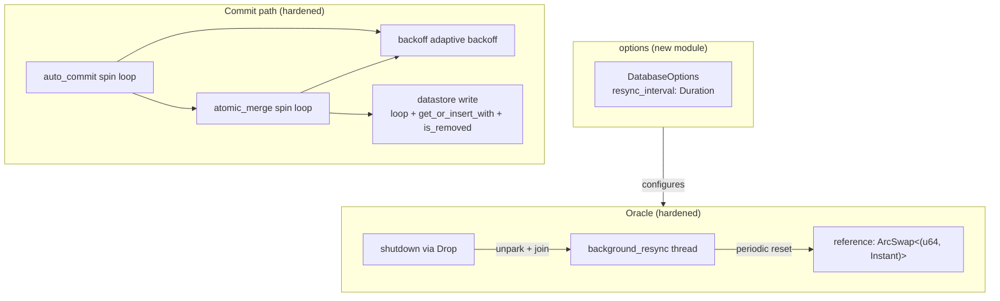
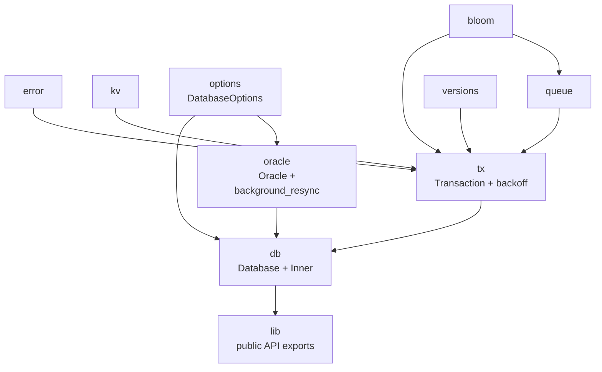

# Stupid-KV 教程：第三节 — 运行时鲁棒性加固：自适应退避、Oracle 抗漂移与写路径并发安全

## 1. 概述

前两节把 MVCC + SI + SSI 的功能骨架搭起来了，测试跑得通，示例跑得动。但"跑得通"和"在生产负载 / 长时间运行 / 高并发压力下也跑得住"是两件事。本节把注意力从**语义正确性**转向**运行时鲁棒性**，集中修复三个此前遗留的、只在特定条件下才会暴露的问题：

- **写路径的并发安全漏洞**：commit 向 datastore 写入新版本时用的 `get + insert/push` 模式，在两种独立的竞争窗口下会**静默丢失数据**——不 panic、不报错，返回 `Ok(())`，但数据永远读不回来。
- **`auto_commit` / `atomic_merge` 的自旋活锁风险**：两个热路径的 CAS-like 循环之前是**纯忙等（busy loop）**，在高竞争下会烧满 CPU 却推进极慢，甚至把持有 slot 的线程饿死。
- **Oracle 的锚点漂移**：`current_time_ns` 靠"启动时抓一次墙钟 + 累计 `Instant::elapsed()`"派生时间，长期运行后会与真实墙钟渐行渐远，MVCC 版本号的时间语义退化。

这三个问题的共同特征是：**故障不会立刻出现**。测试用例跑几秒钟根本触发不到，但一旦上到真实负载，就是那种"偶发的、难以复现的、日志里找不到线索的"疑难杂症。本节把它们一次性收拾干净。

**关键设计目标：**

- **写路径原子性**：commit 与 commit、commit 与未来的 GC 都不能因交错而丢数据
- **自适应退避**：竞争少时快速前进，竞争多时把 CPU 让给持锁者，避免活锁
- **时间锚点稳定**：Oracle 的派生时间要在长时间运行下仍然贴近墙钟
- **可配置化**：新引入的运行时参数（如 resync 间隔）通过 `DatabaseOptions` 暴露

---

## 2. 整体架构变化



---

## 3. 问题一：写路径的并发安全漏洞

### 3.1 旧实现

第一节的 commit 尾段是这样把 writeset 落到 datastore 的：

```rust
for (key, value) in entry.writeset.iter() {
    if let Some(entry) = self.database.datastore.get(key) {
        let mut versions = entry.value().write();
        versions.push(Version { version, value });
    } else {
        self.database.datastore.insert(
            key.clone(),
            RwLock::new(Versions::from(Version { version, value })),
        );
    }
}
```

直觉上没错：有就 push，没有就 insert。但这段代码在两个独立的竞争窗口下都会丢数据。

### 3.2 缺陷一：两个 commit 并发写入同一个不存在的 key

不需要任何 GC 参与，纯并发写入即可触发：

```
Commit A:  get(key) → None
Commit B:  get(key) → None
Commit A:  insert(key, Versions[V_A])   → 节点 E 创建成功
Commit B:  insert(key, Versions[V_B])   → 节点 E 被"整体替换"，V_A 永久丢失
```

`crossbeam-skiplist::SkipMap::insert` 的语义是**替换而非合并**：key 已存在时，整个节点被新节点覆盖，旧节点里挂着的 `Versions` 一并消失。表面上两次 insert 都返回成功，实际先落地的版本就地蒸发。

### 3.3 缺陷二：单个 commit + 未来的 GC 交错

即使只有一个 commit 在写、并且 key 之前已经存在，只要后续引入 GC（下一节的规划内容），下面这个交错就会出问题：

```
Commit A:  get(key) → 拿到节点 E 的引用
GC:                    write_lock(E) → gc_older_versions → entry.remove() → 释放锁
Commit A:                                                                  write_lock(E) → 拿到锁
                                                                           versions.push(V_A) → "成功"
                                                                           释放锁 → 节点 E 归零回收
```

`entry.remove()` 是**逻辑删除**（基于 epoch 内存回收，类似 RCU）：节点从 skip-map 索引里摘除，但只要还有线程持有它的引用，内存就不会立即释放。因此 Commit A 的 `write_lock` 和 `push` 都能正常执行——**不 panic、不报错、返回 Ok**——但节点已经不在 skip-map 里了，push 进去的数据跟着节点一起消失。

这是一种**静默数据丢失**，比崩溃更危险：日志里看不到任何异常，只有事后对账才会发现某笔写入凭空消失。

### 3.4 新实现：`loop + get_or_insert_with + is_removed()`

```rust
for (key, value) in entry.writeset.iter() {
    let value = value.clone();
    loop {
        let entry = self.database.datastore.get_or_insert_with(key.clone(), || {
            RwLock::new(Versions::from(Version { version, value: value.clone() }))
        });
        let mut versions = entry.value().write();
        if entry.is_removed() {
            continue;
        }
        versions.push(Version { version, value });
        break;
    }
}
```

三个变化，各自封堵一个窗口：

| 变化 | 封堵的窗口 |
|------|------------|
| `get_or_insert_with` 替代 `get + insert` | 缺陷一：两次并发的 get-or-create 会拿到**同一个**节点，各自在写锁下 push 自己的版本，两笔都保留 |
| 闭包在插入新节点时**预先 seed 当前版本** | 避免"插入空版本链 → 加锁 → push"这个中间态：GC 若夹在中间可能把空链节点判定为可回收 |
| 加锁后 `is_removed()` 检查 + `continue` | 缺陷二：`get_or_insert_with` 返回到 `write_lock` 加锁之间的窗口若被 GC 摘除节点，检查后重试，让下一轮 `get_or_insert_with` 插入全新节点 |

### 3.5 与 GC 的握手协议

上述修复要成立，GC（下一节实现）必须遵守一个约定：**在持有节点写锁期间调用 `entry.remove()`**。

```rust
// gc_key 未来的骨架
let mut versions = entry.value().write();
if versions.gc_older_versions(cleanup_ts) == 0 {
    entry.remove();  // 摘除必须发生在写锁内
}
```

这保证 commit 和 GC 之间只有两种时序，都是安全的：

- **commit 先拿锁**：GC 的 `entry.remove()` 被阻塞，commit 写完 → `is_removed() == false` → 正常 push
- **GC 先拿锁**：GC 摘除并释放锁，commit 拿锁后 `is_removed() == true` → `continue` 重试

没有第三种交错。

---

## 4. 问题二：热路径自旋的活锁风险

### 4.1 旧实现

`auto_commit` 和 `atomic_merge` 都是"给数据抢一个唯一 slot"的循环：

```rust
loop {
    let version = ...;
    let entry = queue.get_or_insert_with(version, || Arc::clone(&updates));
    if id == entry.value().id {
        return (version, Arc::clone(&updates));
    }
    // 抢 slot 失败，重试
}
```

抢 slot 失败意味着有别的事务先占了当前 `version` / `commit_id`。旧版本的做法是**立刻回到循环开头重试**——纯 busy loop，没有任何退避。这在低竞争下没问题（一两次就成功），但在下面这些场景会出问题：

- **高并发提交**：几十个线程同时抢同一个 `commit_id + 1` slot，只有一个能成功，其余全部原地空转，一直到 CPU 时间片被抢占。整体吞吐没有变高，但 CPU 利用率飙到 100%。
- **持 slot 的线程被调度出去**：赢家可能在 `fetch_add` 之前被抢占（比如 GC pause、page fault），此时所有 loser 都在自旋等一个"暂时不在 CPU 上"的赢家推进——这在最坏情况下就是**活锁**。

### 4.2 新实现：三段式自适应退避

`transaction_inner.rs` 底部新增 `backoff(spins)`：

```rust
#[inline(always)]
fn backoff(spins: usize) {
    if spins < 10 {
        std::hint::spin_loop();
    } else if spins < 100 {
        std::thread::yield_now();
    } else {
        std::thread::park_timeout(std::time::Duration::from_micros(10));
    }
}
```

`auto_commit` / `atomic_merge` 在每次失败尾部调用 `backoff(spins)` 并递增计数。三段的分工：

| 阶段 | 条件 | 行为 | 目的 |
|------|------|------|------|
| **乐观自旋** | `spins < 10` | `std::hint::spin_loop()` | 发出 x86 PAUSE / ARM YIELD 指令；线程仍占 CPU，但降低流水线投机执行、减少内存总线流量，让同核 HyperThread 上的赢家能推进 |
| **让出时间片** | `10 ≤ spins < 100` | `std::thread::yield_now()` | 主动让 OS 调度器把 CPU 分给持 slot 的线程；CPU 利用率不变但有效工作增加，避免整核浪费在自旋上 |
| **短挂起** | `spins ≥ 100` | `std::thread::park_timeout(10µs)` | 真的把线程挂起，彻底释放 CPU；消除活锁风险，代价是唤醒延迟 |

### 4.3 为什么三段式而不是单一策略

- **纯 `spin_loop`**：低竞争极快，但持 slot 者被抢占时会活锁。
- **纯 `yield_now`**：避免了活锁，但 loser 立刻让出时间片会引入 μs 级调度延迟，低竞争下反而变慢。
- **纯 `park_timeout`**：延迟最大，低竞争下完全不合适。

三段式覆盖了"**乐观预期**（大多数情况 slot 竞争一两次就赢）→ **中度竞争**（几十个线程抢同一 slot 时让 OS 调度）→ **持续拥塞**（真的挂起，等其他线程明确推进）"的完整光谱。计数器单调递增，退避策略只会**越来越保守**——不会因为一次调度回来又开始 busy loop。

### 4.4 边界：这不是死锁修复

需要澄清：`backoff` 解决的是**活锁与 CPU 浪费**，不是死锁。这两个循环本身不持有任何锁，也没有循环等待——最坏情况下总是有一个线程能推进（赢家）。`backoff` 只是让 loser 别把 CPU 烧光，把机会留给赢家。

---

## 5. 问题三：Oracle 锚点漂移与后台 resync

### 5.1 旧实现的语义

`Oracle::current_time_ns` 派生当前时间的方式是：

```text
current_time_ns = reference_unix + reference_instant.elapsed()
```

其中 `reference_unix` 是**构造 Oracle 时抓取一次**的墙钟 unix ns，`reference_instant` 是同一时刻记录的 `Instant`。之后所有派生都基于这一对锚点。

这么设计有两个好处：
- `Instant` 是单调时钟，对 NTP 回拨免疫，派生结果保证单调（跨 resync 边界除外，见下）。
- 每次派生只做一次 `elapsed()`（用户态计算），不必走 `SystemTime::now()` 系统调用。

### 5.2 漂移问题

问题是：**`Instant` 和墙钟并不共享时间源**。

- 墙钟受 NTP **slew**（缓慢调速）和 **step**（一次性跳变）修正
- 单调时钟只是"从某个不透明起点开始经过的时间"，不参与任何校准

结果就是：`reference_unix + elapsed()` 与"此刻真正的 unix ns"会随着时间越拉越远。**漂移**。

如果不 resync，Oracle 长时间运行后派生的时间会退化成"启动时刻的墙钟 + 一个越来越不准的单调偏移量"——虽然仍然单调，但已经脱离墙钟语义。对 MVCC 来说，"版本号还是 u64、还是单调"没错，但它的物理时间意义在一天之后可能已经差了几秒到几分钟。

### 5.3 新实现：后台 resync 线程

`Oracle::new` 构造时启动一个后台线程：

```rust
fn background_resync(&self) {
    let oracle = self.inner.clone();
    let interval = oracle.resync_interval;
    let handle = std::thread::spawn(move || {
        while oracle.resync_enable.load(Ordering::Acquire) {
            std::thread::park_timeout(interval);
            let reference_unix = Self::current_unix_ns();
            let reference_time = Instant::now();
            oracle.reference.store(Arc::new((reference_unix, reference_time)));
        }
    });
    *self.inner.resync_handle.lock() = Some(handle);
}
```

三个关键决策：

**`park_timeout` 而不是 `sleep`。** `sleep` 是"睡到时间到"，没有旁路唤醒机制。关停时如果后台线程正在 sleep，得等这一觉自然睡完才能看到退出信号，最坏要阻塞一整个 `resync_interval`。`park_timeout` 可被 `unpark` 提前打断——`shutdown` 里的 `handle.thread().unpark()` 让关停几乎瞬时。此外 `park_timeout` 对"unpark 先于 park"是幂等的（unpark 会留一个 permit），实践中无需在启动与关停之间做额外同步。

**`ArcSwap` 而不是 `Mutex` / `RwLock`。** 读侧 `current_time_ns` 每次事务提交都要调，是热路径；写侧每 `resync_interval` 才动一次。`ArcSwap::load` 是无锁的（近似 RCU），把锚点原子替换给几乎为零的读侧开销，代价只是每次 resync 会多一次 `Arc` 分配。

**`Acquire` / `Release` 配对关停。** `shutdown` 里 `resync_enable.store(false, Release)`，后台循环入口 `resync_enable.load(Acquire)`——一旦后台看到 false，本次 shutdown 之前对共享状态的所有写都对它可见，可以安全地进入 join。

### 5.4 单调性契约的松动

resync 带来一个不容忽视的语义变化：**跨 resync 边界不再严格单调**。

派生公式在两次 resync 之间用的是 `Instant`（单调），resync 那一刻却用 `SystemTime::now()`（墙钟）覆盖锚点。如果墙钟在这段时间里被向后调整（NTP slew 减速、管理员回拨、VM 挂起恢复导致墙钟落后于 Instant 派生值），换锚点的那一刻返回值**可能小于**上一次调用的返回值。

这是有意的取舍：无条件 resync 让 Oracle 长期跟随真实墙钟、保留时间语义；否则 Oracle 会退化成一个纯计数器。代价是跨 resync 的单调性交给调用方兜底。

MVCC 版本号的严格单调由 `atomic_merge` 里的这两行守住：

```rust
let mut version = oracle.current_time_ns();
let last_ts = oracle.inner.timestamp.load(Ordering::Acquire);
if version <= last_ts {
    version = last_ts + 1;
}
// ...
oracle.inner.timestamp.fetch_max(version, Ordering::Release);
```

即使 `current_time_ns` 短暂回退，`last_ts + 1` 兜底 + `fetch_max` 单向推进保证了高水位永不回退。**Oracle 只承诺"派生时间贴近墙钟"，版本号的严格单调由调用方通过 `fetch_max` 组合出来**——这是本节最重要的语义契约。

### 5.5 优雅停机

`Oracle` 实现了 `Drop`：

```rust
impl Drop for Oracle {
    fn drop(&mut self) {
        self.shutdown();
    }
}

fn shutdown(&self) {
    self.inner.resync_enable.store(false, Ordering::Release);
    if let Some(handle) = self.inner.resync_handle.lock().take() {
        handle.thread().unpark();
        handle.join().unwrap();
    }
}
```

- `shutdown` 是模块私有的，**只由 `Drop` 调用**，外部无法（也无需）手动停机
- `Drop` 触发的时机是最后一个 `Arc<Oracle>` 归零，此时 `new()` 早已返回，`resync_handle` 一定已经写入，不存在"handle 还没存进去就 shutdown"的窗口
- `handle.join()` 保证 `Drop` 返回后不再有对 `inner` 的后台访问，避免出现"Oracle 已被 drop、后台线程还在读 inner"的悬空引用

---

## 6. 新增模块：`options`

### 6.1 动机

resync 间隔是一个典型的"没有放之四海皆准的默认值"的参数：单测里希望它够短以覆盖 resync 逻辑，生产里希望它够长以降低开销。硬编码在 Oracle 里显然不合适。

### 6.2 实现（`src/options/mod.rs`）

```rust
pub(crate) const DEFAULT_RESYNC_INTERVAL: Duration = Duration::from_secs(5);

#[derive(Debug, Clone)]
pub struct DatabaseOptions {
    pub resync_interval: Duration,
}

impl Default for DatabaseOptions {
    fn default() -> Self {
        Self { resync_interval: DEFAULT_RESYNC_INTERVAL }
    }
}
```

### 6.3 打通到 `Inner`

```rust
impl Inner {
    pub fn new(opts: &DatabaseOptions) -> Self {
        Self {
            oracle: Oracle::new(opts.resync_interval),
            // ...
        }
    }
}

impl Default for Inner {
    fn default() -> Self {
        Self::new(&DatabaseOptions::default())
    }
}
```

保留 `Default` 让老代码可以零参数构造；新代码可以显式传 `DatabaseOptions`。这是**扩展点**：未来 GC 间隔、bloom filter 大小、退避阈值等参数都可以通过这个入口暴露，不用再改函数签名。

---

## 7. 关键设计权衡

| 决策 | 优点 | 缺点 |
|------|------|------|
| **`loop + get_or_insert_with + is_removed`** | 同时封堵并发 insert 和 GC 竞争两个独立窗口 | 每次写入引入一次 `is_removed` 检查（极小） |
| **闭包预先 seed 版本** | 避免"空版本链节点"这个中间态 | 未插入成功时闭包的 `value.clone()` 是浪费的 |
| **三段式 backoff** | 覆盖无竞争 / 中度 / 高度竞争的完整光谱 | 参数（10 / 100 / 10µs）是启发式的，未做过压测调参 |
| **`park_timeout` 而非 `sleep` 于后台线程** | 关停几乎瞬时；对 unpark-before-park 幂等 | 需要显式 `unpark` 唤醒，`sleep` 不需要 |
| **`ArcSwap` 于锚点** | 读侧完全无锁，写侧原子替换 | 每次 resync 一次 `Arc` 分配 |
| **跨 resync 不保证严格单调** | Oracle 长期跟随墙钟，保留时间语义 | 严格单调需调用方叠加 `fetch_max` 组合 |
| **`Oracle::shutdown` 私有 + 仅由 Drop 调用** | 使用方零心智负担；无并发关停竞争窗口 | 无法在 Drop 之外提前停止后台线程 |
| **`DatabaseOptions` 模块** | 未来所有运行时参数的统一入口 | 目前只有一个字段，看起来"重" |

---

## 8. 故障模式对比

| 场景 | 旧实现 | 新实现 |
|------|--------|--------|
| 两个 commit 并发写不存在的 key | 后写覆盖先写，静默丢失 | 两版本都保留 |
| 单个 commit 撞上未来的 GC 摘除 | 写入孤儿节点，静默丢失 | `is_removed` 检测后重试 |
| 高并发抢 commit slot | 全员 busy loop，CPU 100%，可能活锁 | 自适应退避，赢家推进，loser 让出 |
| 持 slot 线程被抢占 | 所有 loser 空转等赢家回来 | ~10 次自旋后 loser 主动 yield，OS 优先调度赢家 |
| Oracle 长时间运行 | 派生时间逐渐脱离墙钟，最终退化为纯计数器 | 每 `resync_interval` 重新贴近墙钟 |
| Oracle drop 时后台线程还在 sleep | 无关停机制，线程随进程终止（若手动 shutdown 也要等一整个 interval） | `Drop` 触发 `unpark + join`，几乎瞬时退出 |

---

## 9. 模块依赖图（更新）



新增 `options` 模块，被 `db` 和 `oracle` 共同依赖。`oracle` 从直接被 `tx` 依赖调整为经由 `db` 转发（`TransactionInner` 通过 `self.database.oracle` 访问）。

---

## 10. 总结

本节没有引入新功能，也没有改动任何对外可见的 API 行为——SI 还是 SI，SSI 还是 SSI，`Transaction::commit` 的语义完全一致。改动全部是**看不见的运行时质量**：

- 写路径从"能跑通"升级到"任何并发交错下都不丢数据"
- 热路径的 CPU 从"高竞争下烧满"升级到"按需退让、避免活锁"
- 时间源从"启动时抓一次"升级到"长期跟随墙钟"
- 运行时参数有了统一入口，为下一节的 GC / 持久化提供扩展位

这类工作往往在功能开发完成后被搁置——因为它们不产生新特性，测试也很难覆盖。本节把它们视为**下一节工作的前置条件**：GC 会重度依赖第 3.5 节的写路径握手协议，持久化会重度依赖第 5.4 节的版本号单调契约。先把地基夯实，再往上盖楼。
