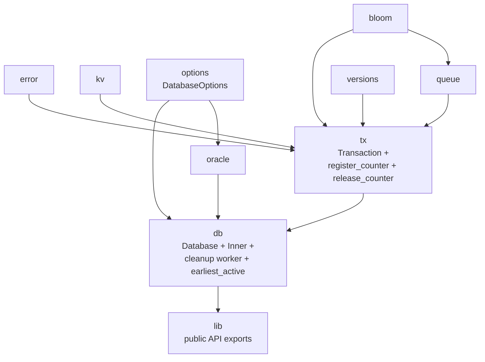

# Stupid-KV 教程：第四节 — 提交队列 GC：活跃事务引用计数与 Dekker 双 fence 协议

## 1. 概述

前三节把 MVCC + SI + SSI 的功能骨架、以及最基本的运行时鲁棒性都搭好了，但整个引擎有一个长期问题一直被推迟：**`transaction_commit_queue` 只增不减**。

commit queue 存在的唯一目的是给未来事务做冲突检测——每次 commit 都要扫描 `range(self.commit + 1 .. current)` 检查是否有他人碰过自己写集里的 key。只要没有任何活跃事务再需要某条 entry，它就变成了纯垃圾内存。第 03 节的 `is_removed()` 握手协议其实已经为"未来的 GC"埋好了写路径侧的接口，本节把 GC 真正实现出来。

看似简单：找出所有活跃事务快照起点的最小值 `oldest`，把 commit queue 中 `< oldest` 的 entry 删掉。但要在并发环境下正确做到这一点，需要一整套引用计数 + 双向内存序协议：

- **活跃事务集合是动态的**：GC 扫描"哪些 commit 还被活跃事务当作快照起点"时，可能有新事务正在注册、旧事务正在退出；若不加同步，可能会把"注册中的事务"漏看，进而算出过大的水位、误删仍在被使用的 commit 记录。
- **误删不 panic**：被误删的记录只是让冲突检测漏检某些提交，静默变成写写/写读冲突丢失——最终数据"就是"被覆盖了，没有任何异常。

本节的核心工作可以分为三块：

- **引用计数基础设施**：`counter_by_commit: SkipMap<u64, Arc<AtomicU64>>` 记录当前活跃事务的快照分布，事务创建时 +1、销毁时 -1。
- **Dekker 风格双 fence 协议**：`register_counter`（TX 侧）与 `earliest_active`（GC 侧）通过一对 SeqCst fence 建立跨线程可见性保证，让 GC 计算出的水位线永远不会 > 任何活跃事务的快照。
- **后台清理线程**：`Database` 启动时 spawn 一个周期性调用 `run_cleanup_inner` 的线程，析构时通过 `unpark + join` 优雅关停。

**关键设计目标：**

- **零误删**：任何活跃事务需要扫描的 commit 记录都不能被 GC 回收
- **无锁读路径**：GC 主循环不阻塞事务提交，事务注册/退出也不阻塞 GC 扫描
- **可关停**：后台线程与 `Database` 生命周期严格绑定，Drop 后不留悬挂线程
- **可配置**：通过 `DatabaseOptions` 暴露 `enable_cleanup` / `cleanup_interval`

---

## 2. 整体架构变化

```mermaid
flowchart TB
    subgraph TX["Transaction lifecycle"]
        REG["register_counter<br/>counter[v] += 1"]
        REL["release_counter<br/>counter[v] -= 1"]
        REG -.->|Drop| REL
    end

    subgraph GC["Background cleanup"]
        WORKER["cleanup worker thread"]
        RUN["run_cleanup_inner"]
        EAC["earliest_active<br/>+ F_gc fence"]
        WORKER -->|park_timeout| RUN
        RUN --> EAC
    end

<!-- APPEND -->
    subgraph SHARED["Shared state (Inner)"]
        MAP["counter_by_commit<br/>SkipMap&lt;u64, Arc&lt;AtomicU64&gt;&gt;"]
        CQ["transaction_commit_queue"]
        CID["transaction_commit_id"]
    end

    REG -->|CAS +1| MAP
    REL -->|CAS -1 / tombstone| MAP
    EAC -->|scan| MAP
    EAC -->|fallback load| CID
    RUN -->|range delete| CQ
```

`Inner` 的字段布局同步扩展：

| 新字段 | 类型 | 作用 |
|--------|------|------|
| `counter_by_commit` | `SkipMap<u64, Arc<AtomicU64>>` | 活跃事务引用计数表 |
| `transaction_cleanup_handle` | `RwLock<Option<JoinHandle<()>>>` | 后台线程句柄，供 Drop 时 join |
| `background_threads_enabled` | `AtomicBool` | 后台任务运行开关 |
| `COUNTER_TOMBSTONE` | `const u64 = u64::MAX` | counter 归零后的墓碑值 |

`TransactionInner` 新增 `counter_commit: Arc<AtomicU64>`，持有本事务在 `counter_by_commit` 上共享的那个原子计数器，便于 `Transaction::drop` 时直接释放而不必再查 map。

---

## 3. 引用计数：counter_by_commit 的语义

### 3.1 数据结构

```rust
pub(crate) counter_by_commit: SkipMap<u64, Arc<AtomicU64>>,
```

- **key**：事务开始时读取的 `transaction_commit_id`，即该事务的快照起点 commit。
- **value**：当前仍持有该快照起点的活跃事务个数（原子计数器）。

一个关键设计选择：**多个事务可能共享同一个 counter**。在负载不高、`transaction_commit_id` 长时间停留在某个 v 时，一批并发开启的事务全都会读到同一个 v，它们共享 `counter_by_commit[v]`，各自 +1、退出时各自 -1。这样 map 的规模只由"活跃过的不同 commit_id 数量"决定，而不是活跃事务总数。

### 3.2 生命周期

**事务开始**：读取当前 `transaction_commit_id` 作为快照起点 commit，在 `counter_by_commit[commit]` 上 +1。

**事务结束**（无论 commit / cancel / 显式 drop）：在对应 counter 上 -1，减到 0 则将其打上 `COUNTER_TOMBSTONE` 墓碑，并由本事务负责把该 entry 从 map 中摘除。

事务整个生命周期结束后，`counter_by_commit` 中不留任何痕迹——它只记录"当前活跃"，不保存历史。

### 3.3 为什么需要 `COUNTER_TOMBSTONE`

考虑这样一个并发场景（没有墓碑机制）：

```
TX-A: counter[5] -= 1 → 0
GC/其他: 打算清理 counter[5]，但还没来得及 remove(5)
TX-B: 新事务开启，读到 commit_id 仍是 5
      map.get_or_insert_with(5) 拿到同一个 counter (值=0)
      counter += 1 → 1，误认为"注册成功"
TX-A: 完成 remove(5) → map 中已经没有 5 这一项
```

此时 TX-B 的 counter 挂在一个"已经从 map 摘除"的 Arc 上，GC 扫描 map 永远看不到 TX-B。TX-B 的快照 5 就成了 GC 的盲点——它可能被算作"不再活跃"，`< 5` 的 commit queue 记录被误删。

`COUNTER_TOMBSTONE = u64::MAX` 让这个死亡状态成为不可复活的信号：

- `release_counter` 在减到 0 时**直接 CAS 到 `TOMBSTONE`**，而不是留个 0；
- `register_counter` 看到 `TOMBSTONE` **立刻放弃**这个 counter，进入下一轮循环，重新走 `get_or_insert_with`——这时新的插入要么替换了这个墓碑 slot，要么 slot 已经被 remove 干净。

### 3.4 commit queue 清理算法

```
1. fallback = transaction_commit_id.load(SeqCst)   ← 先于扫描读取
2. oldest = earliest_active_commit(fallback)
3. 删除 transaction_commit_queue 中所有 key < oldest 的 entry
```

**为什么先读 fallback 再扫描：**

无活跃事务时用 `transaction_commit_id` 作为兜底水位线。先读 fallback 再扫描，保证：若有并发注册的事务被扫描漏掉，其快照 `>= fallback`（commit id 单调递增），其冲突窗口 `(snapshot, ..)` 不会被误删。

**为什么删 `< oldest` 而不是 `<= oldest`：**

oldest 是某个活跃事务的快照起点，该事务需要扫描 `> oldest` 的 commit queue 做冲突检测，oldest 本身不能删。

**commit queue 的 key 来源：**

`transaction_commit_queue` 的 key 由 `auto_commit` 在提交时从 `transaction_commit_id` 分配（`+1`），与 `counter_by_commit` 的 key 来源相同，GC 水位线语义因此自洽。

---

## 4. 问题的核心：GC 必须维护的安全不变式

GC 的正确性可以浓缩成一句话：

> **对任何"注册已完成、快照起点为 v"的活跃事务 TX，本次 GC 扫描若读到 `fallback > v`，则必须读到 `counter[v] >= 1`。**

违反这条不变式意味着 GC 会用 fallback 当水位线，把 `commit_queue` 中 `(v, fallback)` 区间的记录当作过期数据删掉——而这些正是 TX 提交时做冲突检测要扫描的记录。一旦被误删：

- **SI 下**：写写冲突漏检，多个事务同时更新同一 key 都 commit 成功，后写者静默覆盖先写者。
- **SSI 下**：额外还会漏检写读冲突，write skew / phantom 阻挡不住。

这类 bug **不会崩、不会报错**，只会在事后对账时发现某笔提交凭空消失。

正确性挑战完全落在两个操作的并发交错上：

- TX 侧的 `register_counter`：读 commit_id、创建/找到 counter、CAS +1。
- GC 侧的 `earliest_active`：读 commit_id（作为 fallback）、扫描 counter map。

在弱内存序架构（ARM / POWER）上，即使程序顺序看起来"没问题"，编译器 / CPU 的乱序也可以让两个线程各自看到不一致的世界切片。下一节展开这个协议。

---

## 5. Dekker 风格双 fence 协议

### 5.1 时序骨架

`register_counter`（TX 侧）与 `earliest_active`（GC 侧）通过一对 SeqCst fence 建立同步：

```
TX (register_counter)                GC (earliest_active)
─────────────────────                ────────────────────
A. load commit_id → v                X. load commit_id → fallback  (SC)
B. CAS counter[v]: 0 → 1  (Release)  Y. fence(SeqCst)  [F_gc]
C. fence(SeqCst)  [F_tx]             Z. load counter[v] (Acquire)
D. reload commit_id (必须仍 = v)
```

这是标准的 Dekker 模式：两个线程各自都做"先写自己的信号、再读对方的信号"，通过 fence 把这两步在 SC 全局序上钉牢，保证不会互相错过。

### 5.2 关键论证

要证明：若 GC 读到 `fallback > v`，则必然读到 `counter[v] >= 1`。

反证 / 推理：

1. `fallback > v` ⇒ 期间必然发生过一次 `transaction_commit_id` 递增（Committer 的 `fetch_add`），把它从 v 抬到某个 `v' > v`。
2. 由 TX 的 D 步稳定性检查（reload 仍见 v），Committer 的那次递增在 SC 全局序中必然**排在 D 之后**——如果排在 D 之前，TX 的 reload 就该读到 `v'` 而不是 `v`。
3. 又因为 GC 的 X 步读到了 `fallback = v'`，Committer 的递增又必然**排在 X 之前**。
4. 综合 2、3：`F_tx (在 D 之前) < 递增 < X < F_gc`。
5. 两个 SeqCst fence 的语义：`F_tx` 之前的所有写（包括 B 的 CAS）对 `F_gc` 之后的所有读（包括 Z）可见。
6. 因此 Z 的 Acquire load 一定看到 `counter[v] >= 1`。

`F_tx` 让本线程的 CAS 在 SC 全局序上排在 reload 之前；`F_gc` 让 GC 的两次 load 也钉进 SC 全局序。两个 fence 缺一不可——单独任何一个都无法闭合这条推理链。

### 5.3 三个具体场景

**场景 1：注册在 fallback 推进之前完成**

```
TX-A: load commit_id=5
      CAS counter[5]=1
      F_tx
      reload commit_id=5 ✓ 返回
Cmt:                       commit_id: 5 → 6
GC:                                       load fallback=6
                                          F_gc
                                          load counter[5] → 1
```

`fallback=6 > TX-A` 的快照 5；双 fence 把 TX-A 的 CAS 钉在 GC 的 counter load 之前，GC 判定 5 号活跃，`oldest=5`。TX-A 需要扫描的 `> 5` 区间被完整保留。

**场景 2：注册未完成，GC 走 fallback 兜底也安全**

```
TX-B: load commit_id=5
      CAS counter[5]=1  ← 尚未执行
GC:                     load fallback=5 (SC)
                        F_gc
                        load counter[5] → 0（slot 甚至可能不存在）
                        ⇒ oldest = 5，删 commit_queue 中 < 5 的记录
TX-B:                   继续 CAS、F_tx、reload=5 ✓ 返回
```

TX-B 后续注册成功时快照仍为 5，其冲突扫描区间是 `> 5`；GC 删的是 `< 5` 的记录，与 TX-B 扫描区间无交集。只要 TX-B 最终能观察到"commit_id 稳定为 5"，GC 之前读到的 fallback 就不可能小于 5。

**场景 3：注册途中 commit_id 被抬高，reload 失败重试**

```
TX-A: load commit_id=5
      CAS counter[5]=1
      F_tx
Cmt:  commit_id: 5 → 6
TX-A: reload commit_id=6 ≠ 5 ✗
      → release_counter(counter[5])  // 撤销 +1
      → 若归零，摘除 map[5]（需用 Arc::ptr_eq 校验）
      → 回到 loop 头
      load commit_id=6
      CAS counter[6]=1
      F_tx
      reload commit_id=6 ✓ 返回
```

撤销时用 `Arc::ptr_eq` 校验 map 中 key=5 上仍是同一个 counter，防止误删已被后来者替换成新 counter 的同 key entry。

### 5.4 缺失 `F_gc` 时会发生什么

假设只保留 TX 侧的 `F_tx`、去掉 GC 侧的 `F_gc`。弱内存序架构上可能出现：

```
TX-A: CAS counter[5]=1 (Release) ── F_tx ── reload commit_id=5 ✓ 返回
Cmt:                                        commit_id: 5 → 6
GC:                                                     load fallback=6
                                                        (无 F_gc)
                                                        load counter[5] → 0 (stale)
```

GC 的 counter Acquire load 与 fallback SC load 之间没有强制顺序——Acquire load 只在"实际读到某个 Release 存的值"时才与那个 Release 建立同步。如果它从本地缓存读到"初始 0"（TX-A 的 CAS 对应的 cache line invalidation 尚未到达本 CPU 的 invalidation queue），就没有任何机制强制它去看更新过的值。

GC 判定"5 号无人"，用 fallback=6 兜底，删除 `commit_queue` 中 key `< 6` 的记录——**TX-A 提交时 `range(6..)` 扫不到冲突源，冲突检测静默失效**。

`F_gc` 卖的从来不是"看到最新"，而是"两次观测之间的先后不可颠倒"——这才是让 Dekker 协议正确的东西。

### 5.5 fence 的边界

fence 保证的是**顺序**，不是**发现所有事务**：

- 若某个 TX 还没跑完 `register_counter`，GC 完全可以看不到它——这在场景 2 中已经展示，是正确行为，不是漏洞。
- Acquire load 从不承诺读到全局最新的值，它承诺的是"读到某个 Release 值时会与那次 Release 建立同步"。
- 协议真正保证的是：**只要一个事务能够"最终稳定注册成功"，那么在此之后任何观察到 `fallback > 其快照` 的 GC 都能看到它**。

场景 2 的兜底安全正是靠这一点：一个还没注册完的 TX 无法阻止 GC 走 fallback 路径，但 GC 走 fallback 路径也不会碰到 TX 的扫描区间。

---

## 6. 释放路径：release_counter + Transaction::drop

### 6.1 `release_counter` 语义

```rust
pub(crate) fn release_counter(counter: &AtomicU64) -> bool {
    loop {
        let current = counter.load(Ordering::SeqCst);
        if current > 1 {
            if counter.compare_exchange_weak(current, current - 1, ...).is_ok() {
                return false;   // 普通递减，还有其他持有者
            }
            continue;
        }
        debug_assert_eq!(current, 1);
        if counter.compare_exchange_weak(1, COUNTER_TOMBSTONE, ...).is_ok() {
            return true;        // 归零，已打墓碑，调用方负责摘除 map entry
        }
    }
}
```

- `current > 1`：还有别的活跃事务持有，正常递减。
- `current == 1`：本事务是最后一个持有者，直接 CAS 到 `COUNTER_TOMBSTONE`。
- 返回值：`true` 表示"你是最后关灯的人，请把 entry 从 map 中摘除"；`false` 表示"还有别人在"。

### 6.2 Transaction::drop

```rust
impl Drop for Transaction {
    fn drop(&mut self) {
        if let Some(inner) = self.inner.take() {
            if release_counter(&inner.counter_commit) {
                inner.database.counter_by_commit.remove(&inner.commit);
            }
        }
    }
}
```

三个要点：

1. `Drop` 会覆盖所有事务退场路径：commit 成功、cancel、显式 drop、panic unwind。
2. 只有 `release_counter` 返回 `true` 的那次调用才负责摘除 map entry——避免多个事务并发 -1 时都想去 remove。
3. 摘除时不必再验证 `Arc::ptr_eq`：`release_counter` 已经把 counter CAS 到墓碑，任何看到墓碑的 `register_counter` 都会放弃它、走 `get_or_insert_with` 拿到 map 里当前的 entry（要么就是我们即将 remove 的这个，要么是别人已经替换的新 entry；若是后者也没问题，因为我们的 remove 只匹配 key=commit，不匹配 value）。

_（若担心 remove 的语义误伤新插入的同 key entry，也可以采用 `Arc::ptr_eq` 校验后再 remove——本节实现选择了更宽松的路径，因为墓碑机制已足够阻止 register 复活。）_

---

## 7. 后台清理线程

### 7.1 主循环

```rust
fn intialise_cleanup_worker(&self) {
    let inner = self.inner.clone();
    if inner.transaction_cleanup_handle.read().is_none() {
        let interval = self.cleanup_interval;
        let handle = std::thread::spawn(move || {
            while inner.background_threads_enabled.load(Ordering::Relaxed) {
                std::thread::park_timeout(interval);
                if !inner.background_threads_enabled.load(Ordering::Relaxed) {
                    break;
                }
                inner.run_cleanup_inner();
            }
        });
        *self.inner.transaction_cleanup_handle.write() = Some(handle);
    }
}
```

三个关键决策：

**`park_timeout` 而不是 `sleep`。** 与第 03 节 Oracle 的 background_resync 同一套逻辑：`sleep` 无旁路唤醒机制，关停时若线程正在 sleep，最坏要等一整个 `cleanup_interval`。`park_timeout` 可被 `unpark` 提前打断，让 shutdown 几乎瞬时。

**双重开关检查。** `park_timeout` 醒来后再次检查 `background_threads_enabled`：避免关停后又白跑一次 `run_cleanup_inner`。这一次可能是 shutdown 的 unpark 提前唤醒的，也可能是刚好超时自然醒，都需要检查退出条件。

**线程通过 `Arc<Inner>` 持有引用。** 后台线程独立持有 `Arc<Inner>`，与 Database 的生命周期通过 `shutdown` 显式同步——Database 析构时先切断开关、unpark、join，保证 Inner 内部结构在无并发访问后再被释放。

### 7.2 优雅停机

```rust
impl Drop for Database {
    fn drop(&mut self) {
        self.shutdown();
    }
}

fn shutdown(&self) {
    self.background_threads_enabled.store(false, Ordering::Relaxed);
    if let Some(handle) = self.transaction_cleanup_handle.write().take() {
        handle.thread().unpark();
        let _ = handle.join();
    }
}
```

- 步骤 1：置开关为 false，通知线程退出循环。
- 步骤 2：`unpark` 唤醒可能沉睡的线程，避免等到超时。
- 步骤 3：`join` 等待线程真正结束，保证 Inner 在无并发访问后再释放。

与 Oracle 的 shutdown 逻辑几乎完全对称。

---

## 8. 新增/修改的配置项

`DatabaseOptions` 扩展两个字段：

```rust
pub struct DatabaseOptions {
    pub resync_interval: Duration,
    pub enable_cleanup: bool,      // 新增：是否开启后台 GC
    pub cleanup_interval: Duration, // 新增：GC 扫描周期
}
```

默认值：

- `enable_cleanup = true`：默认开启。
- `cleanup_interval = 1s`：远比 Oracle resync 频繁（5s），因为 commit queue 增长速度直接受写入 QPS 影响。

关闭 `enable_cleanup` 时，仍可通过 `Database::run_cleanup()` 手动触发一次清理——便于测试或对 GC 时机有严格控制诉求的场景。

---

## 9. 与第 03 节 write-path 握手协议的呼应

第 03 节引入的 `loop + get_or_insert_with + is_removed()` 写路径修复中，有一条约定：

> GC 摘除 datastore 节点时必须持有该节点的写锁。

本节实现的 GC **只处理 `transaction_commit_queue`**，尚未涉及 datastore 的版本清理。因此第 03 节这条约定在本节还没有被真正启用，但它已经作为架构层面的合同存在——将来在实现 `versions.gc_older_versions` 时会立即用上。

同样地，本节引入的双 fence 协议、引用计数框架也为将来的 datastore GC 打好了基础：**"最早活跃 commit"这个水位线本身就是 MVCC 版本裁剪的关键信号**，只要一个版本 `< oldest`，就可以确认没有事务会再需要它。

---

## 10. 关键设计权衡

| 决策 | 优点 | 缺点 |
|------|------|------|
| **共享 counter（`Arc<AtomicU64>`）** | map 规模只由不同 commit_id 数决定，与事务总数解耦 | 每个 counter 需要 Arc 包装，一次分配的成本 |
| **Dekker 双 fence 协议** | 完全无锁；协议短、易于形式化验证 | 需要仔细论证正确性；对读者门槛较高 |
| **`COUNTER_TOMBSTONE`** | 阻止"减到 0 → remove 之间被 register 复活" | 增加了 counter 值域的一个特殊语义 |
| **`register_counter` reload 失败重试** | 保证注册"绑定到稳定的 commit_id" | 高争用下可能多次循环，最坏情况理论上无界 |
| **后台线程 `park_timeout` + `unpark`** | 关停几乎瞬时 | 与 sleep 相比多一次开关检查 |
| **`Transaction::drop` 中释放** | 覆盖所有退场路径（commit / cancel / panic） | 若事务被 `mem::forget`，counter 泄漏 |

---

## 11. 故障模式对比

| 场景 | 旧实现（无 GC） | 新实现 |
|------|----------------|--------|
| commit queue 只增不减 | 内存随写入 QPS 线性增长，长时间运行 OOM | 后台周期性回收，只保留活跃事务需要的记录 |
| GC 与新事务注册并发 | N/A | Dekker 双 fence 协议：GC 要么看见事务、要么算出的 fallback ≤ 事务快照 |
| GC 摘除 counter entry 与新注册的复活 | N/A | `COUNTER_TOMBSTONE` 阻止复活 |
| 事务 panic 中断退出 | commit queue 不变 | `Transaction::drop` 释放引用计数，不泄漏 |
| Database drop 时后台线程还在 park | N/A | `unpark + join` 瞬时退出 |

---

## 12. 模块依赖图（更新）



`tx` 模块新增 `register_counter` / `release_counter` 与 `Transaction::drop`；`db::inner` 新增 `counter_by_commit`、`earliest_active`、`run_cleanup_inner`；`db::db` 新增后台清理线程与优雅停机逻辑。

---

## 13. 总结

本节把"commit queue 永远只增"这个从第 01 节埋下的坑真正填掉了。核心不是"启动一个后台线程调用 remove"这么简单——真正的难度在于**GC 与并发事务注册/退出之间的正确性证明**。整节工作围绕一个不变式展开：

> 对任何注册已完成的活跃事务 TX（快照 = v），GC 不会误删 `commit_queue` 中 `[v+1, ..)` 的任何记录。

为了让这条不变式在弱内存序架构下也成立，我们引入了：

- **`counter_by_commit`** 作为活跃事务的显式登记表；
- **`COUNTER_TOMBSTONE`** 阻止"归零 → remove 之间的复活";
- **Dekker 风格双 fence 协议**（`F_tx` + `F_gc`）建立 TX 侧 CAS 与 GC 侧 counter load 之间的因果边;
- **reload 稳定性检查** 保证 TX 的注册"绑定到一个稳定的 commit_id"；
- **后台线程 + 优雅停机** 让 GC 与 Database 生命周期严格同步。

下一节的计划——**版本历史 GC**——会复用本节的水位线概念（`oldest` 就是 "所有活跃事务能看到的最老版本"），并激活第 03 节 write-path 中已经预留的 `is_removed()` 握手协议。地基已经打好，接下来就是往上盖楼。

