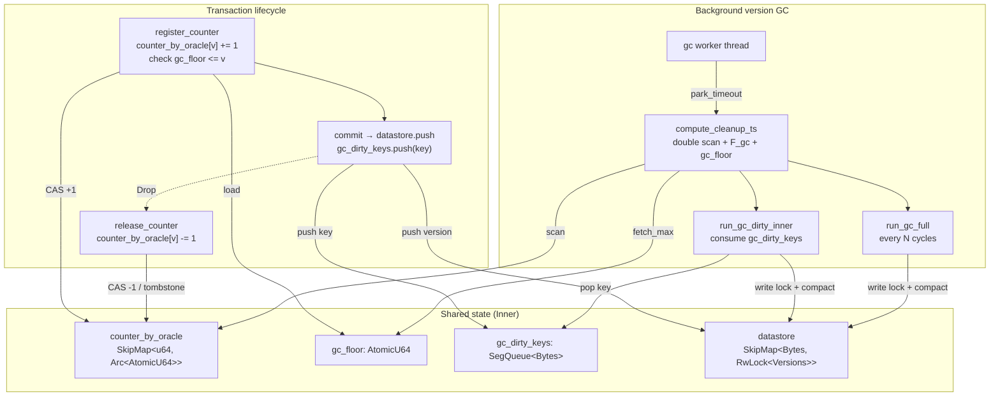
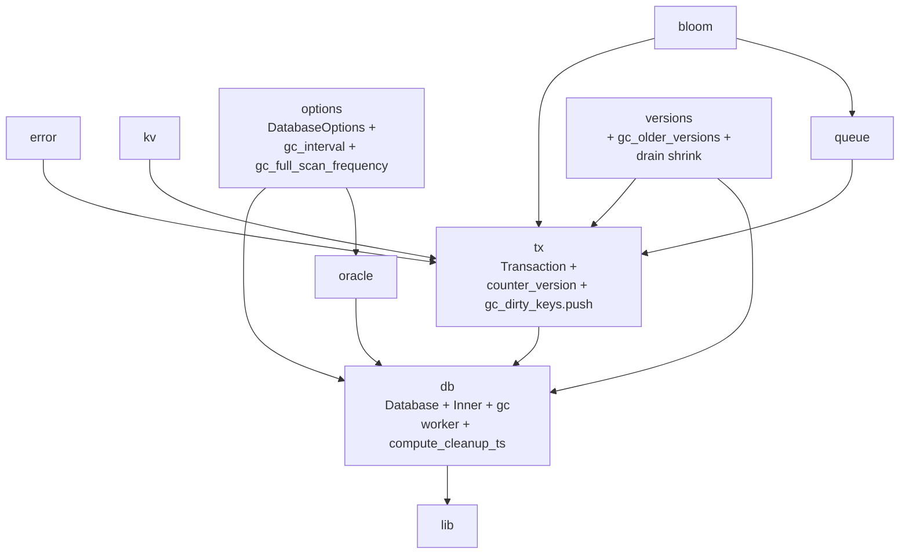

# Stupid-KV 教程：第五节 — 版本历史 GC：datastore 侧的 MVCC 版本压缩

## 1. 概述

第 04 节把 `transaction_commit_queue` 的 GC 骨架搭好了，本节继续沿用同一套引用计数 + Dekker 双 fence 的基础设施，把 GC 的范围扩到 datastore 内部的 MVCC 版本链。

每个 key 在 datastore 中是一条按 `version` 递增的 `Versions` 链，随着事务不断写入，版本数会线性增长。但真正被活跃事务需要的版本永远只是一个"尾巴"——旧版本对任何仍存活的事务都不可见，是纯占内存的历史包袱。本节要做的事情可以概括为：

> 找一个安全水位线 `cleanup_ts`，把每个 key 的版本链中低于水位线的旧版本压缩掉；同时让新事务的注册与水位线的发布之间不产生任何间隙。

看似只是"扫 datastore 每个 key，删掉部分版本"这么简单，但要在并发环境下正确做到这一点，本节引入了三个新组件：

- **`counter_by_oracle: SkipMap<u64, Arc<AtomicU64>>`**：与 04 节的 `counter_by_commit` 完全对称，只是登记的对象是"事务快照 version"而不是"快照 commit id"。
- **`gc_floor: AtomicU64`**：一个 GC 端"预告即将回收到哪里"的原子，用来拦下"新事务的快照恰好落在正被回收的版本上"这种致命情况。
- **`gc_dirty_keys: SegQueue<Bytes>`**：事务提交时把写入过的 key 推入队列，让 GC 有一条 O(变更 key 数) 的增量路径，不必每轮都扫全表。

**为什么版本 GC 比 commit queue GC 更棘手**

commit queue 是纯"新增-删除"结构，历史 entry 一旦被删就再也不会被访问，活跃事务的扫描区间永远在"未来方向"。GC 只要保证"没有活跃事务的快照落在被删范围里"就足够安全。

datastore 的版本链却是"新增+压缩"结构：GC 可能已经**决定**把某个版本 v' 作为水位线，正在删 `<= v'` 的旧版本；此时若有新事务恰好读到 `oracle.timestamp = v'`，它的快照会立即落在正在被回收的位置。仅靠"事后登记"的 counter 无法保护它——counter 是登记到 map 上之后才被 GC 看见的。

`gc_floor` 就是为解决这个"事前"问题而设计的：GC 在真正动手前先把水位线 candidate 写入 `gc_floor`，新事务在 `register_counter` 里同时检查 counter 是否登记成功 **和** `gc_floor <= v`——若发现自己拿到的快照已经被 GC 判死，就撤销注册重新拿一个更靠后的时间戳。两条路径合起来才形成完整的保护。

**关键设计目标**

- **零误删**：任何活跃事务能看到的版本都不能被 GC 回收。
- **无锁读路径**：GC 不阻塞事务提交，事务注册/退出也不阻塞 GC 扫描。
- **可控开销**：热点 key 走增量路径 O(变更 key 数)；冷 key 通过周期性全量扫描兜底，保证内存最终收敛。
- **可关停**：后台线程与 `Database` 生命周期严格绑定，Drop 后不留悬挂线程。
- **协议复用**：`register_counter` 与 `earliest_active` 与 04 节完全同一份代码，只是多接一个 `gc_floor` 参数。

---

## 2. 整体架构变化



`Inner` 的字段布局同步扩展：

| 新字段 | 类型 | 作用 |
|--------|------|------|
| `counter_by_oracle` | `SkipMap<u64, Arc<AtomicU64>>` | 活跃事务快照 version 引用计数表 |
| `garbage_collection_handle` | `RwLock<Option<JoinHandle<()>>>` | 版本 GC 后台线程句柄 |
| `gc_floor` | `AtomicU64` | GC 预告水位线，供 `register_counter` 事前检查 |
| `gc_dirty_keys` | `SegQueue<Bytes>` | 增量 GC 的脏 key 队列 |

`TransactionInner` 新增 `counter_version: Arc<AtomicU64>`，与已有的 `counter_commit` 完全对称。

`DatabaseOptions` 扩展三个字段：

```rust
pub struct DatabaseOptions {
    // ... 已有字段
    pub enable_gc: bool,               // 新增：是否开启版本 GC
    pub gc_interval: Duration,          // 新增：GC 扫描周期
    pub gc_full_scan_frequency: u64,    // 新增：每 N 轮增量 GC 触发一次全量扫描
}
```

默认值：

- `enable_gc = true`
- `gc_interval = 500ms`（远比 commit queue GC 的 1s 频繁——版本链增长直接受写入 QPS 影响）
- `gc_full_scan_frequency = 20`（每 10s 触发一次全量兜底）

---

## 3. 引用计数：counter_by_oracle 的语义

### 3.1 数据结构

```rust
pub(crate) counter_by_oracle: SkipMap<u64, Arc<AtomicU64>>,
```

- **key**：事务开始时读取的 Oracle 时间戳，即该事务的快照版本 `version`。
- **value**：当前仍持有该快照版本的活跃事务个数（共享的原子计数器）。

结构与 04 节的 `counter_by_commit` 完全对称。同一批并发开启的事务通常会读到同一个 Oracle 时间戳（Oracle 只在 commit 时抬高），因此它们共享同一个 counter；map 的规模由"不同快照 version 的数量"决定，而不是活跃事务总数。

### 3.2 生命周期

**事务开始**（`TransactionInner::new`）：调用 `register_counter(&counter_by_oracle, &oracle.inner.timestamp, Some(&gc_floor))`，在读取到的 version 上 +1。

**事务结束**（`Transaction::drop`）：调用 `release_counter(&counter_version)`；若归零则从 `counter_by_oracle` 中摘除该 entry。

代码上就是把 04 节的 counter_commit 释放路径原样复制了一份到 counter_version：

```rust
impl Drop for Transaction {
    fn drop(&mut self) {
        if let Some(inner) = self.inner.take() {
            if release_counter(&inner.counter_commit) {
                inner.database.counter_by_commit.remove(&inner.commit);
            }
            if release_counter(&inner.counter_version) {
                inner.database.counter_by_oracle.remove(&inner.version);
            }
        }
    }
}
```

两个 counter 的释放彼此独立：即便一路仍有其他事务持有，另一路仍可能归零并摘除自己那张 map 的 entry。

---

## 4. gc_floor：GC 端的"事前"警告线

### 4.1 为什么 counter 不够

回想第 04 节里 `register_counter` 的核心承诺：

```text
只要 TX 注册成功（CAS +1 且 reload atomic 仍为 v），
GC 后续读到 fallback > v 时必然能看到 counter[v] >= 1。
```

对 commit queue GC 来说，这一条已经完备：GC 只删 `< oldest` 的历史 commit，只要 counter 登记及时，被活跃事务需要的记录就不会被误删。

但版本 GC 场景下会出现一种新情况：

```text
t1. GC:  compute_cleanup_ts → 决定回收 <= v'
t2. GC:  正在 run_gc_full/run_gc_dirty_inner 调用 versions.gc_older_versions(v')
t3. TX:  oracle.timestamp 仍是 v'，新事务开启，读到 version=v'
t4. TX:  在 counter_by_oracle[v'] 上 CAS +1，登记成功
t5. TX:  用 version=v' 去 datastore 读某个 key
        → 该 key 版本链中 <= v' 的版本已经在 t2 被压缩掉了！
```

问题的根源是：counter 是**事后**登记的，GC 已经把 v' 判死之后再登记进来的事务，counter 根本救不了它。commit queue 不存在这个问题，因为 commit queue 只删"已经不再被任何人指为快照起点"的历史 commit，不涉及"新事务的快照恰好落在被删范围"这种事情。

### 4.2 gc_floor 的角色

`gc_floor: AtomicU64` 是 GC 端对"我即将/正在回收到哪"的显式公告：

- **GC 在真正回收前**先把水位 candidate 写入 `gc_floor.fetch_max(proposed, SeqCst)`；
- **新事务的 `register_counter`**在 CAS +1、`F_tx`、reload atomic 之后追加一个检查：`gc_floor <= v`。若不满足，说明本快照已被 GC 判死，撤销注册重新拿一个更靠后的时间戳。

关键在于**顺序**：GC 必须先发布 `gc_floor`，再插 fence，再动手回收；`register_counter` 必须先 CAS、再插 fence、再检查 `gc_floor`。两个 fence 一起保证：

- 要么新事务能看到新的 `gc_floor`，主动 rollback；
- 要么新事务的 counter 对 GC 的重扫可见，GC 会把 `cleanup_ts` 压到该 version 之下。

两种情况必居其一，不可能同时漏掉。

### 4.3 为什么 proposed 要 cap 到 oracle_now

`compute_cleanup_ts` 计算 proposed 时用了三方取小：

```rust
let proposed = now.min(earliest_tx).min(oracle_now);
```

其中 `oracle_now = oracle.inner.timestamp.load()`。这个 cap 至关重要：idle 数据库下 `oracle.current_time_ns()`（wall clock）会不断推进，但 `oracle.inner.timestamp` 只在 commit 时才被抬高。若不做 cap，`gc_floor` 会超过任何新事务能拿到的 version，让 `register_counter` 里的 `gc_floor <= v` 永远无法满足——注册陷入死循环，数据库彻底卡死。

---

## 5. compute_cleanup_ts：双扫描 + F_gc 协议

```rust
pub(crate) fn compute_cleanup_ts(&self) -> u64 {
    let now = self.oracle.current_time_ns();
    let earliest_tx = self.earlist_active_version(now);           // 第一次扫描
    let oracle_now = self.oracle.inner.timestamp.load(SeqCst);
    let proposed = now.min(earliest_tx).min(oracle_now);
    self.gc_floor.fetch_max(proposed, SeqCst);                    // 发布水位线
    fence(SeqCst);                                                 // F_gc
    let earliest_after = self.earlist_active_version(now);        // 第二次扫描
    proposed.min(earliest_after)
}
```

### 5.1 为什么要两次扫描

第一次扫描到发布 `gc_floor` 之间，可能有并发事务刚完成 CAS +1 但尚未被本次扫描看到。发布 `gc_floor` 后插一个 SeqCst fence，保证：

- **情况一**：新事务已经能看到新的 `gc_floor`，`register_counter` 里的 `gc_floor <= v` 检查失败，主动 rollback 并重新拿一个更新的快照——这个事务不会以 v 为快照存活。
- **情况二**：新事务的 counter 对第二次 re-scan 可见，`earliest_after` 会把 `cleanup_ts` 压到该 version 之下，GC 不会回收到那个位置。

SeqCst 全序保证两种情况必居其一。

### 5.2 与 register_counter 的互锁时序

```text
TX (register_counter)                GC (compute_cleanup_ts)
─────────────────────                ────────────────────────
A. load timestamp → v                X1. 第一次 scan counter_by_oracle
B. CAS counter[v]: 0 → 1  (Release)  X2. gc_floor.fetch_max(proposed) (SC)
C. fence(SeqCst)  [F_tx]             Y.  fence(SeqCst)  [F_gc]
D. reload timestamp (必须仍 = v)      Z.  第二次 scan counter_by_oracle
D'.load gc_floor (必须 <= v)
```

关键论证（对任何最终注册成功、快照为 v 的 TX）：

- 若 TX 的 D' 通过（gc_floor <= v）且 GC 的 X2 写入的 proposed > v：矛盾。X2 是 SC 序，`fetch_max` 单调递增；TX 的 D' 在 SC 序上晚于 X2 时必然读到 `gc_floor > v`，注册失败。所以只要 TX 注册成功，X2 的 proposed ≤ v。
- 若 X2 的 proposed ≤ v，`gc_floor` 发布的水位线本身就 ≤ v，GC 用它作为 `cleanup_ts` 也不会误伤 v。
- 若 X2 的 proposed > v 而 TX 恰好在 X2 之后完成 D'：D' 读到 `gc_floor > v`，注册失败重试；这条 TX 不会存活。

反过来，若 TX 的 CAS 在 SC 序上早于 X1，第一次扫描就能看到它；若晚于 X1、早于 F_gc + Z，第二次扫描能看到它；若晚于 Z，那么 `gc_floor` 的发布也早于 TX 的 D'，D' 会拦下它。三种切分情况互斥且穷尽。

完整对应到不变式：

```text
若 GC 决定 cleanup_ts = W，则任何注册成功的 TX 都满足 W <= version。
```

W ≤ TX.version 意味着 TX 需要的所有版本 `> W`，都在 GC 保留区间内。

---

## 6. gc_older_versions：版本链的就地压缩

`Versions` 提供的 GC 入口：

```rust
pub(crate) fn gc_older_versions(&mut self, version: u64) -> usize {
    let lte = self.find_index_lte_version(version);
    if lte == 0 {
        return self.inner.len();      // 所有版本都 > 水位线，无可回收
    }
    let visible = lte - 1;             // 水位线下最新的一条
    if self.inner[visible].value.is_none() {
        self.drain(..lte);             // tombstone：连它一起丢
    } else {
        self.drain(..visible);         // 保留 visible，丢弃更旧的
    }
    self.inner.len()
}
```

返回压缩后剩余的版本数；调用方用 `== 0` 判定是否可以把整个 datastore entry 摘除。

### 6.1 保留规则

设 `lte = find_index_lte_version(version)`，则 `[0, lte)` 是所有版本号 `<= version` 的版本，`visible = lte - 1` 指向"水位线下最新的一条"。

- **`lte == 0`**：所有版本都比水位线新，没什么可回收，直接返回。
- **`versions[visible].value == None`**（tombstone）：水位线下最新可见状态是"已删除"。任何仍活跃的事务读到该 key 都会看到"删除"，等价于这个 key 不存在——`..lte` 全部丢，包括这条 tombstone 本身。
- **`versions[visible].value == Some(_)`**：`versions[visible]` 是"水位线下最新可见值"，任何 snapshot 位于 `[visible.version, version]` 区间的读操作都要读到它，必须保留；只丢弃比它更旧的历史。

### 6.2 为什么 tombstone 要整条丢

若不丢：版本链会永远留着一条 tombstone，占用 `Versions` 一个 slot、占用整条 `RwLock<Versions>` 的堆内存，且永远不会被 datastore 摘除。工作负载里删除频繁的 key（如 session、cache、临时任务标记）会累积巨量僵尸 entry。

丢掉 tombstone 后，若版本链因此变空，调用方（`run_gc_full` / `gc_key`）看到 `gc_older_versions` 返回 0 就会把整个 datastore entry 摘除，把 `RwLock<Versions>` 一起释放。这里 `Inner::run_gc_full` 与 03 节 write-path 中的 `is_removed()` 握手协议第一次真正配合工作——事务写入路径拿到写锁后如果发现 entry 已被 GC 摘除，会自动重试到新插入的 entry。

### 6.3 drain 的缩容策略

`Versions::drain` 包裹了一层 `shrink_to_fit`：

```rust
pub fn drain<R>(&mut self, range: R) {
    self.inner.drain(range);
    if self.inner.capacity() > self.inner.len().max(4).saturating_mul(2) {
        self.inner.shrink_to_fit();
    }
}
```

GC 会集中裁剪一段旧版本，删除后 `SmallVec` 的容量可能远大于长度；不 shrink 会让"曾经写入频繁、现已稳定"的热点 key 长期占用比实际需要多得多的内存。阈值 `len.max(4) * 2` 至少保留 SmallVec 内联的 4 个 slot 空间，避免在 inline/heap 之间频繁抖动。

---

## 7. 增量 vs 全量：两条互补的回收路径

### 7.1 gc_dirty_keys 增量路径

事务提交时把 writeset 的每一条 key push 进 `gc_dirty_keys`：

```rust
// TransactionInner::commit
for (key, value) in entry.writeset.iter() {
    // ... datastore.push
    self.database.gc_dirty_keys.push(key.clone());
}
```

后台 GC 线程周期性消费该队列：

```rust
pub(crate) fn run_gc_dirty_inner(&self, cleanup_ts: u64) {
    let mut seen = HashSet::new();
    while let Some(key) = self.gc_dirty_keys.pop() {
        if !seen.insert(key.clone()) {
            continue;   // 同一轮内的重复 key 跳过
        }
        self.gc_key(&key, cleanup_ts);
    }
}
```

队列覆盖的正是"上一轮 GC 之后被修改过的 key"，通常也是版本链增长最快的热点。优先回收它们能以最小代价压回大部分内存。

使用 `crossbeam_queue::SegQueue`（无锁 MPMC 队列）而不是 `SkipMap`：写路径追加极快、无排序需求；重复 key 由消费端的 `HashSet` 去重，比在插入端做去重更便宜。

### 7.2 run_gc_full 全量兜底

增量路径有两个覆盖不到的场景：

- **消费后又长期沉默的 key**：某 key 在轮 N 被消费过，之后没有新的写入把它 push 回队列；如果它的版本链因为水位线的推进又出现可回收的旧版本，增量路径永远看不到它。
- **纯 tombstone 的僵尸 entry**：某 key 被删除后永远没有再被写入，datastore 里留着一个 `Versions` 只含一条 tombstone；这条 tombstone 在水位线追上后可以被丢，但 dirty 队列不会有它。

`run_gc_full` 就是这两种场景的兜底：

```rust
pub(crate) fn run_gc_full(&self, cleanup_ts: u64) {
    for entry in self.datastore.iter() {
        let mut versions = entry.value().write();
        if versions.gc_older_versions(cleanup_ts) == 0 {
            entry.remove();
        }
    }
}
```

O(所有 key 数)，比增量路径贵得多，但只需要偶尔跑一次。默认配置 `gc_interval=500ms + gc_full_scan_frequency=20` 意味着每 10s 触发一次全量扫描。

### 7.3 二者共享同一 cleanup_ts

后台线程主循环：

```rust
let cleanup_ts = inner.compute_cleanup_ts();
inner.run_gc_dirty_inner(cleanup_ts);
cycle += 1;
if cycle.is_multiple_of(full_scan_frequency) {
    inner.run_gc_full(cleanup_ts);
}
```

**每轮只算一次 cleanup_ts**，增量与全量共享同一水位线。若分开算，会让同一 key 在两次调用之间出现"增量用了较小水位，全量用了较大水位"的状态，暴露给读路径的中间态会不一致。用同一水位保证本轮回收后所有版本链都收敛到同一逻辑时点。

---

## 8. 后台清理线程

```rust
fn initialise_garbage_worker(&self) {
    let inner = self.inner.clone();
    if inner.garbage_collection_handle.read().is_none() {
        let interval = self.gc_interval;
        let full_scan_frequency = self.gc_full_scan_frequency.max(1);
        let handle = std::thread::spawn(move || {
            let mut cycle: u64 = 0;
            while inner.background_threads_enabled.load(Relaxed) {
                std::thread::park_timeout(interval);
                if !inner.background_threads_enabled.load(Relaxed) {
                    break;
                }
                let cleanup_ts = inner.compute_cleanup_ts();
                inner.run_gc_dirty_inner(cleanup_ts);
                cycle += 1;
                if cycle.is_multiple_of(full_scan_frequency) {
                    inner.run_gc_full(cleanup_ts);
                }
            }
        });
        *self.inner.garbage_collection_handle.write() = Some(handle);
    }
}
```

四个关键决策：

**`park_timeout` 而不是 `sleep`**。与 04 节的 cleanup worker 同一套逻辑：`sleep` 无旁路唤醒，`park_timeout` 可被 `unpark` 提前打断，让 shutdown 几乎瞬时。

**双重开关检查**。`park_timeout` 醒来后再次检查 `background_threads_enabled`：避免关停后又白跑一次 GC。

**`full_scan_frequency.max(1)`**。避免 `cycle % 0` 除零 panic；语义上"每 1 轮就跑一次全量" == "每轮都跑全量"，是合法配置。

**Shutdown 与 04 节的 cleanup worker 共用一个开关**。`Database::shutdown` 同时 join 两个线程：

```rust
fn shutdown(&self) {
    self.background_threads_enabled.store(false, Relaxed);
    if let Some(handle) = self.transaction_cleanup_handle.write().take() {
        handle.thread().unpark();
        let _ = handle.join();
    }
    if let Some(handle) = self.garbage_collection_handle.write().take() {
        handle.thread().unpark();
        let _ = handle.join();
    }
}
```

两个 GC 线程必须都 join 完成后 `Inner` 才能安全释放。

---

## 9. 协议复用：register_counter 的一次泛化

第 04 节 `register_counter` 的签名是：

```rust
fn register_counter(
    map: &SkipMap<u64, Arc<AtomicU64>>,
    atomic: &AtomicU64,
) -> (u64, Arc<AtomicU64>);
```

本节把它泛化为接受可选的 `gc_floor`：

```rust
fn register_counter(
    map: &SkipMap<u64, Arc<AtomicU64>>,
    atomic: &AtomicU64,
    gc_floor: Option<&AtomicU64>,
) -> (u64, Arc<AtomicU64>);
```

调用点分成两路：

```rust
// datastore 版本 GC：需要 gc_floor 事前警告线
let (version, counter_version) = register_counter(
    &db.counter_by_oracle,
    &db.oracle.inner.timestamp,
    Some(&db.gc_floor),
);

// commit queue GC：不需要 gc_floor
let (commit, counter_commit) = register_counter(
    &db.counter_by_commit,
    &db.transaction_commit_id,
    None,
);
```

内部只多了一段检查：

```rust
fence(Ordering::SeqCst);      // F_tx
let atomic_stable = atomic.load(SeqCst) == v;
let floor_ok = match gc_floor {
    Some(floor) => floor.load(SeqCst) <= v,
    None => true,
};
if atomic_stable && floor_ok {
    return (v, counter);
}
// 否则 rollback 重试
```

`earliest_active` 完全没变——两条 GC 协议共用同一份扫描原语，这是 04 节协议设计留下的复用红利。

---

## 10. 关键设计权衡

| 决策 | 优点 | 缺点 |
|------|------|------|
| **复用 `register_counter` + 新增 `gc_floor` 参数** | 双 fence 协议只需一份实现；两条 GC 路径完全对称 | `register_counter` 签名多了一个 `Option` 参数，调用点需要按场景选 |
| **`gc_floor` 事前警告** | 拦下"新事务快照恰好落在被 GC 的版本"这种致命情况 | 多一次原子读；idle 数据库下需要 `oracle_now` cap 防死循环 |
| **增量 + 全量两路** | 热点走 O(变更 key)，冷 key 走全量兜底，性能与内存收敛兼顾 | 全量扫描仍然 O(N)；高 key 数场景下需要拉长 `gc_full_scan_frequency` |
| **`SegQueue<Bytes>` 作为 dirty 队列** | 无锁 MPMC 写路径快；无排序开销 | 允许重复 key，消费端要做 HashSet 去重 |
| **`Versions::drain` 内含 `shrink_to_fit`** | 集中回收后 SmallVec 不会长期占用高容量内存 | 每次 GC 多一次 `shrink_to_fit` 判断 |
| **同轮共享 `cleanup_ts`** | 增量 / 全量视角一致，读路径不会看到不一致中间态 | GC 无法在同轮中根据实际进展再拿一个更新的水位 |

---

## 11. 故障模式对比

| 场景 | 旧实现（无版本 GC） | 新实现 |
|------|-------------------|--------|
| 长时间运行下版本链无限增长 | Versions 只增不减，内存随写入 QPS 线性增长直至 OOM | 后台增量 + 全量 GC 保证收敛到"活跃事务需要的尾部" |
| 频繁删除的 key 累积僵尸 entry | tombstone 永远留在 datastore，`SkipMap<Bytes, ..>` 越攒越大 | tombstone 到水位线后被整条丢，`run_gc_full` 摘除空 entry |
| GC 与新事务注册并发 | N/A | Dekker 双 fence + `gc_floor` 事前警告，两种路径互补覆盖 |
| GC 决定回收 v' 时正好有新事务读到 v' | N/A | `register_counter` 检查 `gc_floor <= v` 失败，主动 rollback 重试 |
| idle 数据库下 wall clock 推进 | 无问题（也无 GC） | proposed cap 到 `oracle_now`，防止 `gc_floor` 走到无人可达位置 |
| Database drop 时后台线程还在 park | N/A | `unpark + join` 瞬时退出，与 04 节 cleanup worker 共用同一 shutdown 逻辑 |

---

## 12. 模块依赖图（更新）



`versions` 模块新增 `gc_older_versions` 与 `drain`；`db::inner` 新增 `counter_by_oracle`、`gc_floor`、`gc_dirty_keys`、`compute_cleanup_ts`、`run_gc_full`、`run_gc_dirty_inner`、`gc_key`；`db::db` 新增版本 GC 后台线程；`tx::transaction` 的 Drop 释放两个 counter。

---

## 13. 总结

本节把第 04 节留下的引用计数 + Dekker 双 fence 协议从 commit queue 迁移到了 datastore 版本链，同时补上了版本 GC 独有的"事前"保护机制。核心不变式从 04 节的：

> 任何注册成功的 TX，其快照 commit 不会被 GC 从 commit_queue 中回收。

自然扩展为：

> 任何注册成功的 TX，其快照 version 及其之上的所有可见版本，都不会被 datastore 版本 GC 回收。

为此本节引入：

- **`counter_by_oracle`**：活跃事务快照 version 的显式登记表，结构与 04 节的 `counter_by_commit` 完全对称；
- **`gc_floor` 事前警告线**：拦下 "GC 已经决定回收 v'，新事务恰好读到 v'" 这种致命交错；
- **`gc_dirty_keys` 增量路径**：把 GC 的常态开销压到 O(变更 key 数)；
- **`run_gc_full` 全量兜底**：兜住冷 key 与纯 tombstone 的僵尸 entry，保证内存最终收敛；
- **`Versions::gc_older_versions`**：版本链就地压缩，tombstone 触底触发整条 entry 摘除，激活第 03 节 write-path 预留的 `is_removed()` 握手协议。

至此 stupid-kv 的两条 GC 通路全部打通：commit queue 与 datastore 版本链都能在活跃事务面前安全地做增量回收，且共用同一套引用计数框架和同一份双 fence 协议实现。下一步的方向可以是持久化（WAL / Snapshot），把内存态一致性向落盘一致性再推一步。
