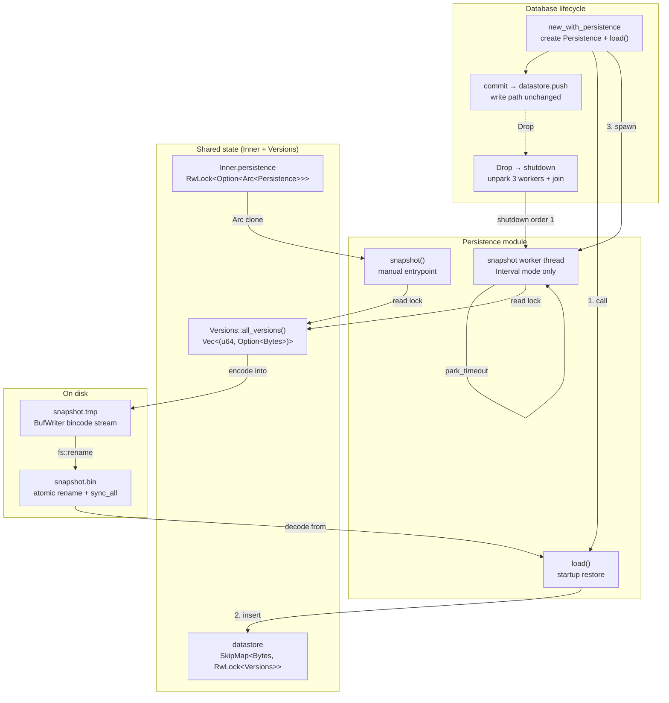
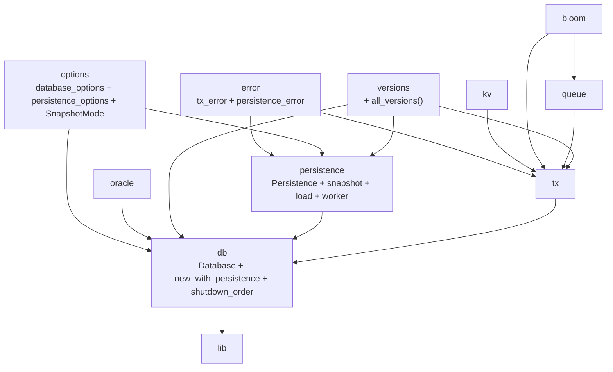

# Stupid-KV 教程：第六节 — 快照持久化：MVCC 内存态到磁盘的全量落地

## 1. 概述

前五节把 stupid-kv 的内存态 MVCC 引擎完整搭了起来：事务提交、SI/SSI 隔离、Bloom 加速冲突检测、commit queue GC、datastore 版本链 GC——但所有状态都在内存里，进程一退出数据全丢。本节迈出持久化的第一步：**全量快照（Snapshot）**。

> 定期把 datastore 中所有 key 的全量版本链用 bincode 序列化到磁盘；重启时从快照文件流式反序列化回内存，让数据库获得「冷启动」能力。

与 WAL（Write-Ahead Log）的「增量追加 + 回放重放」路线不同，快照是「全量转储 + 全量恢复」的经典范式，设计目标更偏向：

- **极简正确性**：快照文件是 datastore 在某一瞬间的只读映像，不涉及未提交事务、不涉及版本合并，写路径几乎零侵入。
- **崩溃恢复无歧义**：使用「临时文件 + atomic rename + `sync_all`」三段式写入协议，任何时刻崩溃要么看见旧快照、要么看见完整新快照，永远不会有半截文件。
- **可控落盘节奏**：两种模式 `Never`（完全手动）与 `Interval(Duration)`（后台周期自动），由调用方在可靠性与写放大之间做权衡。

本节引入的新组件：

- **`Persistence`**（`src/persistence/persistence.rs`）：持久化门面，持有 `Inner` 引用、快照路径、后台开关与快照线程句柄；对外暴露 `snapshot()` 手动接口。
- **`SnapshotMode`** / **`PersistenceOptions`**（`src/options/persistence_options.rs`）：快照模式枚举（Never / Interval）与持久化配置（基础路径、快照路径覆盖）。
- **`PersistenceError`**（`src/error/persistence_error.rs`）：三类错误分类——`Io`（文件系统）、`Serialization`（bincode encode）、`Deserialization`（bincode decode）。
- **`Versions::all_versions()`**（`src/versions/versions.rs`）：把版本链的 `SmallVec<[Version; 4]>` 导出成 `Vec<(u64, Option<Bytes>)>` 供序列化；也是唯一暴露版本链内部结构的口子。
- **`Database::new_with_persistence()`**：新构造函数，串联 `Inner → Persistence::new_with_options → load 恢复 → spawn worker` 四步。

**关键设计目标**

- **原子落盘**：快照写入过程中的任何 IO 失败（磁盘满、断电、权限问题）都不能破坏已有快照文件。
- **流式读写**：大数据库下快照文件可能很大，序列化 / 反序列化必须逐条目进行，不能一次性把整份 datastore 编码到内存缓冲区。
- **后台线程与前两节 GC 线程同构**：`park_timeout` + 双重开关检查 + `unpark` / `join` shutdown，保持认知负担一致。
- **无侵入写路径**：快照读 datastore 只拿 `entry.value().read()` 共享读锁，不阻塞事务提交；事务提交也不影响快照线程。
- **版本链原样导出**：不做合并、不丢历史——加载后 MVCC 读 `fetch_version(v)` 的可见性语义与落盘前严格一致。

---

## 2. 整体架构变化



新增文件一览：

| 文件 | 作用 |
|------|------|
| `src/persistence/mod.rs` | persistence 模块入口，重新导出 `Persistence` 公共项 |
| `src/persistence/persistence.rs` | 快照核心：`snapshot` / `load` / `spwan_snapshot_worker` / `Drop` |
| `src/error/persistence_error.rs` | `PersistenceError` 三分类：Io / Serialization / Deserialization |
| `src/options/persistence_options.rs` | `SnapshotMode` 枚举 + `PersistenceOptions` 结构体 + builder |

既有模块的字段扩展：

| 结构 | 新字段 | 类型 | 作用 |
|------|--------|------|------|
| `Database` | `persistence` | `Option<Persistence>` | 持有持久化实例；None 表示纯内存运行 |
| `Inner` | `persistence` | `RwLock<Option<Arc<Persistence>>>` | 从 Inner 侧也能拿到 Persistence 引用；双 Arc 链路 |
| `Versions` | (方法) `all_versions` | `→ Vec<(u64, Option<Bytes>)>` | 序列化唯一导出接口 |

`Cargo.toml` 新增依赖：

```toml
bincode = { version = "2.0.1", features = ["serde"] }
bytes = { version = "1.11.1", features = ["serde"] }
smallvec = { version = "1.15.1", features = ["serde"] }  # 复用，不是新加但需要 serde feature
```

---

## 3. 快照格式与序列化协议

### 3.1 文件结构

快照文件是**连续的 bincode 二进制条目流**，没有文件头、没有校验和、没有长度前缀：

```
[ entry_0 ][ entry_1 ][ entry_2 ] ... [ entry_N ]
   ↑           ↑
   bincode((Bytes, Vec<(u64, Option<Bytes>)>))
```

每个 `entry` 由 `(key, versions)` 二元组构成：

```rust
// snapshot() 端编码
for entry in self.inner.datastore.iter() {
    let versions = entry.value().read().all_versions();
    if !versions.is_empty() {
        bincode::serde::encode_into_std_write(
            &(entry.key().clone(), versions),   // (Bytes, Vec<(u64, Option<Bytes>)>)
            &mut writer,
            config::standard(),
        )?;
    }
}

// load() 端解码 — 类型必须严格对称
type Entry = (Bytes, Vec<(u64, Option<Bytes>)>);
let result: Result<Entry, _> = bincode::serde::decode_from_std_read(&mut reader, config::standard());
```

**为什么没有文件头**：启动时恢复不是「读元信息 → 预分配 → 批量加载」模式，而是简单的流式逐条解码；空文件（0 字节）也是合法的（空数据库，与第一次运行等价）。调用方只需用 `metadata.len() > 0` 先判断一下。

### 3.2 bincode `config::standard()` 的含义

| 配置项 | 值 | 影响 |
|--------|----|------|
| 整数编码 | Varint | `u64` 版本号小值占 1 字节，节省空间 |
| 字节序 | 原生（Native） | 同机写入同机读取，不跨架构；性能最优 |
| 长度限制 | 无限制 | 大 key / 大 value 不受固定上限限制 |
| `trailing_bytes` | Allow | 文件末尾的任何非 Entry 字节都会被当作「残留 + UnexpectedEof」处理 |

跨架构迁移（ARM 小端 → x86 小端没问题；大端机极少见）会出问题——但 stupid-kv 教程定位不涉及跨机快照交换，这个 tradeoff 合理。

### 3.3 `Versions::all_versions()` 的导出契约

```rust
pub(crate) fn all_versions(&self) -> Vec<(u64, Option<Bytes>)> {
    self.inner
    .iter()
    .map(|v| (v.version, v.value.clone()))
    .collect()
}
```

它在 `Versions` 的 4 个外部可见接口中是唯一能暴露内部结构的：

| 接口 | 返回 | 用途 |
|------|------|------|
| `fetch_version(v)` | `Option<Bytes>` | 事务读路径：按快照版本取可见值 |
| `exists_version(v)` | `bool` | 事务 exists 检查 |
| `gc_older_versions(v)` | `usize` | 版本 GC：就地压缩 |
| `all_versions()` | `Vec<(u64, Option<Bytes>)>` | 仅快照序列化用；版本链按 `version` 升序，与 `push` 后顺序一致 |

调用方必须在 `RwLock<Versions>` 的**读锁**保护下调用它；因为返回的是 `Clone` 出来的独立 `Vec`，锁释放后数据仍然有效，不与后续写入竞争。

---

## 4. 原子落盘：snapshot() 的三段式协议

```rust
pub fn snapshot(&self) -> Result<(), PersistenceError> {
    let temp_path = self.snapshot_path.with_extension(".tmp");
    
    let result = || -> Result<(), PersistenceError> {
        // 1. 建临时文件，BufWriter 包装
        let file = File::create(&temp_path)?;
        let mut writer = BufWriter::new(file);

        // 2. 遍历 datastore，逐条 bincode encode
        for entry in self.inner.datastore.iter() {
            let versions = entry.value().read().all_versions();
            if !versions.is_empty() {
                bincode::serde::encode_into_std_write(
                    &(entry.key().clone(), versions),
                    &mut writer,
                    config::standard(),
                )?;
            }
        }

        writer.flush()?;     // 3. BufWriter → OS PageCache

        // 4. 原子 rename：tmp → 正式路径
        fs::rename(&temp_path, &self.snapshot_path)?;

        // 5. sync_all：把 PageCache → 磁盘 platter
        {
            let final_file = File::open(&self.snapshot_path)?;
            final_file.sync_all()?;
        }

        Ok(())
    }();

    if result.is_err() {
        let _ = fs::remove_file(&temp_path);   // 失败清理
    }
    result
}
```

### 4.1 为什么要「tmp → rename → sync」三步

| 步骤 | 目的 | 崩溃后的后果 |
|------|------|------------|
| `File::create(.tmp)` | 在单独的临时文件上写，不触碰已有快照 | 崩溃 → 留一个半截 `.tmp`；下次启动 `load()` 只认 `snapshot.bin`，完全不受影响 |
| `writer.flush()` | 把 `BufWriter` 的 8KB 用户态 buffer 全部刷进 OS 内核的 PageCache | 崩溃 → tmp 文件可能不完整，但不污染正式快照 |
| `fs::rename(tmp, final)` | POSIX rename 对同文件系统下的目标是**原子替换**：要么 final 仍指向旧 inode，要么指向新 inode，没有中间态 | 崩溃 → 要么用旧快照（数据略旧但一致），要么用新快照（完整） |
| `final_file.sync_all()` | 通知文件系统把刚 rename 过来的新文件的 data + metadata **真正 flush 到磁盘** | 崩溃 → 若 sync_all 完成前断电，rename 后实际 data 还在 PageCache 里没落盘，下次读到的文件有可能是「新 inode + 半截 data」。sync_all 封死这最后一个窗口 |

### 4.2 `sync_all` 为什么要 `File::open` 一次

`fs::rename` 返回成功后，我们手上的 `writer` 对应的文件句柄已经是「已 rename、但句柄仍指向原来的 tmp inode（即现在的 final inode）」——理论上可以直接 `file.sync_all()`。但由于 Rust 中 `BufWriter::into_inner()` 之后拿回的原 `File` 所有权在闭包里的局部变量上，用 `File::open` 重新打开更清晰，也不依赖 `BufWriter` 内部状态，少一个出错维度。

### 4.3 并发一致性（Snapshot Isolation 的"快照"）

`snapshot()` 拿的是 datastore 每个 key 的 **`entry.value().read()` 共享读锁**，不是全局锁。这意味着：

```text
snapshot 线程按 SkipMap 升序扫 key：
    [k1 读锁 → 读取 k1 版本链 状态 A]
    [k2 读锁 → 读取 k2 版本链 状态 B]
    ...
与此同时 TX 可能在 snapshot 已经读过 k1 之后才修改 k1，
但 snapshot 已经读到的 k1 仍保持 A 状态。
```

最终快照文件不是某一瞬间的「全局一致点」，而是**每个 key 各自某一瞬间的版本链**。但这不影响正确性：重启后所有数据都来自「某一时刻或之后」的提交，MVCC 读通过 `oracle.current_time_ns()` 取新快照版本，所有落盘的版本 `v` 都小于重启后的新快照版本——不存在"可见性回退"。若要严格全局一致，需要在 snapshot 开始前阻塞提交（拿全局写锁），这对教程阶段的简单性目标是过度设计。

---

## 5. 启动恢复：load() 的流式解码

```rust
fn load(&self) -> Result<(), PersistenceError> {
    if self.snapshot_path.exists() {
        let file = File::open(&self.snapshot_path)?;
        let metadata = file.metadata()?;
        if metadata.len() > 0 {
            let mut reader = BufReader::new(file);
            let mut count = 0;
            loop {
                count += 1;
                tracing::trace!("load snapshot entry {}", count);

                type Entry = (Bytes, Vec<(u64, Option<Bytes>)>);
                let result: Result<Entry, _> = bincode::serde::decode_from_std_read(
                    &mut reader,
                    config::standard(),
                );

                match result {
                    Ok((k, versions)) => {
                        if !versions.is_empty() {
                            let mut entries = Versions::new();
                            for (version, value) in versions {
                                entries.push(Version { version, value });
                            }
                            self.inner.datastore.insert(k, RwLock::new(entries));
                        }
                    }
                    Err(e) => match e {
                        bincode::error::DecodeError::Io { inner, .. }
                            if inner.kind() == std::io::ErrorKind::UnexpectedEof =>
                        {
                            break;   // 正常文件结束
                        }
                        e => return Err(PersistenceError::Deserialization(e)),
                    },
                }
            }
        }
    }
    Ok(())
}
```

### 5.1 结束条件：`UnexpectedEof`

bincode 的 `decode_from_std_read` 在底层 `Read` 返回 `Ok(0)`（无可读字节）时，会包装成 `DecodeError::Io { inner: Error(UnexpectedEof), .. }` 返回。这不是错误——它恰好表示"条目流读完了"。

```text
正常文件: [entry_0][entry_1]...[entry_N] EOF
                 ↑ bincode 解码完 entry_N，下一次读就是 0 字节 → UnexpectedEof → break
损坏文件: [entry_0][半截 entry_1] EOF
                 ↑ decode entry_1 时需要更多字节，但遇到 EOF → 不是 UnexpectedEof 的 Io 包装
                   → 匹配失败 → 返回 Deserialization 错误
```

### 5.2 `Versions::push` 的语义保留

`load()` 不直接构造 `Versions { inner: SmallVec::from_vec(..) }`，而是每条 `(version, value)` 都调 `entries.push(Version {..})`。这是故意的：

- 因为 `push` 内部有 fast-path 去重（相邻相同 version / 相同 value 会合并或忽略）；
- 保证加载后的版本链与在线写入后的版本链满足同一不变式（无重复 version、无相邻相同 value 的冗余 entry）；
- 若未来 `push` 增加了校验或统计逻辑，加载路径自动继承，不需要两份维护。

### 5.3 `versions.is_empty()` 的两层过滤

- **编码端**过滤：`all_versions()` 可能返回空 Vec？实际上不会——因为编码前已经 `entry.value().read().all_versions()` 判了 `if !versions.is_empty()`，空的 `Versions`（tombstone GC 之后整条链空但 entry 还没被 `run_gc_full` 摘除的瞬态）不会落盘。
- **解码端**再判一次：防御性编程，任何未来的格式变化都不会往 datastore 里塞一个空 `Versions` 占一个 `SkipMap` 节点 + 一个 `RwLock`。

---

## 6. 后台快照线程：spwan_snapshot_worker

```rust
fn spwan_snapshot_worker(&self) {
    if self.snapshot_mode == SnapshotMode::Never {
        return;
    }
    let SnapshotMode::Interval(interval) = self.snapshot_mode else {
        return;
    };

    if self.snapshot_handle.read().is_none() {
        let inner = self.inner.clone();
        let snapshot_path = self.snapshot_path.clone();
        let enable = self.background_threads_enabled.clone();
        let handle = thread::spawn(move || {
            while enable.load(Ordering::Acquire) {
                thread::park_timeout(interval);

                if !enable.load(Ordering::Acquire) {
                    break;
                }

                // 与手动 snapshot() 完全相同的内部闭包
                let temp_path = snapshot_path.with_extension(".tmp");
                let result = || -> Result<(), PersistenceError> {
                    // ... 同 第 4 节 ...
                }();
                if let Err(e) = result {
                    tracing::error!("snapshot worker error: {:?}", e);
                    let _ = fs::remove_file(&temp_path);
                }
            }
        });
        *self.snapshot_handle.write() = Some(handle);
    }
}
```

### 6.1 与 04 / 05 节 GC 线程的同构

| 特征 | cleanup worker (04) | gc worker (05) | snapshot worker (本节) |
|------|---------------------|----------------|------------------------|
| 休眠原语 | `park_timeout` | `park_timeout` | `park_timeout` |
| 开关 | `inner.background_threads_enabled` | `inner.background_threads_enabled` | `persistence.background_threads_enabled`（独立 Arc） |
| 双重开关检查 | park 后再判一次 | park 后再判一次 | park 后再判一次 |
| shutdown | `store(false) → unpark → join` | `store(false) → unpark → join` | `store(false) → unpark → join` |
| 错误处理 | N/A（纯内存操作不出错） | N/A（纯内存操作不出错） | `tracing::error!` + 清理 `.tmp` |

三个后台线程的认知模型完全一致，学习曲线平滑。snapshot worker 用独立的 `background_threads_enabled: Arc<AtomicBool>` 而不是复用 `Inner` 的那个，是因为 `Persistence` 可以被单独构造（绕过 `Database::new_with_persistence`），此时 `Inner` 可能不存在、或者生命周期不同步。`Database::shutdown` 中两个开关会分别关闭。

### 6.2 `SnapshotMode::Interval(interval)` 的解构

```rust
let SnapshotMode::Interval(interval) = self.snapshot_mode else { return; };
```

这是 Rust 1.65+ 的 let-else 语法，等价于：

```rust
let interval = match self.snapshot_mode {
    SnapshotMode::Interval(i) => i,
    _ => return,
};
```

配合前面的 `if self.snapshot_mode == SnapshotMode::Never` 判一次，看似重复，但：

- `SnapshotMode` 是 `#[derive(PartialEq, Eq)]` 的，`==` 对 Never 变体可以直接比较；
- 但对 `Interval(Duration)` 这种带数据的变体，你没法 `== Interval(any)`，必须用模式解构把 `interval` 拿出来。
- 所以流程上是 "Never 直接 return；否则尝试解构 Interval；解构不出就 return"。未来如果加第三种模式（如 `OnCommit { threshold: u64 }` 每 N 次提交快照一次），let-else 自然 return，不用改。

---

## 7. Database 集成：new_with_persistence 与 shutdown 顺序

### 7.1 构造函数

```rust
pub fn new_with_persistence(
    opts: DatabaseOptions,
    persistence_opts: PersistenceOptions,
) -> std::io::Result<Self> {
    let inner = Arc::new(Inner::new(&opts));

    // 1. Persistence::new_with_options 内部会 load() 恢复快照
    let persist = Persistence::new_with_options(persistence_opts, inner.clone())
        .map_err(std::io::Error::other)?;

    // 2. Inner 里也存一份 Arc<Persistence>，便于从 Inner 侧调用
    inner.persistence.write().replace(Arc::new(persist.clone()));

    let db = Database {
        inner,
        cleanup_interval: opts.cleanup_interval,
        gc_interval: opts.gc_interval,
        gc_full_scan_frequency: opts.gc_full_scan_frequency,
        persistence: Some(persist),
    };

    // 3. 恢复完再启 GC 线程；否则 GC 可能把 load 进来、但还没启动事务引用的旧版本一口气清掉
    if opts.enable_cleanup {
        db.intialise_cleanup_worker();
    }
    if opts.enable_gc {
        db.initialise_garbage_worker();
    }

    Ok(db)
}
```

**第 3 步的顺序为什么重要**：`Persistence::new_with_options` 内部是 `load() → spwan_snapshot_worker()`，**不启动 commit queue / 版本 GC**。这两个 GC 线程必须在 `load()` 之后再启，因为：

- 版本 GC 会算 `cleanup_ts = min(now, earliest_active, oracle_now)`；刚 load 完还没有任何活跃事务注册 counter，`earliest_active = now`，水位线直接压到现在，load 进来的旧版本会被 GC 当作"没人看"直接收走。
- 启动事务后事务会注册 counter，GC 看见 `earliest_active < load_进来的最老 version`，就不会误收。

换句话说：**load 完成、构造完 Database、GC 线程启动之后——才是对外暴露能开事务的安全点**。

### 7.2 Shutdown 顺序

```rust
fn shutdown(&self) {
    // 第一关：先关 snapshot worker（最早动 inner.persistence 的线程）
    {
        if let Some(ref persistence) = self.persistence {
            persistence.background_threads_enabled.store(false, Ordering::Release);
            if let Some(handle) = persistence.snapshot_handle.write().take() {
                handle.thread().unpark();
                let _ = handle.join();
            }
        }
    }

    // 第二关：再关两个 GC 线程（操作 datastore / commit_queue 的）
    self.background_threads_enabled.store(false, Ordering::Relaxed);
    {
        if let Some(handle) = self.transaction_cleanup_handle.write().take() {
            handle.thread().unpark();
            let _ = handle.join();
        }
        if let Some(handle) = self.garbage_collection_handle.write().take() {
            handle.thread().unpark();
            let _ = handle.join();
        }
    }
}
```

顺序语义：**先关快照（读线程），再关 GC（写线程）**。如果反过来先关 GC，snapshot worker 可能还在读 versions 链时 GC 线程的写锁持有者已析构——不会出 UB（有锁保护），但 snapshot 生成到一半可能看到版本链被 GC 裁了一截，导致快照不完整。先关 snapshot，join 返回后再关 GC，保证最后一张快照（如果线程恰好在跑）在它读的那一刻看到的版本链是完整的。

### 7.3 `Drop for Persistence` 兜底

```rust
impl Drop for Persistence {
    fn drop(&mut self) {
        self.background_threads_enabled.store(false, Ordering::Release);
        // Database::shutdown 已经抢先把 handle 设为 None 并 join 过，通常这里的 take() 拿到 None
        if let Some(handle) = self.snapshot_handle.write().take() {
            handle.thread().unpark();
            let _ = handle.join();
        }
    }
}
```

这对应 persistence.rs 第 237-238 行的注释：「database::shutdown 会抢先关闭 snapshot_handle 线程」。因为 `Database.persistence` 是 `Option<Persistence>`（值类型，不是 Arc），`Database::drop → shutdown` 先执行，此时 snapshot worker 已经 join 完、handle 已被 take 出置 None，`Drop for Persistence` 里的 take 就是空的兜底路径。

但如果调用方绕开 `Database`，直接 `let p = Persistence::new_with_options(..);` 使用，`Database::shutdown` 就不会跑，`Drop for Persistence` 是关闭线程的唯一保障——双保险设计。

---

## 8. PersistenceError：三类错误与 thiserror 派生

```rust
#[derive(Debug, Error)]
pub enum PersistenceError {
    #[error("IO error: {0}")]
    Io(#[from] IoError),

    #[error("Serialization error: {0}")]
    Serialization(#[from] BincodeEncodeError),

    #[error("Deserialization error: {0}")]
    Deserialization(#[from] BincodeDecodeError),
}
```

和 `TxError` 纯业务语义分类不同，`PersistenceError` 三分类对应快照生命周期的三个阶段：

| 变体 | 触发时机 | 典型根因 |
|------|---------|---------|
| `Io` | 文件 `create / open / rename / remove / sync_all / metadata` | 磁盘满、权限不足、跨文件系统 rename 失败、父目录不存在 |
| `Serialization` | `encode_into_std_write` 期间 | `Bytes` 过长触发 bincode 内部 limit（当前配置无 limit 不会出）；底层 BufWriter 刷盘时磁盘故障 |
| `Deserialization` | `decode_from_std_read` 期间，**且不是 UnexpectedEof** | 快照文件损坏（被截断、手动编辑）；跨平台 native 字节序不兼容；bincode 版本升级 breaking change |

`#[from]` 让 `?` 可以在 `snapshot()` 的闭包中无缝把三种底层错误包上来，不用手动 `map_err`。注意 `Database::new_with_persistence` 中把 `PersistenceError` 再转成 `std::io::Error` 是因为 `std::io::Result<Self>` 的签名要求：对外给调用方一个稳定、不依赖本库内部 error 类型的 IO 结果。

---

## 9. 关键设计权衡

| 决策 | 优点 | 缺点 |
|------|------|------|
| **全量快照而非 WAL** | 实现极简、恢复无需回放、写路径零侵入；版本链原样保存 | 大数据库写放大高（每次全量重写）；两次快照之间的提交崩溃会丢 |
| **连续 bincode 流 + UnexpectedEof 作 EOF 标记** | 无文件头、无校验和编码成本、真正流式 O(1) 内存解码 | 文件损坏只能靠 bincode 自己的解码错误发现，无 CRC 校验；跨 native 字节序不可移植 |
| **tmp + rename + sync_all 三段式** | POSIX 保证 rename 原子；sync_all 封死 PageCache → 磁盘的最后窗口；旧快照绝不被半写入污染 | 同文件系统才原子 rename（跨 FS 要 `copy + remove` 改写）；sync_all 对大盘是串行化阻塞点 |
| **版本链全量导出不合并** | 重启后 MVCC 可见性语义精确一致；不需要设计"哪些版本需要保留"的规则 | 快照文件可能包含大量历史版本，体积偏大；可以在 `all_versions()` 之前先做一次"到当前版本为止的安全压缩"（当前没做，留作后续优化） |
| **后台 worker 用独立开关 + 独立 Arc** | Persistence 可独立于 Database 使用，生命周期解耦 | 双 Arc + 双 RwLock 路径稍显复杂；Inner.persistence 和 Database.persistence 各拿一份引用 |
| **load() 完再启 GC 线程** | 防止 GC 把 load 进来的未被事务引用的旧版本当垃圾收走 | 构造函数的顺序约束是"隐式不变式"，未来改代码容易误动；需要注释明确文档化 |
| **SnapshotMode 两态设计（Never / Interval）** | 简单、覆盖常见两种使用模式；let-else 易扩展 | 没有 OnCommit / OnShutdown / Manual + Interval 组合；未来加新变体不需要大改 |

---

## 10. 故障模式对比

| 场景 | 纯内存实现（0.0.5） | 快照实现（0.0.6） |
|------|-------------------|-----------------|
| 进程优雅退出 | 数据全部丢失 | 最后一次成功的快照保留；下次启动从快照恢复 |
| 进程崩溃（panic / kill -9） | 数据全部丢失 | 崩溃时刻正在跑的 snapshot：tmp 留半截、正式快照仍是旧的；下次从旧快照恢复 |
| 落盘时磁盘满（ENOSPC） | N/A | `BufWriter flush` 或 `rename` 返回 `Io(ENOSPC)` → 清除 `.tmp`；已有快照完好无损 |
| 快照文件被手动截断 / 破坏 | N/A | `decode_from_std_read` 遇到非 EOF 解码错 → `Err(Deserialization)`，启动失败；调用方可选择删除坏文件重来 |
| 跨文件系统 rename（跨分区部署） | N/A | `fs::rename` 返回 `EXDEV`（Cross-device link）→ `Io` 错误，不会损坏旧快照；调用方应把 `base_path` 放在同 FS |
| 大 key（> 几 MB） | 内存中存着没问题 | bincode 流式直接编码；内存中 `all_versions()` 会 clone 一份 value，极大 value 有内存峰值 |
| 加载后马上有事务读刚 load 进来的老版本 | N/A | GC 线程在 GC 前已有 `earliest_active_version` 检查；事务注册的 counter 会压低水位，版本不会被误收 |
| shutdown 时 snapshot worker 恰好 park_timeout 中 | N/A | `unpark + join` 瞬时唤醒，线程检查开关退出，最长等待 = `park_timeout` 醒来一次再判开关（不超过 interval） |

---

## 11. 模块依赖图（更新）



新依赖边：
- `options → persistence`：`SnapshotMode` 与 `PersistenceOptions` 由 persistence 消费
- `versions → persistence`：`Versions::all_versions()` 是快照序列化的导出接口
- `error → persistence`：`PersistenceError` 三类分类（Io / Ser / De）
- `persistence → db`：`Database` 持有 `Option<Persistence>`，Inner 持有 `Option<Arc<Persistence>>`

---

## 12. 总结

本节把 stupid-kv 从「纯内存 MVCC 引擎」推到了「有持久化能力的 KV 数据库」的第一级台阶。核心不是引入了多么复杂的持久化算法，而是**把工程正确性上的几个基本关扎扎实实把住了**：

- **原子落盘**：`tmp → rename → sync_all` 三段式，保证旧快照不被半截写入污染，任何崩溃点要么看到旧快照、要么看到完整新快照。
- **流式 IO**：`encode_into_std_write` / `decode_from_std_read` 配对使用，让快照文件大小不依赖内存，真正做到"能放磁盘就能放内存就放磁盘就能恢复"（在内存够用的前提下）。
- **后台线程三兄弟同构**：`park_timeout` + 双重开关 + `unpark` / `join`，snapshot worker 与前两节的两个 GC worker 在生命周期管理上完全同构，保持了代码库的一致性。
- **启动顺序 / Shutdown 顺序**：load 先于 GC 线程、snapshot 关闭先于 GC 关闭——两处顺序约束封住了「版本被误收」和「快照读到半截版本链」的两个窗口期。
- **错误分类**：Io / Serialization / Deserialization 三分了快照生命周期的三类失败，调用方可以分别针对处理（如反序列化错删快照重来、IO 错打告警、序列化错查磁盘）。

这条全量快照路线的下一步自然延伸有两个方向：

1. **WAL（Write-Ahead Log）**：把两次快照之间的写入追加到日志文件，崩溃恢复时"加载快照 + 回放日志尾巴"，把"崩溃丢失窗口"从 snapshot interval 缩小到 WAL fsync 的粒度。
2. **快照格式加固**：加文件头（Magic + Version + CRC32 目录校验）、加条目级 checksum、改用网络字节序让快照跨架构可交换——让快照文件从「同机、同版本、同二进制」内可靠，变成真正可归档、可迁移的稳定格式。

到本节为止，stupid-kv 已经具备了：并发事务（001）→ SSI + Bloom（002）→ 运行时加固（003）→ commit queue GC（004）→ 版本历史 GC（005）→ 全量快照持久化（006）的完整闭环，是一个能在生产环境之外「真的用起来」的 Rust MVCC KV 原型了。
