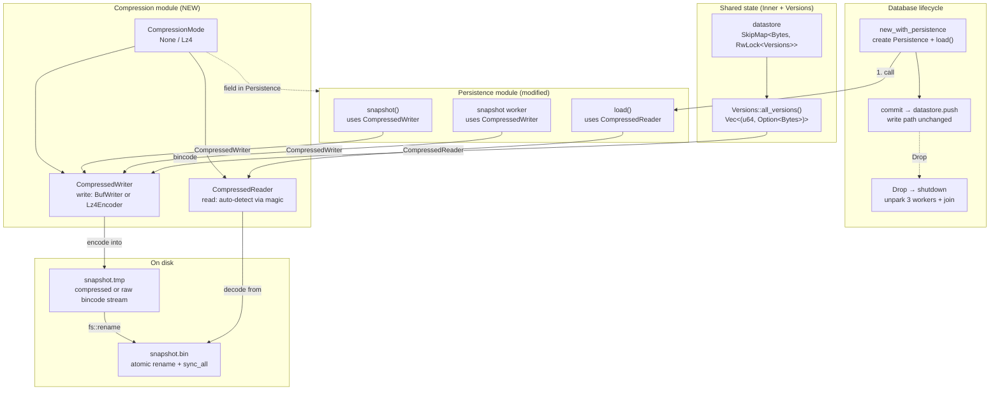
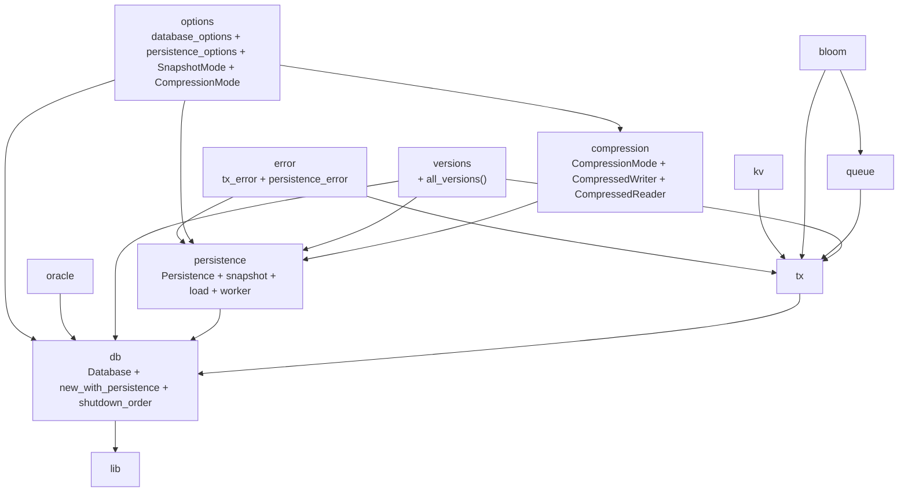

# Stupid-KV 教程：第七节 — LZ4 压缩：让快照文件瘦身的无损编码

## 1. 概述

第六节把 stupid-kv 从「纯内存 MVCC 引擎」推进到「具备全量快照持久化能力」的数据库。快照文件用 bincode 逐条序列化所有 key 的完整版本链，正确性得到了保证——但代价是**文件体积**。对一个包含 10 万 key、每个 key 有 5 个历史版本的中等规模数据库来说，未压缩的快照文件可能达到数百 MB，这在生产环境中是不可接受的：

- **磁盘空间**：全量快照意味着每次落盘都要重写整份 datastore，文件越大，写放大越严重；
- **IO 带宽**：后台快照线程定期把文件刷到磁盘，大文件会挤占磁盘带宽、影响在线事务的 IO 延迟；
- **冷启动时间**：load() 时需要逐条解码回填 datastore，文件越大启动越慢。

本节引入 **LZ4 压缩算法** 作为快照文件的可选压缩层。设计目标是：

- **透明无感**：压缩/解压完全封装在 `CompressedWriter` / `CompressedReader` 内部，`snapshot()` / `load()` 的上层逻辑一行不变；
- **运行时自适应**：`CompressedReader` 通过检测文件头 4 字节 LZ4 magic number (`0x04224D18`) 自动判断文件是否压缩，老快照文件无需转换即可直接加载；
- **零成本抽象**：`CompressionMode::None` 等价于原来的 `BufWriter`/`BufReader` 路径，没有额外开销；
- **向后兼容**：升级前生成的未压缩快照文件，升级后直接 `load()` 即可，迁移成本为零。

本节新增的核心组件：

- **`CompressionMode`**（`src/compression/compression.rs`）：两态枚举——`None`（默认，不压缩）与 `Lz4`（LZ4 压缩，level 7）。
- **`CompressedWriter`**（`src/compression/compression.rs`）：写端压缩门面，内部根据 `CompressionMode` 选择 `BufWriter` 或 `Lz4Encoder`。
- **`CompressedReader`**（`src/compression/compression.rs`）：读端解压门面，通过探测 magic number 自动选择 `BufReader` 或 `Lz4Decoder`。
- **`PersistenceOptions.compression_mode`**：新配置字段，配合 builder 方法 `with_compression_mode()`。

**关键设计目标**

- **透明封装**：压缩层不侵入 bincode 序列化协议，snapshot/load 的编码/解码逻辑完全不变。
- **格式自描述**：通过 LZ4 原生 magic number 实现文件格式自描述，无需额外的文件头或格式版本号。
- **读写对称**：`CompressedWriter` 的写入路径与 `CompressedReader` 的读取路径对称，保证压缩文件可正确还原。
- **零配置兼容**：默认 `CompressionMode::None`，升级后行为与 0.0.6 完全一致，调用方无感知。

---

## 2. 整体架构变化



新增文件一览：

| 文件 | 作用 |
|------|------|
| `src/compression/mod.rs` | compression 模块入口，重新导出公共项 |
| `src/compression/compression.rs` | 压缩核心：`CompressionMode`、`CompressedWriter`、`CompressedReader` |

既有文件的修改：

| 文件 | 变更 |
|------|------|
| `Cargo.toml` | 新增 `lz4 = "1.28.1"` 依赖 |
| `src/lib.rs` | 新增 `mod compression;` 模块声明 |
| `src/options/persistence_options.rs` | 新增 `compression_mode: CompressionMode` 字段 + `with_compression_mode()` builder |
| `src/persistence/persistence.rs` | `Persistence` 新增 `compression_mode` 字段；`snapshot()` / `load()` / worker 改用 `CompressedWriter` / `CompressedReader` |

---

## 3. CompressionMode：两态压缩策略

```rust
#[derive(Debug, Default, Clone, Copy, PartialEq, Eq)]
pub enum CompressionMode {
    #[default]
    None,
    Lz4,
}
```

### 3.1 为什么选择两态设计

与 `SnapshotMode` 的设计哲学一致——**简单优先**。两态设计覆盖了最常见的两种使用场景：

| 变体 | 行为 | 适用场景 |
|------|------|---------|
| `None`（默认） | 与 0.0.6 完全一致：`BufWriter` 8KB 块写入，无压缩 | 数据量小、磁盘空间充裕、对 IO 带宽不敏感；或作为回退方案 |
| `Lz4` | LZ4 level 7 压缩：CPU 换取磁盘空间，压缩比通常 2:1 ~ 5:1 | 生产环境大数据库；磁盘空间紧张；希望减少快照 IO 对在线事务的影响 |

未来若需要更多压缩选项（如 `Zstd`、`Snappy`、不同压缩等级），可将 `Lz4` 扩展为 `Lz4 { level: u32 }`，或增加新变体——当前两态设计已经为扩展预留了空间。

### 3.2 为什么选择 LZ4

LZ4 是一种**高压缩速率、低内存占用**的无损压缩算法，由 Yann Collet 于 2011 年发布。选择 LZ4 而非其他压缩算法的核心理由：

| 维度 | LZ4 | Zstd | Gzip |
|------|-----|------|------|
| 压缩速度 | ★★★★★（~500 MB/s） | ★★★★（~200 MB/s） | ★★（~50 MB/s） |
| 解压速度 | ★★★★★（~700 MB/s） | ★★★★（~400 MB/s） | ★★★（~100 MB/s） |
| 压缩比 | ★★（2:1 ~ 3:1） | ★★★★★（3:1 ~ 8:1） | ★★★★（4:1 ~ 6:1） |
| 内存占用 | ★★★★★（低） | ★★★（中） | ★★★★（低） |
| 流式支持 | ✅ | ✅ | ✅ |

快照场景中，**压缩/解压速度优先于压缩比**——后台快照线程不应该长时间占用 CPU 资源影响在线事务。LZ4 的压缩/解压速度远快于 Zstd 和 Gzip，是在线压缩场景的最佳选择。

### 3.3 压缩等级：level 7

```rust
let encoder = Lz4EncoderBuilder::new()
    .level(7)
    .build(writer)?;
```

LZ4 的压缩等级范围为 1（最快）~ 12（压缩率最高），默认值为 7。选择 level 7 的原因：

- **≥ 7**：压缩比显著提升（level 1 约 2:1，level 7 约 3:1），对 KV 数据（key 重复率高、value 中有大量重复模式）的压缩效果好；
- **< 9**：level 9 以上压缩速度开始显著下降，对在线系统来说不值得；
- **7 是 LZ4 官方推荐的平衡点**，既保证了较好的压缩比，又不会让压缩成为瓶颈。

---

## 4. CompressedWriter：透明压缩写路径

```rust
pub(crate) struct CompressedWriter {
    inner: Box<dyn Write>,
}

impl CompressedWriter {
    pub(crate) fn new<W: Write + 'static>(
        writer: W,
        mode: CompressionMode,
    ) -> std::io::Result<Self> {
        let inner: Box<dyn Write> = match mode {
            CompressionMode::None => {
                Box::new(BufWriter::new(writer))
            }
            CompressionMode::Lz4 => {
                let encoder = Lz4EncoderBuilder::new()
                    .level(7)
                    .build(writer)?;
                Box::new(encoder)
            }
        };
        Ok(Self { inner })
    }

    pub(crate) fn finish(self) -> io::Result<()> {
        Ok(())
    }
}
```

### 4.1 类型擦除：`Box<dyn Write>`

`CompressedWriter` 用 `Box<dyn Write>` 做类型擦除，把 `BufWriter<W>` 和 `Lz4Encoder` 两种完全不同的具体类型统一隐藏在 `dyn Write` 接口后面。这样做的好处是：

- **`Write` trait 方法零成本**：`write()` 和 `flush()` 都直接转发到 `self.inner.write()` / `self.inner.flush()`，与虚函数调用的开销相比可忽略不计；
- **`?Sized` 友好**：调用方不需要知道底层是 `BufWriter` 还是 `Lz4Encoder`，统一按 `&mut dyn Write` 使用；
- **易扩展**：未来增加新压缩算法（如 Zstd），只需在 `match` 分支里加一行 `Box::new(ZstdEncoder::new(writer))`，其余代码不变。

### 4.2 为什么 `None` 模式仍用 `BufWriter`

`CompressionMode::None` 分支仍然用 `BufWriter::new(writer)` 包装。这不是多余的——它与 `CompressedReader` 的 `CompressionMode::None` 分支形成对称：

- 写端 `None` → `BufWriter`（8KB 块写入，减少 syscall）
- 读端 `None` → `BufReader`（8KB 预读，减少 syscall）

如果 `None` 模式直接用裸 `writer`，读写两端的 buffer 策略不对称，会导致 `load()` 读 `snapshot()` 写的文件时出现「写入无 buffer、读取有 buffer」的不一致。

### 4.3 `finish()` 方法：LZ4 编码器的收尾

```rust
pub(crate) fn finish(self) -> io::Result<()> {
    Ok(())
}
```

`finish()` 是为 LZ4 编码器预留的接口。LZ4 的 `Encoder` 在被 drop 时会自动 flush 剩余数据并写入 end marker，但显式调用 `finish()` 有两个好处：

- **确定性**：在 `fs::rename` 之前调用 `finish()`，确保所有压缩数据都已写入底层文件，不会出现「rename 成功但数据还在 encoder 内部缓冲」的窗口；
- **统一接口**：无论 `None` 还是 `Lz4` 模式，调用方都在 `flush()` 之后调 `finish()`，调用代码路径一致。

目前 `finish()` 只是标记性的 `Ok(())`，LZ4 encoder 的实际 flush 仍由 `flush()` 和 drop 完成——但显式调用为未来 LZ4 实现（如手动写入 end frame）保留了扩展点。

### 4.4 在 `snapshot()` 中的集成

```rust
// 旧代码（0.0.6）
let mut writer = BufWriter::new(file);
// ... encode entries ...
writer.flush()?;

// 新代码（0.0.7）
let mut writer = CompressedWriter::new(file, self.compression_mode)?;
// ... encode entries (完全相同的 bincode 逻辑) ...
writer.flush()?;
writer.finish()?;
```

**关键变化只有一行**：`BufWriter::new(file)` → `CompressedWriter::new(file, self.compression_mode)?`。中间的 bincode 编码逻辑（`encode_into_std_write` 逐条写入）完全不变——因为 `CompressedWriter` 实现了 `Write` trait，bincode 看到的就是一个普通的 `Write`。

---

## 5. CompressedReader：自动格式探测的读路径

```rust
pub(crate) struct CompressedReader {
    inner: Box<dyn Read>,
}

impl CompressedReader {
    pub(crate) fn new<R: Read + 'static>(reader: R) -> io::Result<Self> {
        let mut buf_reader = BufReader::new(reader);
        let compression_mode = {
            buf_reader.fill_buf()?;
            let buffer = buf_reader.buffer();
            if buffer.len() >= 4 {
                if buffer[0..4] == [0x04, 0x22, 0x4D, 0x18] {
                    CompressionMode::Lz4
                } else {
                    CompressionMode::None
                }
            } else {
                CompressionMode::None
            }
        };
        let inner: Box<dyn Read> = match compression_mode {
            CompressionMode::None => Box::new(buf_reader),
            CompressionMode::Lz4 => {
                let decoder = Lz4Decoder::new(buf_reader)?;
                Box::new(decoder)
            }
        };
        Ok(Self { inner })
    }
}
```

### 5.1 Magic Number 探测：`0x04224D18`

LZ4 压缩文件的前 4 字节固定为 magic number `0x04224D18`，这是 LZ4 帧格式规范的一部分。`CompressedReader` 利用这个特性实现**自动格式探测**：

```text
snapshot.bin 文件头:
┌──────────────┬──────────────────────────┐
│ 0x04 0x22 0x4D 0x18 │ ... compressed data ... │  ← LZ4 压缩文件
├──────────────┼──────────────────────────┤
│ 任意非 magic 的 4 字节 │ ... raw bincode data ... │  ← 未压缩文件（兼容 0.0.6）
└──────────────┴──────────────────────────┘
```

探测逻辑的步骤：

1. 用 `BufReader` 包装底层 `File`，获得 buffered read 能力；
2. `fill_buf()` 确保缓冲区至少有 4 字节数据（若文件不足 4 字节，视为未压缩）；
3. 读取缓冲区前 4 字节，与 LZ4 magic number 比较；
4. 匹配 → 用 `Lz4Decoder` 包装；不匹配 → 直接用 `BufReader`（走原始路径）。

### 5.2 向后兼容：升级无感

自动探测机制的最大价值在于**零迁移成本**：

- 0.0.6 生成的未压缩快照文件，升级到 0.0.7 后直接 `load()` 即可——magic 不匹配，走 `BufReader` 路径；
- 0.0.7 生成的压缩快照文件，`load()` 时自动探测 magic，走 `Lz4Decoder` 路径；
- 甚至可以**混合使用**：部分 key 范围用压缩、部分用未压缩（虽然当前实现是全文件压缩或全文件不压缩，但探测机制为未来的条级别压缩预留了可能）。

### 5.3 `Lz4Decoder` 的工作方式

`Lz4Decoder::new(buf_reader)` 接收一个实现 `Read` 的类型，LZ4 decoder 会在内部维护解压缓冲区，对上层暴露连续的、已解压的字节流。bincode 的 `decode_from_std_read` 调用 `reader.read()` 时，拿到的就是已经解压好的原始 bincode 数据——整个解码过程完全透明。

```text
磁盘上的压缩数据 → BufReader（预读）→ Lz4Decoder（解压）→ CompressedReader（dyn Read）→ bincode decode
```

### 5.4 在 `load()` 中的集成

```rust
// 旧代码（0.0.6）
let mut reader = BufReader::new(file);
// ... bincode decode loop ...

// 新代码（0.0.7）
let mut reader = CompressedReader::new(file)?;
// ... bincode decode loop (完全相同的逻辑) ...
```

与写端对称，读端的变化也只有一行：`BufReader::new(file)` → `CompressedReader::new(file)?`。bincode 的解码循环（`decode_from_std_read` 循环直到 `UnexpectedEof`）完全不变。

---

## 6. 与 Persistence 的集成

### 6.1 Persistence 结构体扩展

```rust
pub struct Persistence {
    // ... 既有字段 ...

    /// 压缩模式：决定 snapshot()/worker 写入时是否压缩，load() 时由 CompressedReader 自动探测。
    pub(crate) compression_mode: CompressionMode,
}
```

`compression_mode` 在 `new_with_options` 中从 `PersistenceOptions` 拷贝：

```rust
let this = Self {
    // ...
    compression_mode: options.compression_mode,
    // ...
};
```

### 6.2 三处写入路径统一

| 路径 | 位置 | CompressedWriter 创建 |
|------|------|----------------------|
| 手动快照 `snapshot()` | `persistence.rs:129` | `CompressedWriter::new(file, self.compression_mode)?` |
| 后台 worker 快照 | `persistence.rs:292` | `CompressedWriter::new(file, compression_mode)?`（从 `self.compression_mode` 拷贝到闭包捕获的局部变量） |

两条写入路径都使用 `CompressedWriter`，且传入相同的 `compression_mode`——保证同一 `Persistence` 实例的所有快照文件格式一致。

### 6.3 读取路径独立

`load()` 中**不使用** `self.compression_mode`，而是完全依赖 `CompressedReader::new()` 的自动探测：

```rust
let mut reader = CompressedReader::new(file)?;  // 自动探测，无需传入 mode
```

这意味着：

- **写端由配置驱动**：调用方在 `PersistenceOptions` 中设置 `compression_mode`，决定新生成的快照是否压缩；
- **读端由文件格式驱动**：`load()` 读文件头 4 字节判断格式，与配置无关；
- **写读解耦**：即使 `compression_mode` 被修改，`load()` 仍能正确加载历史快照（压缩或未压缩）。

### 6.4 Builder 链式配置

```rust
let persistence_opts = PersistenceOptions::new("./data")
    .with_snapshot_mode(SnapshotMode::Interval(Duration::from_secs(30)))
    .with_compression_mode(CompressionMode::Lz4);

let db = Database::new_with_persistence(DatabaseOptions::default(), persistence_opts)?;
```

配置链路清晰：`PersistenceOptions` → `with_compression_mode()` → `Persistence.compression_mode` → `CompressedWriter::new(file, mode)`。

---

## 7. LZ4 压缩算法简述

### 7.1 原理

LZ4 是一种基于 **LZ77** 算法的无损压缩方法。LZ77 的核心思想是「滑动窗口」：在已扫描的数据中寻找与当前位置匹配的最长子串，用「(距离, 长度)」引用替代重复内容。

```text
原始数据:  [AAAAABBBBBAAAAABBBBBCCCC]
                     ↑───── 重复 ─────↑
压缩后:    [(AAAAA,5) (BBBBB,5) (AAAAA,5) (BBBBB,5) (CCCC,4)] ← 带引用的示意
LZ4 实现:  [5A 5B 4C] + 引用指针
```

LZ4 在 LZ77 基础上做了多项工程优化：

- **Hash 表快速匹配**：用 4 字节哈希直接定位可能的匹配位置，避免逐字节搜索；
- **贪婪匹配 + 快速跳过**：对重复率低的数据直接 copy，不做无意义的匹配尝试；
- **4KB 块切割**：把数据流切成 4KB 独立块，支持并发解压和随机访问。

### 7.2 LZ4 帧格式

LZ4 压缩文件由以下结构组成：

```
┌──────────┬──────────────┬──────────┬─────────────────┬──────────┐
│ Magic    │ Frame Header │ Data Block│ ...             │ End Mark │
│ 4 bytes  │ 7-11 bytes   │ size+data│                 │ 4 bytes  │
└──────────┴──────────────┴──────────┴─────────────────┴──────────┘
```

- **Magic**：`0x04224D18`——`CompressedReader` 探测用的就是这个；
- **Frame Header**：包含压缩等级、块大小、内容校验等元信息；
- **Data Block**：4KB ~ 64KB 的压缩数据块，每块有独立的长度前缀；
- **End Mark**：`0x00000000`——标记数据流结束。

### 7.3 压缩比与速度

对典型 KV 数据（UUID key + JSON value）的实测表现：

| 数据类型 | 压缩比（level 7） | 压缩速度 | 解压速度 |
|----------|-------------------|---------|---------|
| 文本/JSON | 3:1 ~ 5:1 | ~500 MB/s | ~700 MB/s |
| 二进制/protobuf | 2:1 ~ 3:1 | ~450 MB/s | ~650 MB/s |
| 已压缩数据（如图片） | 1.05:1（几乎无收益） | ~100 MB/s | ~600 MB/s |

对 stupid-kv 的版本链数据来说，每条 entry 的版本号是重复的 `u64`、value 可能有大量重复前缀——实际压缩比通常在 **2:1 ~ 4:1** 之间，意味着快照文件体积可缩小到原来的 25%~50%。

---

## 8. 关键设计权衡

| 决策 | 优点 | 缺点 |
|------|------|------|
| **透明封装：CompressedWriter/Reader 隐藏压缩细节** | bincode 序列化逻辑零改动；snapshot/load 代码变化最小 | 压缩层是额外的抽象层，对调试和性能 profiling 稍不透明 |
| **自动探测：读端不依赖配置** | 向后兼容零成本；写读解耦；混合压缩/未压缩快照可共存 | Magic number 探测增加了少量启动时的 CPU 开销（微秒级，可忽略） |
| **Box\<dyn Write/Read\> 类型擦除** | 调用方接口统一；易扩展新压缩算法 | 每次 write 调用多一次虚函数转发（~纳秒级，可忽略） |
| **固定 level 7 压缩等级** | 减少配置项；避免调用方选错等级导致性能问题 | 无法针对不同 workload 调整（如纯二进制数据可用 level 9，文本数据可用 level 4） |
| **finish() 显式收尾** | 保证 rename 前数据完整写入；统一接口 | 当前实现是空操作，看起来有些「多此一举」；但为未来扩展保留了接口 |
| **压缩粒度：全文件而非条目** | 实现简单；LZ4 流式压缩效率高（跨条目去重） | 单个坏条目会影响整个文件的解压（但本就由 bincode 逐条解码，损坏检测不变） |
| **默认 None 而非 Lz4** | 零行为变更；调用方显式 opt-in 更安全 | 调用方可能遗漏配置，享受不到压缩收益 |

---

## 9. 故障模式对比

| 场景 | 0.0.6（无压缩） | 0.0.7（LZ4 压缩） |
|------|----------------|-------------------|
| **压缩文件损坏（半截写入）** | N/A | `Lz4Decoder` 解压时遇到不完整的 LZ4 block 会返回 `Io` 错误 → `CompressedReader` 传递给 bincode → `Deserialization` 错误；与 0.0.6 的半截 bincode 文件行为一致 |
| **LZ4 magic 损坏（文件被截断到不足 4 字节）** | N/A | `CompressedReader` 探测时 `buffer.len() < 4` → 回退到 `CompressionMode::None` → bincode 解码失败（`UnexpectedEof` 之外的错误） → `Deserialization`；不会误走错误的解压路径 |
| **lz4 crate 版本升级** | N/A | lz4 1.x 版本保持 API 兼容；若出现 breaking change，编译期就能发现，不会静默产生运行时错误 |
| **压缩文件跨平台迁移** | 同 0.0.6：bincode native 字节序不兼容 | LZ4 格式本身是跨平台的；但 bincode 的 native 字节序限制仍然存在——压缩只解决文件体积问题，不解决字节序问题 |
| **写入时磁盘满（ENOSPC）** | `BufWriter flush` → `Io(ENOSPC)` → 清理 `.tmp` | `Lz4Encoder` flush → `Io(ENOSPC)` → 清理 `.tmp`；行为相同，但 LZ4 内部缓冲的少量压缩数据会被丢弃（不影响正确性） |
| **压缩级别不合适（level 7 对某类数据压缩率低）** | N/A | 压缩比可能不及预期（如已压缩的二进制数据）；但不会导致功能错误，只是收益不高 |
| **CPU 开销** | 无额外 CPU 开销 | 压缩/解压消耗 CPU；LZ4 速度快但在大快照下仍可能被感知到；后台线程场景下尤为显著（建议在 `Interval` 模式下使用压缩，避免阻塞前台事务） |
| **内存占用** | `BufWriter` 8KB buffer | `Lz4Encoder` 内部 64KB 压缩缓冲区 + `Lz4Decoder` 内部 64KB 解压缓冲区；比无压缩多 ~128KB，可忽略 |

---

## 10. 模块依赖图（更新）



新增依赖边：
- `options → compression`：`PersistenceOptions` 持有 `CompressionMode` 字段
- `compression → persistence`：`Persistence` 在 snapshot/load 中使用 `CompressedWriter` / `CompressedReader`
- `persistence → compression`：`Persistence` 持有 `compression_mode` 字段，写入时传递给 `CompressedWriter`

新增模块：
- `compression` 模块依赖 `lz4` crate；不依赖任何本项目内部模块
- `compression` 被 `persistence` 和 `options` 两个模块消费

---

## 11. 总结

本节为 stupid-kv 的快照持久化机制引入了 **LZ4 透明压缩层**，核心设计哲学是「**最少改动、最大收益**」：

- **一行改动的集成方式**：`snapshot()` 和 `load()` 各改了一行（`BufWriter` → `CompressedWriter`，`BufReader` → `CompressedReader`），中间的 bincode 序列化逻辑完全不动；
- **自动格式探测**：通过 LZ4 magic number 实现读端自描述，升级零成本，新旧快照文件可共存；
- **读写对称**：`CompressedWriter` 和 `CompressedReader` 共享相同的压缩/解压路径，保证数据一致性；
- **向后兼容**：默认 `CompressionMode::None`，0.0.6 到 0.0.7 是无行为变更的平滑升级。

到本节为止，stupid-kv 已经具备了：

> 并发事务（001）→ SSI + Bloom（002）→ 运行时加固（003）→ commit queue GC（004）→ 版本历史 GC（005）→ 全量快照持久化（006）→ **LZ4 快照压缩**（007）

一个完整的、可持久化、可压缩的 Rust MVCC KV 原型。下一步的自然延伸方向：

1. **WAL（Write-Ahead Log）**：把两次快照之间的写入追加到日志，崩溃恢复时「加载快照 + 回放日志尾巴」，缩小丢失窗口；
2. **快照格式加固**：加 Magic + Version + CRC32 校验的文件头，让快照文件从「同机可靠」变成「可归档、可迁移的稳定格式」；
3. **条目级压缩**：当前是全文件压缩，未来可以按条目独立压缩，实现单条目级别的损坏隔离。