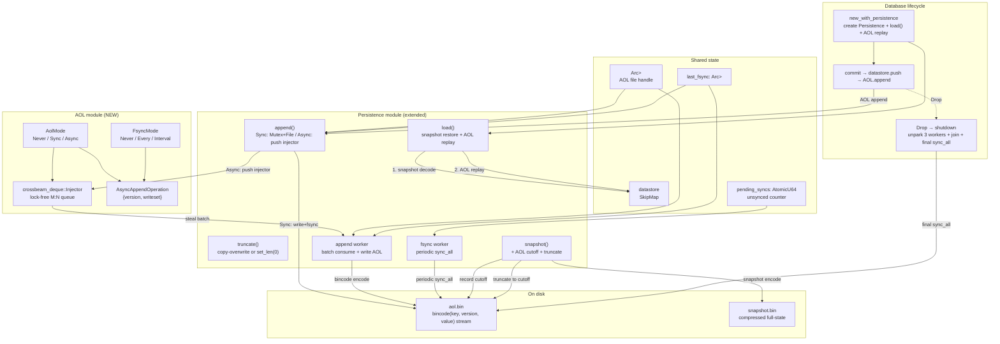
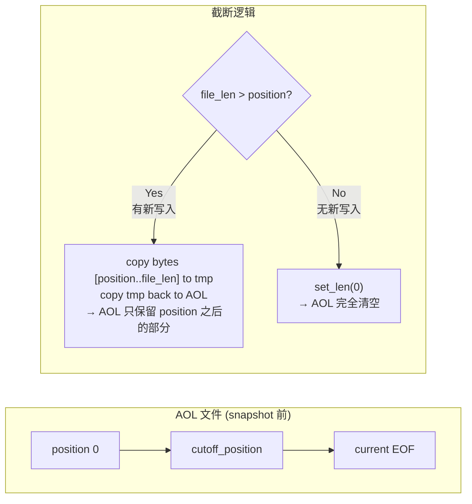
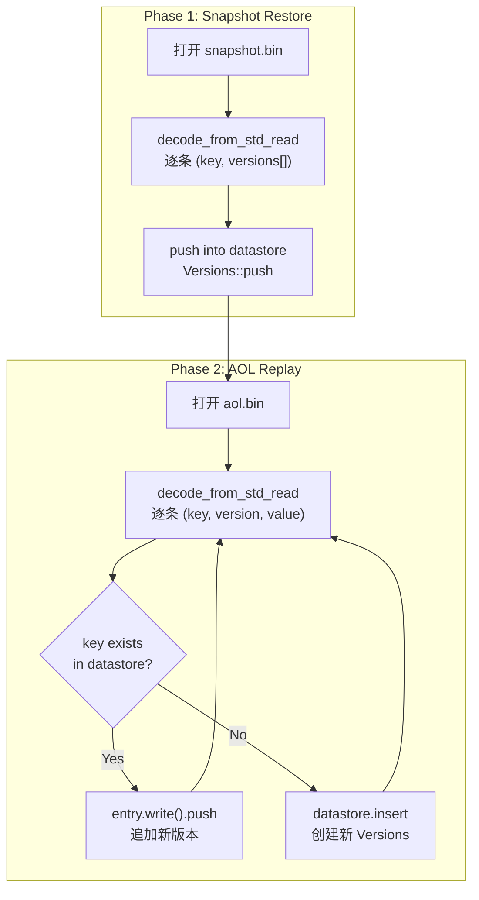
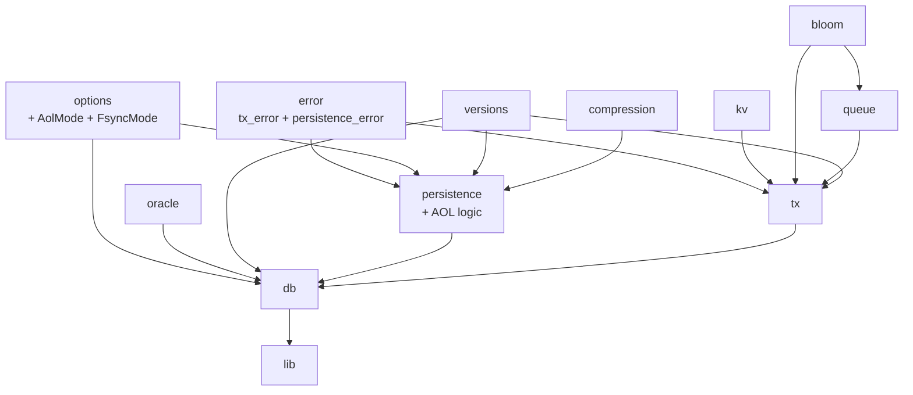

# Stupid-KV 教程：第八节 — AOL 增量日志：从快照到准实时持久化

## 1. 概述

第六节和第七节把 stupid-kv 的持久化基础打牢了：**全量快照**（Snapshot）保证了「数据库不丢」——定期把整份 datastore 序列化到磁盘，重启时从快照恢复。但全量快照有一个根本局限：**两次快照之间的写入是脆弱的**。如果快照间隔是 30 秒，进程在快照完成后第 29 秒崩溃，那么这 29 秒内的全部提交数据都会丢失。

本节引入 **AOL（Append-Only Log）** 模块——一个极简的 WAL（Write-Ahead Log）实现，弥补快照的持久化间隙。核心思路是：**每次事务提交后，先写入 datastore，再将写集追加到 AOL 日志文件**。快照完成后，AOL 中已被快照覆盖的早期部分会被截断。

> 持久化模型从「全量快照单轨制」升级为「快照 + AOL 双轨制」：快照负责全量恢复，AOL 负责增量覆盖。崩溃恢复流程 = 加载快照 → 回放 AOL 日志。

与经典 WAL 相比，stupid-kv 的 AOL 做了以下简化和权衡：

- **追加即提交**：写集进入 AOL 文件（或内存队列）就算「已持久化」，不要求每次都 fsync；`FsyncMode` 提供灵活的落盘策略。
- **截断而非归档**：快照完成后直接截断 AOL 文件，不做日志归档，实现极简。
- **单文件日志**：所有写集追加到同一个 `.bin` 文件，无日志段（segment）概念。

本节引入的新组件：

- **`AolMode`**（`src/options/persistence_options.rs`）：三态枚举——`Never`、`SynchronousOnCommit`、`AsynchronousAfterCommit`。
- **`FsyncMode`**（`src/options/persistence_options.rs`）：三态枚举——`Never`、`EveryAppend`、`Interval(Duration)`。
- **`AsyncAppendOperation`**（`src/persistence/persistence.rs`）：异步追加操作结构体，描述一次事务提交的写集。
- **`append()`**（`src/persistence/persistence.rs`）：核心追加方法，根据 `AolMode` 选择同步或异步写入路径。
- **`truncate()`**（`src/persistence/persistence.rs`）：AOL 文件截断方法，快照完成后清除已覆盖的早期日志。
- **三个后台 Worker**：`append_worker`（异步批量写）、`fsync_worker`（周期性 fsync）、`snapshot_worker`（已存在，新增 AOL truncate 逻辑）。
- **`PersistenceError::LockFailed`**（`src/error/persistence_error.rs`）：新增错误变体 + `PoisonError` → `PersistenceError` 的 `From` 实现。
- **`Error::TxCommitNotPersisted`**（`src/error/tx_error.rs`）：事务提交时 AOL 写入失败的回滚错误。

**关键设计目标**

- **准实时持久化**：提交返回后，写集要么已在磁盘（同步模式），要么已在 OS PageCache（异步 + fsync 兜底），崩溃丢数据窗口缩小到毫秒级。
- **零侵入写路径**：AOL 写入在 `TransactionInner::commit` 中完成，不影响 MVCC 核心逻辑；同步模式仅多一次 `write()` syscall。
- **可配置落盘策略**：`AolMode × FsyncMode` 矩阵覆盖了从「完全异步、不 fsync」到「同步写入、每次 fsync」的完整谱系，适应不同可靠性要求。
- **启动恢复无缝衔接**：`load()` 先恢复快照全量数据，再回放 AOL 增量日志，保证一致性。
- **与快照协同**：snapshot 完成后自动 truncate AOL，控制日志文件大小，避免无限增长。

---

## 2. 整体架构变化



新增文件一览：

| 文件 | 作用 |
|------|------|
| （无新文件） | AOL 模块完全实现在既有文件的扩展中，无独立 `.rs` 文件 |

既有文件的修改：

| 文件 | 变更 |
|------|------|
| `Cargo.toml` | 新增 `crossbeam-deque = "0.8.7"` 依赖 |
| `src/options/persistence_options.rs` | 新增 `AolMode`、`FsyncMode` 枚举 + `aol_mode`/`aol_path`/`fsync_mode` 字段 + 4 个 builder |
| `src/persistence/persistence.rs` | 新增 `AsyncAppendOperation`、AOL 相关字段、`append()`、`truncate()`、`spawn_appender_worker()`、`spawn_fsync_worker()`、`load()` 扩展 AOL replay、`snapshot()` 扩展 AOL truncate、`Drop` 扩展 |
| `src/error/persistence_error.rs` | 新增 `LockFailed` 变体 + `PoisonError` → `PersistenceError` 的 `From` 实现 |
| `src/error/tx_error.rs` | 新增 `TxCommitNotPersisted(PersistenceError)` 变体 |
| `src/tx/transaction.rs` | `assert_eq!` → `matches!` 适配枚举非完全相等比较 |
| `src/tx/transaction_inner.rs` | `auto_commit` 中新增 AOL 追加阶段 + 失败回滚逻辑 |

---

## 3. AolMode：三态写入策略

```rust
#[derive(Debug, Clone, Default, Copy, PartialEq, Eq)]
pub enum AolMode {
    #[default]
    Never,
    SynchronousOnCommit,
    AsynchronousAfterCommit,
}
```

### 3.1 三种模式对比

| 模式 | 提交路径行为 | 提交延迟 | 持久化保证 | 适用场景 |
|------|-------------|---------|-----------|---------|
| `Never`（默认） | 不写 AOL，纯内存 + 快照 | 最快，无额外 IO | 崩溃丢数据窗口 = 快照间隔 | 可容忍丢数据的缓存层、测试 |
| `SynchronousOnCommit` | 提交线程同步加锁写 AOL 文件 | 每次提交多 `write()` syscall + 可选 `fsync` | 提交返回后数据在 PageCache（或磁盘） | 强持久化要求、写入吞吐较低 |
| `AsynchronousAfterCommit` | 提交线程推入 `crossbeam_deque::Injector`，后台线程批量消费 | 提交线程无磁盘 IO 阻塞 | 批量写入后由 fsync 兜底 | **推荐**：兼顾持久化与吞吐 |

### 3.2 为什么选择三态而非开关

与 `SnapshotMode` 的 `Never / Interval` 设计哲学一致——**简单优先**。三态覆盖了从「完全不关」到「完全同步」的完整谱系，每种模式的行为边界清晰：

- `Never` 是零成本路径，`append()` 直接 `return Ok(())`，不会创建 AOL 文件、不会启动任何 AOL 相关线程。
- `SynchronousOnCommit` 和 `AsynchronousAfterCommit` 都会创建 AOL 文件并启动对应 worker（后者还会额外启动 fsync worker）。

如果未来需要更细粒度控制（如按 key 范围分日志、不同大小操作不同模式），当前设计为扩展预留了空间。

---

## 4. FsyncMode：三态刷盘策略

```rust
#[derive(Debug, Clone, Default, Copy, PartialEq, Eq)]
pub enum FsyncMode {
    #[default]
    Never,
    EveryAppend,
    Interval(Duration),
}
```

### 4.1 fsync 的作用

`fsync` 是 OS 级别的「将 PageCache 刷到磁盘介质」操作。没有 fsync，AOL 数据可能还在 PageCache 中，断电后 AOL 文件会出现截断——bincode 解码时把半截条目当作 `UnexpectedEof` 跳过，导致**静默丢数据**。

### 4.2 三种策略对比

| 策略 | fsync 频率 | 性能影响 | 数据安全 |
|------|-----------|---------|---------|
| `Never`（默认） | 从不主动 fsync，仅记 `pending_syncs` 计数器 | 最快 | 依赖 OS，不保证 |
| `EveryAppend` | 每次 AOL 追加后立即 `fsync()` | 最慢，每次两次 syscall（write + fsync） | 最安全，提交即落盘 |
| `Interval(Duration)` | 每 N 毫秒 fsync 一次，其余仅递增计数 | 折中 | 安全窗口 = Duration |

### 4.3 与 AolMode 的组合效果

`AolMode × FsyncMode` 构成 3×3 = 9 种组合，其中有实际意义的组合：

| | `Never` | `EveryAppend` | `Interval(100ms)` |
|---|---|---|---|
| **`Never`** | 不写 AOL，不 fsync（无意义） | 不可能（AOL 没开） | 不可能 |
| **`SynchronousOnCommit`** | 同步写入，仅记计数，靠 OS/兜底 fsync | 同步写入 + 每次 fsync，最安全但最慢 | 同步写入 + 周期 fsync，性能/安全折中 |
| **`AsynchronousAfterCommit`** | 异步批量写，仅记计数 | 异步批量写 + 每批 fsync | 异步批量写 + 周期 fsync，**推荐**生产配置 |

---

## 5. AOL 文件格式与编码协议

### 5.1 文件结构

AOL 文件是**连续的 bincode 二进制条目流**，没有文件头、没有校验和：

```
[ entry_0 ][ entry_1 ][ entry_2 ] ... [ entry_N ]
   ↑           ↑
   bincode((key: Bytes, version: u64, value: Option<Bytes>))
```

每条 AOL 记录是一个 `(key, version, value)` 三元组：

```rust
// 编码端：append() / append_worker
bincode::serde::encode_into_std_write(
    (k, version, v),   // (Bytes, u64, Option<Bytes>)
    &mut writer,
    config::standard(),
)?;

// 解码端：load() AOL replay
type Entry = (Bytes, u64, Option<Bytes>);
let result: Result<Entry, _> = bincode::serde::decode_from_std_read(
    &mut reader,
    config::standard(),
);
```

### 5.2 与快照格式的区别

| 维度 | 快照（snapshot.bin） | AOL（aol.bin） |
|------|---------------------|----------------|
| 条目类型 | `(key, Vec<(version, value)>)` — 一个 key 的完整版本链 | `(key, version, value)` — 单次写入操作 |
| 记录粒度 | 一条 = 一个 key 的全历史 | 一条 = 一次事务提交中某个 key 的写入 |
| 压缩 | 由 `CompressionMode` 控制 | 由 `CompressionMode` 控制（对称） |
| 生命周期 | 长期存在，被覆盖前持续保留 | 短期存在，快照完成后截断清除 |
| 典型大小 | 大（全量版本链） | 小（单条写入） |

### 5.3 为什么 AOL 用不同的条目格式

快照需要保存一个 key 的完整版本链（支持 MVCC 可见性），而 AOL 只需要记录一次提交中某个 key 的最新值。这种不对称是有意的：

- 快照是「全量」的——`(key, versions[])` 一个 entry 涵盖该 key 所有历史。
- AOL 是「增量」的——`(key, version, value)` 一条记录只对应一次写入。

load() 时先从快照恢复全量版本链，再用 AOL 记录逐条追加新版本——保证 MVCC 可见性不变。

---

## 6. AOL 写入路径详解

### 6.1 同步模式：`SynchronousOnCommit`

```rust
// 提交线程直接执行
let aol = self.aol.as_ref().unwrap();
let mut file = aol.lock()?;                    // ① 加锁 Mutex<File>
let mut writer = BufWriter::new(&mut *file);

for (k, v) in writeset {
    bincode::serde::encode_into_std_write(      // ② 逐条编码
        (k, version, v),
        &mut writer,
        config::standard(),
    )?;
}
writer.flush()?;                                // ③ flush → PageCache
drop(writer);

// ④ 根据 FsyncMode 决定 sync_all
match self.fsync_mode {
    FsyncMode::Never => { self.pending_syncs.fetch_add(1, Ordering::Release); }
    FsyncMode::EveryAppend => { file.sync_all()?; }
    FsyncMode::Interval(duration) => { /* 判断是否到期 */ }
}
```

**关键步骤**：

| 步骤 | 说明 |
|------|------|
| ① 加锁 | `Mutex<File>` 保证并发写入串行化，文件内记录线性有序 |
| ② 编码 | 逐 key bincode 编码为 `(key, version, value)` |
| ③ flush | `BufWriter` → `File` → OS PageCache |
| ④ fsync | 根据 `FsyncMode` 决定是否/何时 `sync_all` |

**性能特征**：每次提交 = 1 次 `Mutex::lock` + N 次 bincode encode（N = writeset 大小）+ 1 次 `write()` syscall + 可选 `fsync`。

### 6.2 异步模式：`AsynchronousAfterCommit`

```rust
// 提交线程
self.async_append_injector.push(AsyncAppendOperation {
    version,
    writeset: writeset.clone(),
});
if let Some(handle) = self.append_handle.read().as_ref() {
    handle.thread().unpark();                    // 唤醒 append worker
}
// 提交线程立即返回，不等磁盘 IO
```

提交线程仅做两次 O(1) 操作：`Injector::push()` + `Thread::unpark()`。实际磁盘写入由 append worker 线程批量完成。

**`crossbeam_deque::Injector` 的选择理由**：

- **多生产者安全**：Injector 支持任意数量的线程同时 `push()`，无锁、无阻塞。
- **批量消费友好**：与 `Stealer::steal()` 配合，append worker 可以批量获取操作。
- **零额外依赖复杂度**：crossbeam 是 Rust 生态的成熟库，稳定性有保障。

### 6.3 Append Worker：批量消费

```rust
// append_worker 线程伪代码
const BATCH_SIZE: usize = 100;
const TIMEOUT_MS: u64 = 10;

loop {
    batch.clear();

    // 内层循环：窃取操作直到满足批量或队列为空
    loop {
        match injector.steal() {
            Steal::Retry => { std::thread::yield_now(); continue; }
            Steal::Success(op) => {
                batch.push(op);
                if batch.len() >= BATCH_SIZE { break; }
            }
            Steal::Empty => {
                if !batch.is_empty() { break; }  // 有数据就立即刷
                thread::park_timeout(10ms);      // 无数据就等待
            }
        }
    }

    // 批量写入
    let mut writer = BufWriter::new(&mut *file);
    for op in &batch {
        for (k, v) in &op.writeset {
            encode_into_std_write((k, op.version, v), &mut writer, ...)?;
        }
    }
    writer.flush()?;
    drop(writer);

    // 根据 fsync_mode 决定刷盘
}
```

**批量策略参数**：

| 参数 | 值 | 说明 |
|------|----|------|
| `BATCH_SIZE` | 100 | 攒够 100 次提交后统一写盘，减少 syscall |
| `TIMEOUT_MS` | 10 | 队列为空时 park 10ms，避免空转浪费 CPU |
| **立即刷条件** | 队列空 + 有数据 | 攒了一半但队列空了，立即刷写不等待 |

**fsync 处理**：批量写入完成后，根据 `fsync_mode` 决定：
- `Never`：仅递增 `pending_syncs`
- `EveryAppend`：立即 `sync_all`
- `Interval`：检查是否到达 fsync 时间窗口（共享 `Arc<Mutex<Instant>>`，与同步路径和 fsync worker 共用）

---

## 7. Fsync Worker：周期性兜底刷盘

```rust
fn spawn_fsync_worker(&self) {
    let FsyncMode::Interval(duration) = self.fsync_mode else { return; };
    // ...
    loop {
        thread::park_timeout(duration);
        if pending_syncs.load(Ordering::Acquire) > 0 {
            file.sync_all()?;
            pending_syncs.store(0, Ordering::Release);
        }
    }
}
```

**启动条件**：`AolMode != Never && FsyncMode::Interval`。仅在这两个条件同时满足时才启动。

**作用**：作为兜底机制，保证即使 append worker 的 `Interval` 判断出现边界情况（如时间窗口刚过又没过），fsync worker 也会周期性检查 `pending_syncs` 并补刷。

---

## 8. AOL Truncate：快照后的日志回收

### 8.1 截断时机

`truncate()` 在 `snapshot()` 完成后调用，以快照开始前记录的 AOL 文件大小（`aol_cutoff_position`）为基准：

```rust
// snapshot() 中
let aol_cutoff_positon = if let Some(ref aol) = self.aol {
    aol.lock()?.metadata()?.len()  // 快照开始前的 AOL 文件大小
} else { 0 };

// ... 快照编码 ...

Self::truncate(&self.aol, aol_cutoff_positon, &self.pending_syncs)?;
```

### 8.2 截断策略



| 场景 | 操作 | 说明 |
|------|------|------|
| `file_len <= position` | `set_len(0)` | 快照期间无新 AOL 写入，直接清空文件 |
| `file_len > position` | 复制-覆写 | 快照期间有新写入，需要保留。将 `[position, file_len)` 段复制到临时文件，再覆写回 AOL 文件 |

**为什么用「复制-覆写」而非 `set_len`**：部分操作系统的 `set_len()` 只做逻辑截断（文件元数据标记缩短），数据块并不真正释放。复制-覆写虽然多一次 IO，但语义明确且在所有文件系统上一致。

### 8.3 截断后的状态

截断完成后：
- AOL 文件只保留快照完成后产生的增量记录
- `pending_syncs` 在 `position == 0` 时归零（文件完全清空，无需补 fsync）
- 下次 load() 时，快照恢复全量数据，AOL replay 覆盖剩余增量

---

## 9. 启动恢复：AOL Replay

### 9.1 两阶段恢复流程



### 9.2 Replay 逻辑

```rust
// load() 第二阶段
loop {
    let mut reader = CompressedReader::new(file)?;
    loop {
        type Entry = (Bytes, u64, Option<Bytes>);
        let result: Result<Entry, _> = bincode::serde::decode_from_std_read(&mut reader, config::standard());

        match result {
            Ok((k, version, val)) => {
                if let Some(entry) = self.inner.datastore.get(&k) {
                    entry.value().write().push(Version { version, value: val });
                } else {
                    self.inner.datastore.insert(k, RwLock::new(Versions::from(Version { version, value: val })));
                }
            }
            Err(e) if is_unexpected_eof(e) => break,
            Err(e) => return Err(PersistenceError::Deserialization(e)),
        }
    }
}
```

**关键设计**：

- **对称使用 `CompressedReader`**：AOL 文件也使用与快照相同的压缩读取逻辑，保持格式一致性。
- **`push` 语义保留**：与快照恢复一样，AOL replay 也通过 `Versions::push` 逐条组装版本链，复用去重/合并逻辑。
- **两阶段独立**：快照恢复和 AOL replay 是两个独立的循环，中间没有数据依赖。

---

## 10. 事务集成：提交路径的 AOL 追加

### 10.1 在 `auto_commit` 中的位置

```rust
// TransactionInner::auto_commit 伪代码

// 1. 冲突检测 ...

// 2. 合并 → 写 datastore
for (key, value) in &entry.writeset {
    // ... 写入 datastore Versions ...
    self.database.gc_dirty_keys.push(key.clone());
}

// 3. AOL 追加（新增阶段）
if let Some(p) = self.database.persistence.read().clone() {
    if let Err(e) = p.append(version, &entry.writeset) {
        // 回滚：从合并队列移除、清空 writeset/readset
        self.database.transaction_merge_queue.remove(&version);
        self.writeset.clear();
        return Err(Error::TxCommitNotPersisted(e));
    }
}

// 4. 从合并队列移除（正常完成）
self.database.transaction_merge_queue.remove(&version);
self.writeset.clear();
Ok(())
```

### 10.2 回滚逻辑

AOL 写入失败时，需要回滚已完成的内存状态：

| 步骤 | 操作 | 原因 |
|------|------|------|
| 1 | `transaction_merge_queue.remove(&version)` | 数据已进入 datastore，但合并队列中的条目需要在 commit 时被清理；移除避免残留 |
| 2 | `readset.clear()` / `readset_bloom.clear()` | SSI 模式下读取集合已无效 |
| 3 | `writeset.clear()` | 重置事务写操作状态 |

回滚后事务返回 `Error::TxCommitNotPersisted`，调用方可选择重试或放弃。

### 10.3 为什么 AOL 在 datastore 写入之后

AOL 追加放在 datastore 写入之后有两个考虑：

1. **简化回滚逻辑**：如果 AOL 写在 datastore 写之前，AOL 成功但 datastore 写失败时，需要清理 AOL 文件——比回滚内存状态复杂得多。
2. **错误语义明确**：`TxCommitNotPersisted` 表示「内存操作完成但持久化失败」，调用方可以明确决策。

---

## 11. 线程生命周期管理

### 11.1 Worker 启动时机

```
new_with_options():
  1. fs::create_dir_all(base_path)
  2. 推导 aol_path / snapshot_path
  3. 创建/打开 AOL 文件（如启用）
  4. load() — 快照恢复 + AOL replay
  5. spawn_snapshot_worker()
  6. spawn_appender_worker()   ← 新增，仅异步模式
  7. spawn_fsync_worker()      ← 新增，仅 FsyncMode::Interval
```

启动顺序保证了 worker 启动时 datastore 已经完整恢复。

### 11.2 Worker 关闭（Drop 兜底）

```rust
impl Drop for Persistence {
    fn drop(&mut self) {
        self.background_threads_enabled.store(false, Ordering::Release);

        // 按启动反序关闭
        if let Some(h) = self.snapshot_handle.write().take() {
            h.thread().unpark(); let _ = h.join();
        }
        if let Some(h) = self.append_handle.write().take() {
            h.thread().unpark(); let _ = h.join();     // ← 新增
        }
        if let Some(h) = self.fsync_handle.write().take() {
            h.thread().unpark(); let _ = h.join();     // ← 新增
        }

        // 最终兜底 fsync
        if pending_syncs.load(Ordering::Acquire) > 0 {
            file.sync_all();                           // ← 新增
        }
    }
}
```

关闭顺序与启动顺序相反：snapshot → append → fsync。最后补一次 `sync_all` 兜底，确保异步模式下 `pending_syncs` 非零时数据真正落盘。

---

## 12. 配置与 Builder 链式 API

### 12.1 `PersistenceOptions` 新字段

```rust
pub struct PersistenceOptions {
    // ... 既有字段 ...

    pub aol_mode: AolMode,          // 默认 Never
    pub aol_path: Option<PathBuf>,  // 默认 None → base_path/aol.bin
    pub fsync_mode: FsyncMode,      // 默认 Never
}
```

### 12.2 Builder 方法

```rust
let opts = PersistenceOptions::new("./data")
    .with_snapshot_mode(SnapshotMode::Interval(Duration::from_secs(30)))
    .with_aol_mode(AolMode::AsynchronousAfterCommit)
    .with_fsync_mode(FsyncMode::Interval(Duration::from_millis(100)))
    .with_aol_path(Some("logs/aol.bin".into()))
    .with_compression_mode(CompressionMode::Lz4);

let db = Database::new_with_persistence(DatabaseOptions::default(), opts)?;
```

**配置链路**：

```
PersistenceOptions
  → with_aol_mode()    → Persistence.aol_mode
  → with_fsync_mode()  → Persistence.fsync_mode
  → with_aol_path()    → Persistence.aol_path
                        → Persistence.aol (Arc<Mutex<File>>)
                                                    ↓
                                              append() / appender_worker / fsync_worker
```

---

## 13. 关键设计权衡

| 决策 | 优点 | 缺点 |
|------|------|------|
| **AOL 三态（Never/Sync/Async）** | 覆盖从关闭到同步的完整谱系；每种模式行为边界清晰 | 同步模式提交延迟受磁盘 IO 限制；需额外配置 fsync 策略 |
| **FsyncMode 三态（Never/EveryAppend/Interval）** | 灵活的持久化等级；`Interval` 是生产推荐配置 | 三态组合使配置矩阵变复杂；用户需理解 trade-off |
| **`Arc<Mutex<File>>` 保护 AOL 文件** | 简单可靠的串行化；支持多线程安全追加 | Mutex 可能成为热点（所有写入竞争同一把锁）；`PoisonError` 需特殊处理 |
| **`crossbeam_deque::Injector` 异步队列** | 多生产者安全、零锁开销；crossbeam 成熟稳定 | 多一个外部依赖；需处理 `Steal::Retry` 竞争 |
| **批量写（BATCH_SIZE=100）** | 减少 syscall 次数；批量 fsync 合并更高效 | 崩溃时最多丢 BATCH_SIZE 条操作的延迟 |
| **截断采用「复制-覆写」而非 `set_len`** | 在所有文件系统上语义一致；可靠 | 多一次 IO 操作；需要临时文件 |
| **AOL 在 datastore 之后写入** | 写路径延迟低（内存写入与 AOL 写入解耦）；回滚可在内存中完成；天然适配异步模式 | datastore 写成功但 AOL 写失败时需回滚内存状态（移除 merge queue、清空 writeset/readset） |
| **单文件 AOL 而非日志段** | 实现极简；截断逻辑简单 | 单文件可能成为瓶颈；不支持并发恢复 |
| **`pending_syncs` 原子计数兜底** | Drop/snapshot/truncate 时统一判断；零配置开销 | `Never` 模式下计数器无意义但仍存在 |

### 13.1 AOL 追加顺序：先写 AOL vs 先写 Datastore

事务提交时，数据有两个需要落定的目的地：**内存 datastore** 和 **磁盘 AOL 文件**。两者的写入顺序决定了崩溃窗口内的数据一致性语义。存在两种主流方案：

**方案 A：先写 AOL，后写 Datastore（Write-Ahead Logging，经典 WAL 范式）**

```text
事务提交 → 写 AOL 文件（持久化屏障）→ 写 datastore → 返回成功
```

这是传统 WAL 的标准做法：先将数据追加到日志文件并 `fsync`，确保数据已在磁盘上，再写入内存结构。崩溃恢复时只需回放 AOL 日志，无需考虑 datastore 中的数据是否完整。

**方案 B：先写 Datastore，后写 AOL（No-Force / Shadow Paging 范式）**

```text
事务提交 → 写 datastore（内存）→ 写 AOL 文件 → 返回成功
```

这是本项目当前采用的方案：先完成内存写入，再追加到 AOL。两者的 tradeoff 对比如下：

| 维度 | 方案 A：先写 AOL（WAL 经典范式） | 方案 B：先写 Datastore（本项目采用） |
|------|----------------------------------|-------------------------------------|
| **崩溃一致性** | 最安全：AOL `fsync` 完成即代表提交已持久化，datastore 写失败可回滚；崩溃恢复时 AOL replay 即可重建 datastore | 次安全：datastore 写成功但 AOL 写失败时需要**回滚内存状态**（从 merge queue 移除、清空 writeset/readset）；崩溃恢复时 AOL replay 同样能重建 datastore |
| **回滚复杂度** | 回滚逻辑简单：只需丢弃 AOL 中已写入但未完成的日志记录（或标记为无效），datastore 不受影响 | 回滚逻辑复杂：需要逆向操作已完成的内存写入（移除 merge queue 条目、清空事务写集、清理 SSI readset/bloom），且需处理并发读写竞争 |
| **提交延迟** | 更高：`fsync` 是同步 IO，必须等待磁盘落盘才能写 datastore；同步模式下每次提交 = 一次 `fsync` syscall | 更低：datastore 写入是内存操作（`RwLock::write()` + `SmallVec::push()`），与 AOL 写入并行化；若 AOL 用异步模式，提交线程几乎无 IO 阻塞 |
| **持久化保证** | 更强：`fsync` 返回成功 = 数据已在磁盘，无 OS PageCache 丢失风险 | 稍弱：异步模式下数据可能还在 PageCache，依赖 fsync worker 或 Drop 兜底；同步模式下等价 |
| **恢复逻辑** | 更简单：只需「加载快照 → 回放 AOL」；若 datastore 写成功但进程崩溃，AOL 中可能存在「日志有、datastore 无」的记录（恢复时自然重建） | 同样简单：「加载快照 → 回放 AOL」；若 datastore 写成功但 AOL 写前崩溃，AOL 中可能存在「日志无、datastore 有」的记录（内存已丢，下次恢复从快照+AOL重建，该提交丢失） |

### 13.2 本项目选择「先写 Datastore 后写 AOL」的原因

本项目采用方案 B（datastore → AOL），基于以下考量：

**1. 写路径性能优先**

stupid-kv 是 MVCC 引擎，datastore 写入是内存操作（`RwLock<Versions>::write()` + `SmallVec::push()`），延迟在微秒级。将 AOL 放在后面意味着：
- **同步模式**：datastore 写入和 AOL `write()` syscall 可以连续执行，不需要在中间插入 `fsync` 屏障
- **异步模式**：datastore 写入完成后立即返回，AOL 写入由后台线程批量处理，提交延迟几乎等于纯内存操作

**2. 回滚逻辑可控**

虽然方案 B 的回滚比方案 A 复杂，但本项目的回滚范围是**可控的**：
- 回滚操作都是内存操作（`remove`、`clear`），不需要触碰磁盘
- 回滚逻辑集中在 `TransactionInner::auto_commit` 的 AOL 追加失败分支，覆盖了 merge queue、writeset、readset 三个结构
- 回滚失败的场景（如 `PoisonError`）会向上传播为 `TxCommitNotPersisted`，事务返回错误后调用方可明确决策（重试或放弃）

**3. 与快照持久化的协调**

本项目的持久化是「快照 + AOL」双轨制，不是纯 WAL 单轨制。快照完成后会 truncate AOL，这意味着：
- **快照写入在 AOL 之前**：与 AOL 在 datastore 之后的顺序形成对称，整体数据流是「datastore ← AOL ← 快照」的反向链路
- **truncate 不需要回滚**：快照完成后 truncate AOL 是单向操作（截断旧日志），不存在「快照成功但 truncate 失败」的中间态需要回滚

**4. 对异步模式的天然适配**

方案 B 天然适配异步追加：datastore 写入完成后，AOL 追加只是「向无锁队列 push 一个操作」，提交线程完全不感知磁盘 IO。如果采用方案 A，异步模式下 AOL 写入可能在 datastore 写入之前还没完成（队列消费有延迟），导致「AOL 日志延迟于 datastore」——反而会出现一致性窗口。

**总结**：方案 A 在理论安全性上更强，但本项目作为教程级 MVCC 原型，方案 B 在**性能、实现复杂度、与快照的协同性**上更合适。如果未来需要更强的持久化保证（如同步模式下的严格 `fsync` 屏障），可以在 `AolMode::SynchronousOnCommit` 中切换到方案 A——两者的代码改动集中在 `auto_commit` 函数的几行顺序调整上。

### 13.3 推荐配置组合模式

`AolMode × FsyncMode × SnapshotMode` 提供了丰富的配置组合，但在实际使用中最常见的配置模式可以归纳为以下三类：

**模式一：纯快照模式（最简，零 AOL 开销）**

```rust
let opts = PersistenceOptions::new("./data")
    .with_snapshot_mode(SnapshotMode::Interval(Duration::from_secs(60)))
    // 不传 with_aol_mode / with_fsync_mode，默认 Never
    .with_compression_mode(CompressionMode::Lz4);
```

| 维度 | 说明 |
|------|------|
| 配置 | `AolMode::Never` + `FsyncMode::Never` + `SnapshotMode::Interval(60s)` |
| 持久化保证 | 崩溃丢数据窗口 = 快照间隔（60 秒） |
| 提交延迟 | 最低，无任何磁盘 IO 开销 |
| 适用场景 | 可容忍丢数据的缓存层、测试/开发环境、数据可从其他来源重建 |
| 优点 | 实现最简、性能最佳、零配置 |
| 缺点 | 数据丢失窗口大，可靠性依赖快照频率 |

**模式二：快照 + AOL 异步 + 周期 fsync（性价比最佳，推荐生产默认）**

```rust
let opts = PersistenceOptions::new("./data")
    .with_snapshot_mode(SnapshotMode::Interval(Duration::from_secs(30)))
    .with_aol_mode(AolMode::AsynchronousAfterCommit)
    .with_fsync_mode(FsyncMode::Interval(Duration::from_millis(100)))
    .with_compression_mode(CompressionMode::Lz4);
```

| 维度 | 说明 |
|------|------|
| 配置 | `AolMode::Async` + `FsyncMode::Interval(100ms)` + `SnapshotMode::Interval(30s)` |
| 持久化保证 | 崩溃丢数据窗口 ≤ 100ms（fsync 间隔） |
| 提交延迟 | 极低，提交线程仅做无锁队列 push，无磁盘 IO 阻塞 |
| 适用场景 | **推荐生产默认**：兼顾持久化与吞吐；在线事务系统、需高写入吞吐的场景 |
| 优点 | 提交延迟接近纯内存操作；批量写 + 周期 fsync 合并减少 syscall；丢数据窗口可控 |
| 缺点 | 实现稍复杂（3 个后台 worker）；异步模式下极端崩溃可能丢少量在途操作 |

**模式三：快照 + AOL 同步 + 每次 fsync（安全性最高）**

```rust
let opts = PersistenceOptions::new("./data")
    .with_snapshot_mode(SnapshotMode::Interval(Duration::from_secs(30)))
    .with_aol_mode(AolMode::SynchronousOnCommit)
    .with_fsync_mode(FsyncMode::EveryAppend)
    .with_compression_mode(CompressionMode::Lz4);
```

| 维度 | 说明 |
|------|------|
| 配置 | `AolMode::Sync` + `FsyncMode::EveryAppend` + `SnapshotMode::Interval(30s)` |
| 持久化保证 | **最强**：每次提交返回后数据已在磁盘，无丢失窗口 |
| 提交延迟 | 最高，每次提交 = 1 次 `write()` + 1 次 `fsync()` syscall（约几 ms） |
| 适用场景 | 对数据零丢失有硬性要求的场景：金融交易、订单系统、审计日志 |
| 优点 | 持久化保证最强；无需后台 worker（append/fsync 均同步完成）；行为可预测 |
| 缺点 | 写入吞吐最低（fsync 是瓶颈）；高并发下磁盘 IO 可能成为瓶颈 |

**三种模式对比总结**：

| | 模式一：纯快照 | 模式二：异步 + 周期 fsync | 模式三：同步 + 每次 fsync |
|---|---|---|---|
| 丢数据窗口 | 60 秒 | ≤ 100ms | ≈ 0 |
| 提交延迟 | ~微秒 | ~微秒 | ~几毫秒 |
| 写入吞吐 | ★★★★★ | ★★★★☆ | ★★☆☆☆ |
| 持久化保证 | ★☆☆☆☆ | ★★★★☆ | ★★★★★ |
| 实现复杂度 | ★☆☆☆☆ | ★★★☆☆ | ★★☆☆☆ |
| 后台 worker | 仅 snapshot | snapshot + append + fsync | 仅 snapshot |
| **推荐** | 开发/测试 | **生产默认** | 金融级安全 |

---

## 14. 故障模式对比

| 场景 | 无 AOL（0.0.7） | AOL（0.0.8） |
|------|----------------|-------------|
| **进程在快照完成后第 29 秒崩溃** | 丢 29 秒数据（快照间隔内的全部提交） | 若用 `EveryAppend`：丢数据窗口 ≈ 0；若用 `Interval(100ms)`：丢数据窗口 ≤ 100ms |
| **进程在 AOL 异步队列中的操作还未消费时崩溃** | N/A | 最多丢 `TIMEOUT_MS` 窗口（10ms）内推入但未被 append worker 消费的操作 |
| **AOL 文件被截断（崩溃时正在追加）** | N/A | bincode 解码遇到半截条目 → `UnexpectedEof` → 跳过该条 → 静默丢该条数据（不影响后续正常条目） |
| **AOL 文件 Mutex 被 poison（某线程 panic 时持锁）** | N/A | `PoisonError` → `LockFailed` → 向上传播 → 事务回滚 → `TxCommitNotPersisted` |
| **Fsync worker panic** | N/A | `park_timeout` 线程不会 panic（内部逻辑全用 `if let` 容错）；若 panic，进程级 panic 会导致重启，AOL replay 恢复数据 |
| **truncate 时磁盘满（ENOSPC）** | N/A | `std::io::copy` → `Io(ENOSPC)` → `truncate` 返回错误 → `snapshot` 返回错误 → 清理 `.tmp`；AOL 文件保持截断前状态 |
| **AOL 文件被手动删除** | N/A | `load()` 时 `aol_path.exists()` 返回 false → 跳过 replay → 仅从快照恢复；AOL 功能自动降级为快照模式 |
| **Drop 时 `pending_syncs > 0`** | N/A | 最后一次 `sync_all` 兜底——保证未 fsync 的数据真正落盘后再退出 |

---

## 15. 模块依赖图（更新）



新增依赖边：

| 依赖 | 说明 |
|------|------|
| `options → persistence` | `AolMode`、`FsyncMode`、`aol_path` 由 persistence 消费 |
| `tx → error` | 新增 `TxCommitNotPersisted` 错误变体 |
| `persistence → error` | 新增 `LockFailed` 错误变体 + `PoisonError` → `PersistenceError` 的 `From` 实现 |
| `persistence → crossbeam_deque` | 新增外部依赖，提供无锁队列 |

---

## 16. 总结

本节为 stupid-kv 引入了 **AOL（Append-Only Log）增量持久化层**，将崩溃恢复窗口从「快照间隔」缩小到「毫秒级」。核心设计哲学：

- **灵活的持久化策略**：`AolMode × FsyncMode` 矩阵覆盖了从「完全关闭」到「同步落盘」的完整谱系，由调用方根据可靠性需求选择。
- **零阻塞写路径**：异步模式下提交线程无磁盘 IO 阻塞，批量写还可合并 fsync，整体吞吐远高于同步模式。
- **与快照协同**：快照完成后自动 truncate AOL，控制日志文件大小，避免无限增长。
- **崩溃恢复无缝衔接**：启动时先恢复快照全量数据，再回放 AOL 增量日志，保证一致性。
- **完整的生命周期管理**：三个后台 worker 线程的启动/关闭顺序、shutdown 兜底、Drop 最终 fsync，保证任何退出路径下数据安全。

到本节为止，stupid-kv 已经具备了：

> 并发事务（001）→ SSI + Bloom（002）→ 运行时加固（003）→ commit queue GC（004）→ 版本历史 GC（005）→ 全量快照持久化（006）→ LZ4 快照压缩（007）→ **AOL 增量日志**（008）

一个完整的、支持快照 + 增量日志双轨持久化的 Rust MVCC KV 原型。下一步的自然延伸方向：

1. **WAL 正式化**：将当前 AOL 从「简化版」升级为带检查点标记的正式 WAL，支持更精确的恢复边界定位。
2. **数据校验**：为 AOL 条目增加 CRC32 校验，让日志文件具备损坏检测能力。
3. **日志归档与压缩**：截断前将旧日志段归档压缩，长期保留历史数据的同时控制在线文件大小。
4. **条目级压缩与校验**：AOL 条目级独立压缩/校验，实现单条粒度的损坏隔离。