# Stupid-KV 教程：第九节 — Workspace 架构与 HTTP Server：从库到服务

## 1. 概述

前八节中，stupid-kv 一直以 **库（Library）** 的形态存在——使用者通过 `use stupid_kv::Database` 将 MVCC KV 引擎嵌入自己的 Rust 进程。这种模式对学习数据库内核非常友好（示例代码即文档，`cargo test` 即集成验证），但也意味着**任何外部语言或非 Rust 生态的使用者都无法直接体验**这个项目。

本节将 stupid-kv 的项目结构升级为 **Cargo Workspace（工作区）**，引入第二个 crate：`server`——一个基于 **axum** 框架的 HTTP Server，将 lib 层的事务接口暴露为 RESTful CRUD API。这一步的定位是：**将纯内核库「套上一层 Web 壳」，让任何人都能通过 curl/Postman 体验 MVCC 事务的写入、读取、冲突检测等特性**。

本节引入的新组件：

- **Workspace 根 `Cargo.toml`**：将项目从单 crate 升级为 workspace，`stupid-kv`（lib）和 `server`（bin）作为 workspace members。
- **`server/` crate**：独立的 bin crate，依赖 `stupid-kv` lib，使用 `axum 0.8` 构建 REST API。
- **5 个 RESTful 端点**：`GET /{key}`、`GET /exists/{key}`、`POST /{key}`、`PUT /{key}`、`DELETE /{key}`。
- **错误映射层**：将内核的 `Error` 枚举映射为 HTTP `StatusCode`（冲突 → 409、内部错误 → 500）。
- **`make_app()` 工厂函数**：将 Router 构建逻辑抽取出来，供 `main()` 和测试共用。
- **12 个集成测试**：通过 `tower::ServiceExt::oneshot` 直接在进程内测试路由，无需真实 HTTP 端口。
- **`Database` 取消 `Clone`**：改为 `Arc<Database>` 包装，语义上表达「全局唯一实例」。

**关键设计目标**

- **体验优先**：HTTP API 是为了让更多人（不限于 Rust 开发者）能简单体验 stupid-kv 的 MVCC 行为，不作为生产级 Web 框架设计。
- **不破坏 lib 接口**：所有既有事务 API 和错误类型保持不变，server 层仅做薄封装。
- **测试闭环**：API 层的每个端点都有对应的单元测试，覆盖成功路径和错误路径。
- **最小依赖**：server crate 只引入必要的外部依赖（axum、serde、tokio、tower），保持可维护性。

---

## 2. 整体架构变化

### 2.1 项目结构：单 crate → Workspace

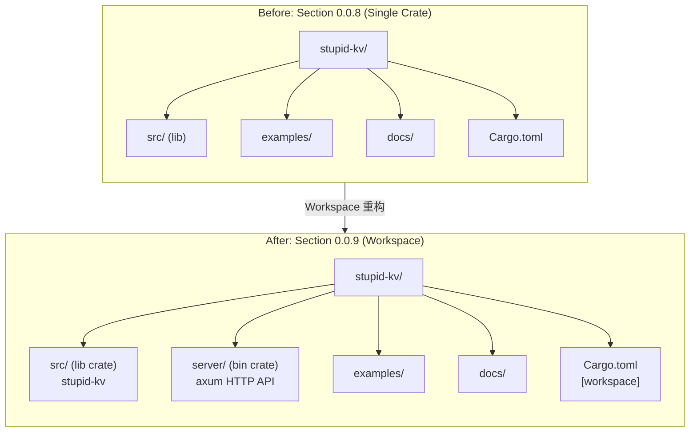

### 2.2 Workspace 成员关系

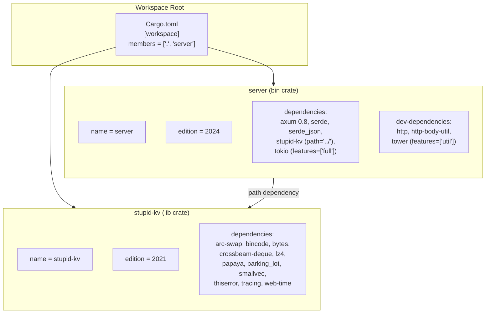

**根 `Cargo.toml`** 是 workspace 入口：

```toml
[workspace]
members = [".", "server"]
resolver = "2"
```

两个成员通过 `resolver = "2"` 独立解析依赖树，互不干扰。`server` 通过 `path = "../"` 依赖根目录下的 lib crate。

### 2.3 API 数据流

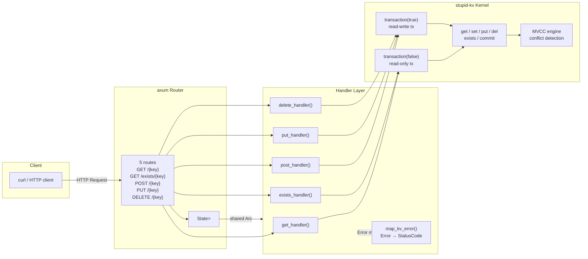

**每个请求的处理流程**：

1. axum Router 根据路径和方法匹配到对应 handler
2. handler 通过 `State<Arc<Database>>` 提取共享的 Database 实例
3. 针对每个请求创建一个独立的事务（读操作 → `transaction(false)`，写操作 → `transaction(true)`）
4. 调用事务 API 执行操作
5. 提交事务并返回 JSON 响应；若失败则通过 `map_kv_error()` 映射为 HTTP 错误

---

## 3. Workspace 重构详解

### 3.1 为什么使用 Cargo Workspace

| 维度 | 说明 |
|------|------|
| **关注点分离** | lib crate 专注 MVCC 内核实现，bin crate 专注 HTTP 接口；互不干扰 |
| **独立编译** | `cargo build -p server` 只编译 server 及其依赖；`cargo test -p stupid-kv` 只跑内核测试 |
| **共享依赖** | 两个 crate 可以复用同一份 `Cargo.lock`，减少依赖冗余 |
| **可扩展性** | 未来可以轻松增加更多 crate（如 CLI 工具、基准测试、额外协议适配器） |
| **语义清晰** | workspace 结构明确表达了「核心库 + 可选前端」的架构关系 |

---

## 4. Server Crate 设计

### 4.1 依赖关系

```toml
# server/Cargo.toml
[dependencies]
axum = "0.8.9"                          # Web 框架
serde = { version = "1", features = ["derive"] }  # 序列化
serde_json = "1"                        # JSON 处理
stupid-kv = { path = "../" }            # 内核库
tokio = { version = "1", features = ["full"] }   # 异步运行时

[dev-dependencies]
http = "1"                              # HTTP 类型
http-body-util = "0.1"                  # Body 工具
tower = { version = "0.5", features = ["util"] }  # ServiceExt 测试
```

### 4.2 axum 0.8 的路由语法

axum 0.8 的路由语法相比 0.7 有重大变更——路径参数从 `:param` 改为 `{param}`：

```rust
// axum 0.7 语法（旧）
.route("/:key", get(handler))

// axum 0.8 语法（新）
.route("/{key}", get(handler))
```

同时 `State<T>` 提取器要求 `T: Clone + Send + Sync + 'static`，`Arc<Database>` 完全满足这个约束。

### 4.3 响应结构体

```rust
#[derive(Serialize)]
struct GetResponse {
    key: String,
    value: Option<String>,  // None 表示 key 不存在或已删除
}

#[derive(Serialize)]
struct ExistsResponse {
    key: String,
    exists: bool,
}

#[derive(Serialize)]
struct WriteResponse {
    key: String,
    value: String,
}

#[derive(Serialize)]
struct ErrorResponse {
    error: String,
}

#[derive(Deserialize)]
struct WriteRequest {
    value: String,  // POST/PUT 请求体中的 value 字段
}
```

**统一响应格式**：所有成功响应都返回 `{"key": "...", ...}` 结构，错误响应返回 `{"error": "..."}`，方便调用方解析。

### 4.4 `make_app()` 工厂函数

```rust
fn make_app(db: Arc<Database>) -> Router {
    Router::new()
        .route("/{key}", get(get_handler))
        .route("/{key}", post(post_handler))
        .route("/{key}", put(put_handler))
        .route("/{key}", delete(delete_handler))
        .route("/exists/{key}", get(exists_handler))
        .with_state(db)
}
```

**抽取原因**：将 Router 构建逻辑从 `main()` 中分离，有三个好处：

1. **复用**：`main()` 和测试模块都调用 `make_app()`，保证路由一致性
2. **可测试性**：测试代码直接构造 `Router` 实例进行 `oneshot()` 测试，无需启动 HTTP 端口
3. **清晰**：`main()` 只负责「启动 Runtime → 构建 App → 监听端口」三件事

### 4.5 生命周期管理

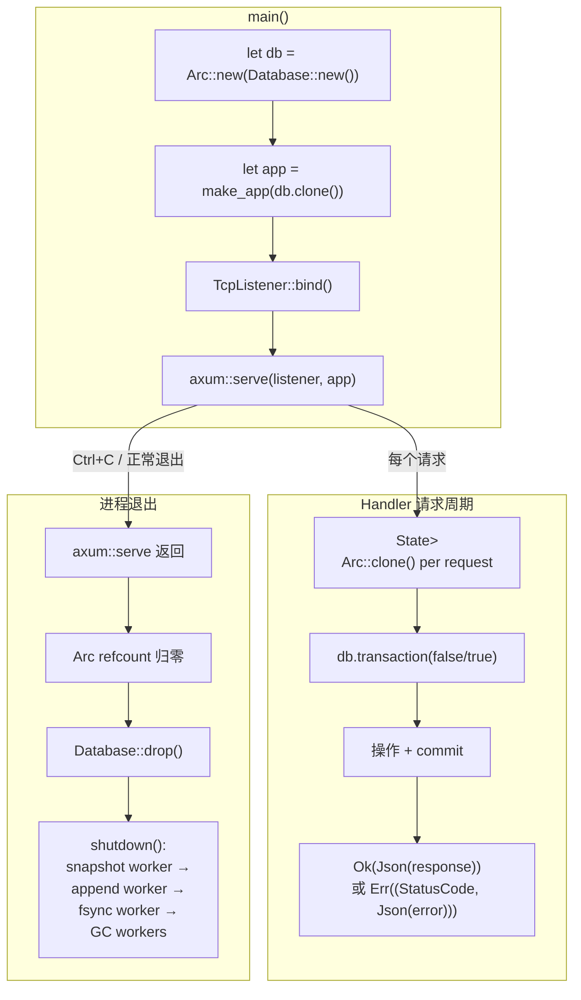

**关键生命周期节点**：

| 节点 | 说明 |
|------|------|
| `Arc::new(Database::new())` | 创建唯一的 Database 实例 + 初始 Arc 引用 |
| `make_app(db)` | 将 Arc 移入 Router 的 State |
| 每个请求的 `State<Arc<Database>>` | axum 自动 clone Arc（原子 +1），handler 获得 Arc 所有权 |
| `Database::drop()` | 所有 Arc 引用归零后自动触发，调用 `shutdown()` 按序关闭后台线程 |

---

## 5. API 端点详解

### 5.1 端点总览

| 方法 | 路径 | 事务类型 | 内核 API | 说明 |
|------|------|---------|----------|------|
| GET | `/{key}` | 只读 | `tx.get()` | 获取键值，不存在返回 `null` |
| GET | `/exists/{key}` | 只读 | `tx.exists()` | 检查键是否存在 |
| POST | `/{key}` | 读写 | `tx.put()` | 创建新键（已存在返回 409） |
| PUT | `/{key}` | 读写 | `tx.set()` | 创建或更新键（幂等 upsert） |
| DELETE | `/{key}` | 读写 | `tx.get()` + `tx.del()` | 删除键，返回被删除的旧值 |

### 5.2 POST vs PUT：语义差异

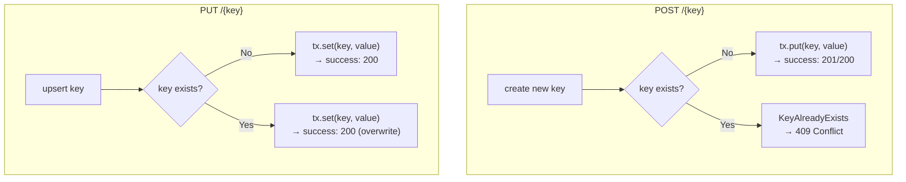

| 维度 | POST (`tx.put`) | PUT (`tx.set`) |
|------|----------------|----------------|
| 语义 | **Create** — 仅创建新键 | **Upsert** — 存在则更新，不存在则创建 |
| 冲突行为 | 已存在 → 409 Conflict | 已存在 → 200 OK（覆盖旧值） |
| 幂等性 | 非幂等（第二次调用冲突） | 幂等（每次结果相同） |
| 对应内核 API | `Transaction::put()` | `Transaction::set()` |

这种设计与 HTTP 语义对齐：POST 用于「创建」，PUT 用于「整体替换（upsert）」。

### 5.3 DELETE 的实现

```rust
async fn delete_handler(
    State(db): State<Arc<Database>>,
    Path(key): Path<String>,
) -> ApiResult<GetResponse> {
    let mut tx = db.transaction(true);
    let value = tx.get(&key).map_err(map_kv_error)?;  // ① 先读旧值
    tx.del(&key).map_err(map_kv_error)?;              // ② 写墓碑
    tx.commit().map_err(map_kv_error)?;                // ③ 提交
    Ok(Json(GetResponse {
        key,
        value: value.map(|v| String::from_utf8_lossy(&v).into_owned()),
    }))
}
```

**设计决策**：DELETE 返回被删除的旧值，而不是简单的 `{"success": true}`。这让调用方在删除后仍能知道删除前的内容，某些场景下很有用（如回滚操作）。删除不存在的 key 不报错——内部写一个墓碑（`None` value），最终响应 `value: null`。

### 5.4 错误映射策略

```rust
fn map_kv_error(err: KvError) -> (StatusCode, Json<ErrorResponse>) {
    let status = match &err {
        KvError::KeyWriteConflict | KvError::KeyReadConflict => StatusCode::CONFLICT,
        KvError::KeyAlreadyExists => StatusCode::CONFLICT,
        _ => StatusCode::INTERNAL_SERVER_ERROR,
    };
    (status, Json(ErrorResponse { error: err.to_string() }))
}
```

| 内核错误 | HTTP 状态码 | 说明 |
|----------|------------|------|
| `KeyWriteConflict` / `KeyReadConflict` | 409 Conflict | MVCC 检测到并发冲突，客户端应重试 |
| `KeyAlreadyExists` | 409 Conflict | POST 时 key 已存在 |
| `TxClosed` / `TxNotWritable` | 500 Internal Server Error | 服务端内部错误（理论上不常见） |
| `TxCommitNotPersisted` | 500 Internal Server Error | 持久化失败，需要运维介入 |

**冲突错误一律映射为 409**：MVCC 的冲突检测是「正常的业务状态」而非系统错误，409 语义更准确——告诉客户端「重试即可」。

---

## 6. 测试策略

### 6.1 为什么选择 `tower::ServiceExt::oneshot`

axum 生态推荐的测试方式是**直接在进程内调用 Router**，无需启动真实 HTTP 端口：

```rust
async fn test_post_create_key_successfully() {
    let app = setup();  // make_app(Arc::new(Database::new()))

    let res = app
        .clone()
        .oneshot(
            http::Request::builder()
                .method("POST")
                .uri("/hello")
                .header("content-type", "application/json")
                .body(Body::from(r#"{"value":"world"}"#))
                .unwrap(),
        )
        .await
        .unwrap();

    assert_eq!(res.status(), StatusCode::OK);
}
```

**优势**：

| 维度 | 说明 |
|------|------|
| **零端口冲突** | 不需要 `127.0.0.1:PORT`，并行测试不会互锁 |
| **速度快** | 进程内函数调用，无网络栈开销 |
| **隔离性好** | 每个测试独立 `Database::new()`，数据互不影响 |
| **可断言** | 直接检查 `StatusCode` 和响应体，无需解析 |

### 6.2 测试辅助函数

```rust
fn setup() -> Router {
    make_app(Arc::new(Database::new()))
}

async fn json_response(res: http::Response<Body>) -> (StatusCode, serde_json::Value) {
    let status = res.status();
    let body = res.into_body().collect().await.unwrap().to_bytes();
    let json: serde_json::Value = serde_json::from_slice(&body).unwrap();
    (status, json)
}
```

`setup()` 为每个测试创建独立的 `Database` 实例，`json_response()` 封装了 Body 收集和 JSON 解码。

### 6.3 测试用例清单

**CRUD 基本操作（6 个）**

- `test_post_create_key_successfully` — POST 创建新 key 成功
- `test_post_duplicate_key_returns_conflict` — POST 已存在 key 返回 409
- `test_put_upsert_non_existing_key` — PUT 对不存在的 key 执行 upsert
- `test_put_update_existing_key` — PUT 更新已存在的 key
- `test_get_existing_key` — GET 读取存在的 key
- `test_get_non_existing_key_returns_null` — GET 读取不存在的 key 返回 null

**存在性检查（2 个）**

- `test_exists_true_for_existing_key` — EXISTS 对存在的 key 返回 true
- `test_exists_false_for_non_existing_key` — EXISTS 对不存在的 key 返回 false

**删除操作（2 个）**

- `test_delete_existing_key` — DELETE 删除存在的 key
- `test_delete_non_existing_key` — DELETE 不存在的 key（写墓碑）

**集成场景（2 个）**

- `test_full_crud_flow` — 创建→读取→更新→检查→删除→验证 完整流程
- `test_mixed_keys_isolation` — 多 key 隔离性验证

### 6.4 测试覆盖矩阵

| 端点 | 成功路径 | 错误路径 |
|------|---------|---------|
| POST `/{key}` | ✅ `test_post_create_key_successfully` | ✅ `test_post_duplicate_key_returns_conflict` |
| PUT `/{key}` | ✅ `test_put_upsert_non_existing_key`、`test_put_update_existing_key` | — |
| GET `/{key}` | ✅ `test_get_existing_key` | ✅ `test_get_non_existing_key_returns_null` |
| GET `/exists/{key}` | ✅ `test_exists_true_for_existing_key` | ✅ `test_exists_false_for_non_existing_key` |
| DELETE `/{key}` | ✅ `test_delete_existing_key` | ✅ `test_delete_non_existing_key` |

---

## 7. 请求-响应生命周期详解

### 7.1 POST 创建：完整调用链

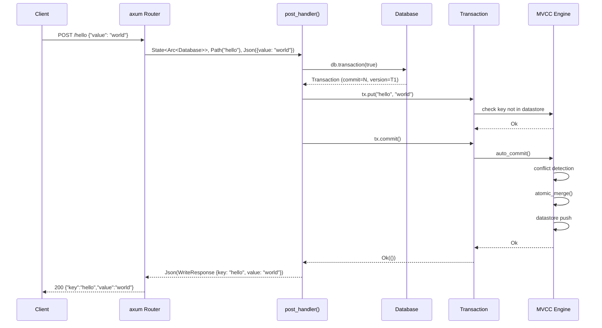

### 7.2 GET 读取：事务快照

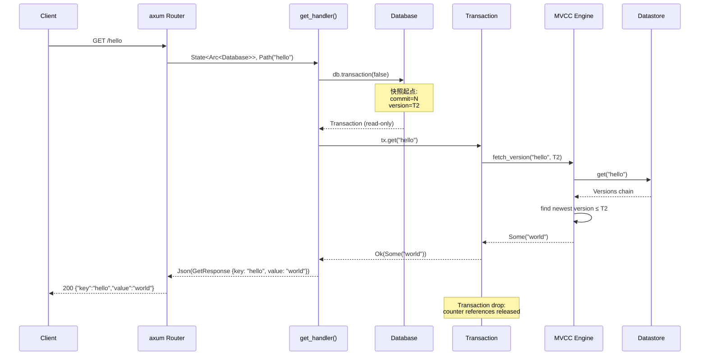

### 7.3 并发冲突场景

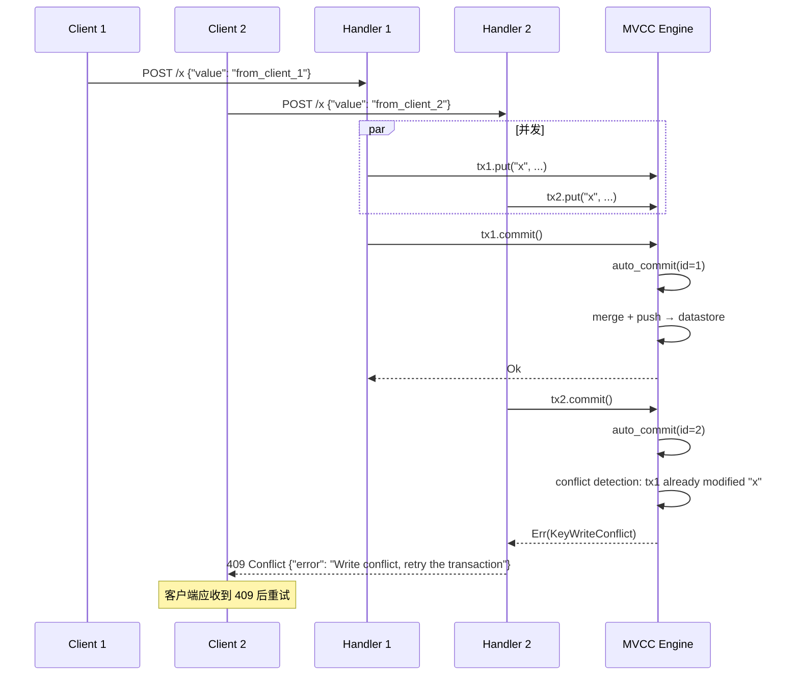

---

## 8. 关键设计决策与权衡

### 8.1 为什么每个请求创建新事务

| 方案 | 优点 | 缺点 |
|------|------|------|
| **每个请求一个事务（本项目采用）** | 事务隔离天然保证；请求间无状态；MVCC 快照语义清晰 | 每请求创建事务对象（微秒级开销） |
| 长事务（多个请求共用一个事务） | 减少事务创建开销 | MVCC 快照会过期；需要服务端管理事务生命周期；HTTP 天然无状态 |
| 每请求多个事务（嵌套） | 灵活 | 复杂度高；嵌套冲突检测困难 |

**选择理由**：HTTP 天然是无状态协议，每个请求一个事务的模型最符合 HTTP 的请求-响应范式。MVCC 的快照隔离意味着即使两个请求并发到达，也能正确检测冲突。

### 8.2 为什么用 `Arc<Database>` 而非 `State<Database>`

| 方案 | 优点 | 缺点 |
|------|------|------|
| `State<Database>` | 代码更简洁（无需 Arc 解引用） | 要求 `Database: Clone`，语义不明确（clone 是否意味着复制数据库？） |
| `State<Arc<Database>>` | 语义清晰：Arc 明确表达共享；不需要 `Database: Clone` | 多一层 Arc 解引用（零开销） |

**选择理由**：语义明确性优先。`Arc<Database>` 从类型层面告诉阅读者「这是共享的全局实例」，避免误解。

### 8.3 错误处理策略：在 Handler 层统一映射

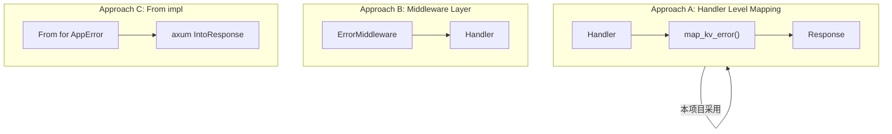

**选择 Approach A 的理由**：

- **简单直接**：一个函数 `map_kv_error()` 搞定所有映射，逻辑集中
- **不侵入内核**：不需要给 `KvError` 添加 axum 相关的 `IntoResponse` 实现（保持内核纯粹）
- **灵活**：未来如果需要不同的错误映射策略（如调试模式返回更多详情），只需修改 `map_kv_error()`

### 8.4 为什么 `POST` 用 `put` 而 `PUT` 用 `set`

这是一个容易混淆的点：

| HTTP 方法 | 内核 API | 语义 | 冲突行为 |
|-----------|---------|------|---------|
| POST | `put()` | Create only | 已存在 → 409 |
| PUT | `set()` | Upsert | 已存在 → 覆盖 |

**与 HTTP 语义对齐**：

- **POST**：HTTP 规范中 POST 用于「创建子资源」，如果资源已存在应该拒绝或返回不同状态。这里用 `put()` 的「KeyAlreadyExists」正好匹配。
- **PUT**：HTTP 规范中 PUT 用于「整体替换指定资源」，如果资源不存在则创建。这里用 `set()` 的无条件覆盖正好匹配。

这种映射让 HTTP 层和内核层的语义形成清晰的对应关系。

### 8.5 为什么不实现 PATCH 或批量操作

本节的定位是「体验 MVCC」，不是「构建完整 Web 框架」。因此：

- **不做 PATCH**：PATCH 需要「部分更新」的语义，在 KV 场景下没有清晰的对应（value 是整体替换）
- **不做批量操作**：批量操作需要额外的原子性保证（全部成功或全部失败），增加了不必要的复杂度
- **不做持久化配置**：Server 目前用 `Database::new()`（纯内存），不涉及 `PersistenceOptions`。如果需要持久化，可以在后续版本中添加

---

## 9. 模块依赖图（更新）

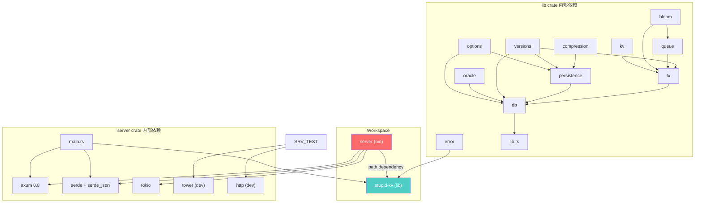

**新增的依赖关系**：

| 源 | 目标 | 类型 | 说明 |
|----|------|------|------|
| `server` | `stupid-kv` | 编译时路径依赖 | lib crate 被 bin crate 引用 |
| `server` | `axum` | 编译时外部依赖 | HTTP 框架 |
| `server` | `serde` / `serde_json` | 编译时外部依赖 | JSON 序列化 |
| `server` | `tokio` | 编译时外部依赖 | 异步运行时 |
| `server` | `tower` / `http` | 测试时依赖 | `ServiceExt::oneshot` 测试工具 |
| `stupid-kv::error` | `server` | 可见性依赖 | `pub mod error` 让 `Error` 类型对外可见 |

---

## 10. 配置与运行

### 10.1 启动服务

```bash
# 编译并启动
cargo run -p server

# 输出：
# stupid-kv server listening on http://127.0.0.1:3000
```

### 10.2 curl 快速体验

```bash
# 创建
curl -X POST http://127.0.0.1:3000/mykey \
  -H 'Content-Type: application/json' \
  -d '{"value": "hello"}'

# 读取
curl http://127.0.0.1:3000/mykey

# 更新
curl -X PUT http://127.0.0.1:3000/mykey \
  -H 'Content-Type: application/json' \
  -d '{"value": "updated"}'

# 检查存在
curl http://127.0.0.1:3000/exists/mykey

# 删除
curl -X DELETE http://127.0.0.1:3000/mykey
```

### 10.3 运行测试

```bash
# 仅 server 测试
cargo test -p server

# 整个 workspace 测试
cargo test
```

### 10.4 预期响应示例

```mermaid
flowchart TD
    subgraph "POST /hello"
        P_REQUEST["POST /hello<br/>Content-Type: application/json<br/>Body: {&quot;value&quot;: &quot;world&quot;}"]
        P_RESPONSE["200 OK<br/>{&quot;key&quot;: &quot;hello&quot;, &quot;value&quot;: &quot;world&quot;}"]
    end

    subgraph "POST /hello (重复)"
        P2_REQUEST["POST /hello<br/>Body: {&quot;value&quot;: &quot;world&quot;}"]
        P2_RESPONSE["409 Conflict<br/>{&quot;error&quot;: &quot;Key already exists, cannot be overwritten&quot;}"]
    end

    subgraph "GET /hello"
        G_REQUEST["GET /hello"]
        G_RESPONSE["200 OK<br/>{&quot;key&quot;: &quot;hello&quot;, &quot;value&quot;: &quot;world&quot;}"]
    end

    subgraph "GET /nonexistent"
        GN_REQUEST["GET /nonexistent"]
        GN_RESPONSE["200 OK<br/>{&quot;key&quot;: &quot;nonexistent&quot;, &quot;value&quot;: null}"]
    end

    subgraph "PUT /hello"
        U_REQUEST["PUT /hello<br/>Body: {&quot;value&quot;: &quot;updated&quot;}"]
        U_RESPONSE["200 OK<br/>{&quot;key&quot;: &quot;hello&quot;, &quot;value&quot;: &quot;updated&quot;}"]
    end

    subgraph "DELETE /hello"
        D_REQUEST["DELETE /hello"]
        D_RESPONSE["200 OK<br/>{&quot;key&quot;: &quot;hello&quot;, &quot;value&quot;: &quot;updated&quot;}"]
    end

    P_REQUEST --> P_RESPONSE
    P2_REQUEST --> P2_RESPONSE
    G_REQUEST --> G_RESPONSE
    GN_REQUEST --> GN_RESPONSE
    U_REQUEST --> U_RESPONSE
    D_REQUEST --> D_RESPONSE
```

---

## 11. 故障模式与边界情况

| 场景 | 行为 |
|------|------|
| **POST 已存在的 key** | 409 Conflict，`{"error": "Key already exists, cannot be overwritten"}` |
| **DELETE 不存在的 key** | 200 OK，`{"value": null}`（写墓碑成功，返回 null） |
| **GET 不存在的 key** | 200 OK，`{"value": null}` |
| **并发写冲突（MVCC 检测到）** | 409 Conflict，`{"error": "Write conflict, retry the transaction"}` |
| **POST/PUT 缺少 value 字段** | axum 自动返回 400 Bad Request（`serde` 反序列化失败） |
| **JSON 格式错误** | axum 自动返回 400 Bad Request |
| **请求 key 包含特殊字符** | URL 编码后正常处理（如 `%2F` = `/`） |
| **长时间持有写事务** | MVCC 的 GC 机制会正确处理：活跃事务的快照版本被保留 |
| **服务重启（无持久化配置）** | 纯内存模式，重启后数据全部丢失（预期行为） |

---

## 12. 总结

本节为 stupid-kv 引入了两个结构性变化：

1. **项目升级为 Cargo Workspace**：lib crate（`stupid-kv`）和 bin crate（`server`）分离，关注点清晰。
2. **新增 HTTP Server**：基于 axum 提供 5 个 RESTful 端点，将 MVCC KV 引擎的能力暴露给任意 HTTP 客户端。

核心设计哲学：

- **体验优先**：HTTP API 是为了让更多人能简单体验 stupid-kv 的 MVCC 行为，每个请求自动开启事务，无需手动管理。
- **薄封装**：server 层只做三件事——参数解析（`Path`、`Json`）、事务调用（`get`/`set`/`put`/`del`/`exists`）、错误映射。不引入任何内核逻辑。
- **测试闭环**：12 个用例覆盖了所有端点的成功路径和常见错误路径，通过 `tower::ServiceExt::oneshot` 在进程内高效执行。
- **类型安全**：`Arc<Database>` 明确表达全局唯一实例的语义；响应结构体用 `Serialize`/`Deserialize` 保证类型安全的 JSON 编解码。

到本节为止，stupid-kv 已经具备了：

> 并发事务（001）→ SSI + Bloom（002）→ 运行时加固（003）→ commit queue GC（004）→ 版本历史 GC（005）→ 全量快照持久化（006）→ LZ4 快照压缩（007）→ AOL 增量日志（008）→ **Workspace + HTTP Server**（009）

一个完整的、可以通过 HTTP 接口体验的 Rust MVCC KV 原型。下一步的自然延伸方向：

1. **持久化配置暴露**：为 Server 添加启动参数（如 `--aol-mode`、`--snapshot-interval`），让 HTTP API 的数据真正持久化到磁盘。
2. **多数据库支持**：在 URL 中引入 database namespace（如 `/{db}/{key}`），实现逻辑隔离。
3. **批量操作端点**：添加 `POST /batch` 支持批量读写操作，利用 MVCC 的原子性保证。
4. **SSI 隔离级别暴露**：通过请求头或查询参数让客户端选择 SI 或 SSI 隔离级别。
5. **监控与指标**：添加 Prometheus metrics 端点，暴露事务提交延迟、冲突率等运行时指标。