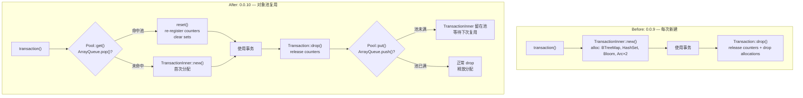
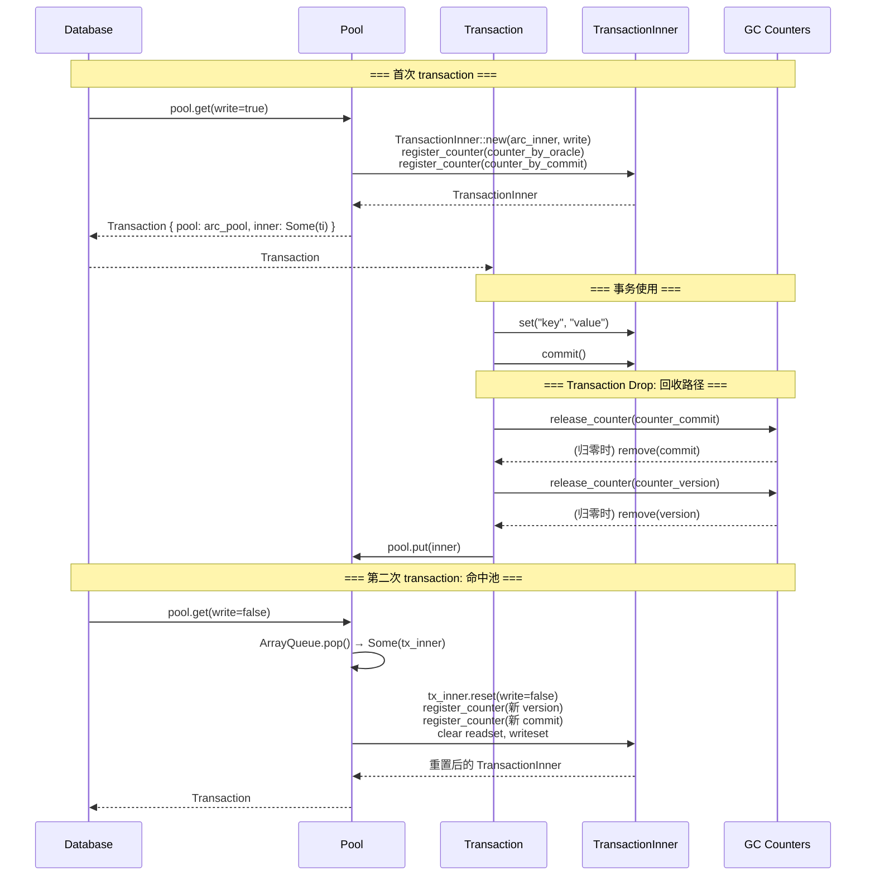
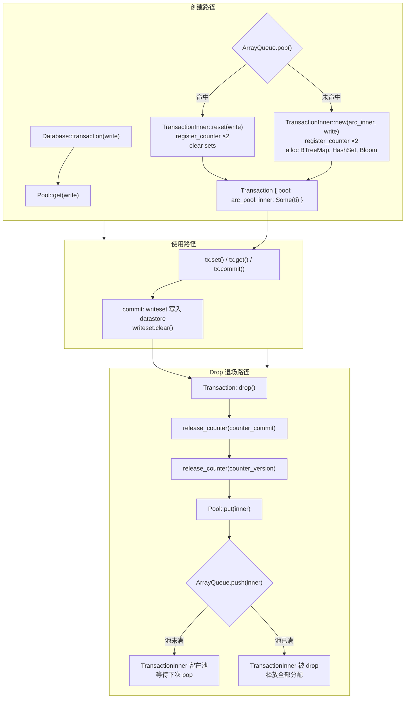
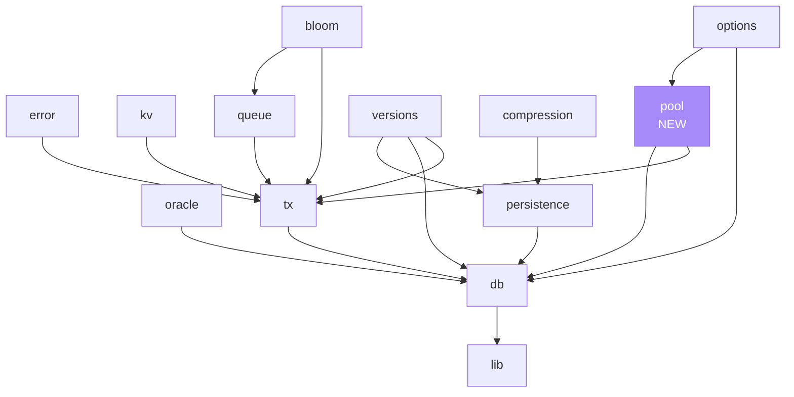

# Stupid-KV 教程：第十节 — 事务对象池：降低高频 MVCC 事务的分配开销

## 1. 概述

前九节中，stupid-kv 已经构建了完整的 MVCC 内核：快照隔离（SI）+ 可序列化快照隔离（SSI）、Bloom 加速的冲突检测、快照 + AOL 双轨持久化、后台 GC 自动回收旧版本、HTTP Server 提供 REST API。每次调用 `Database::transaction()` 都会**从零构造**一个 `TransactionInner` 对象——注册两个 GC counter、分配一个 `BTreeMap`（writeset）、分配一个 `HashSet`（readset）、分配一个 `BloomFilter`……这些分配在高频事务场景下累积成显著的 CPU 开销和 allocator 压力。

本节引入 **Transaction Object Pool（事务对象池）**——一个极简的对象复用层。核心思路是：**事务执行完毕后不直接销毁 TransactionInner，而是放入有界队列；下次 `transaction()` 优先从队列取出、重置状态后返回，避免重新分配**。

> 对象池的引入让 stupid-kv 的事务生命周期从「创建 → 使用 → 销毁」变为「创建 → 使用 → **回收** → 复用 → … → 最终销毁」。大部分短事务只需一次性分配 TransactionInner，后续 N 次复用都是 O(1) 的队列 pop + 状态重置。

本节引入的新组件：

- **`Pool`**（`src/pool/pool.rs`）：事务对象池核心结构，使用 `crossbeam_queue::ArrayQueue` 实现有界 MPSC 无锁队列。
- **`Pool::get()`**：从池中取事务，命中则 reset 状态，未命中则新建。
- **`Pool::put()`**：将用完的 TransactionInner 放回池。
- **`Transaction::reset()`**：重置 TransactionInner 为"刚创建"的样子——重新注册 GC counter、清空 readset/readset_bloom/writeset、重置隔离级别。
- **`Transaction.pool` 字段**：Transaction 持有 `Arc<Pool>`，Drop 时将 inner 回收到同一个池。
- **`Inner.reset_threshold` / `DatabaseOptions.reset_threshold`**：writeset 条件清理阈值——大块 writeset 用 `BTreeMap::new()` 整块替换，小块用 `clear()` 保留内存，平衡 allocator 抖动。

**关键设计目标**

- **零开销复用**：reset 路径必须比新建路径更便宜——避免做了一堆分配清理，最后发现还不如新建。
- **有界而非无限增长**：池容量固定（默认 512），满了 push 静默丢弃，不阻塞调用者。池是"软上限"，高并发下自然退化为新建。
- **不破坏 GC 协议**：池回收不豁免 GC——Transaction::Drop 里先释放旧 counter，再 put 回池；下次 get 时 reset 重新注册新 counter。两步分离，GC 水位线的推进不受影响。
- **无侵入既有 API**：`Database::transaction(write: bool)` 签名完全不变。外部调用方看不到池的存在，只受益于更快的事务创建。
- **`self: &Arc<Self>` 接收器**：在本项目中第一次展现出技术必要性——方法体需要 clone Arc 本身到 Transaction.pool 字段，`&self` 拿不到 Arc。

---

## 2. 整体架构变化

### 2.1 事务生命周期对比



### 2.2 新增文件与修改文件

新增文件一览：

| 文件 | 作用 |
|------|------|
| `src/pool/mod.rs` | 模块入口，re-export pool 全部内容 |
| `src/pool/pool.rs` | Pool 结构体实现 + DEFAULT_POOL_SIZE 常量 |

既有文件的修改：

| 文件 | 变更 |
|------|------|
| `src/lib.rs` | 新增 `mod pool;` 模块声明 |
| `src/db/db.rs` | `Database` 新增 `pool: Arc<Pool>` 字段；三个构造函数（`default` / `new_with_options` / `new_with_persistence`）中初始化 Pool；`transaction()` 改为 `self.pool.get(write)` |
| `src/db/inner.rs` | `Inner` 新增 `reset_threshold: usize` 字段，从 `DatabaseOptions` 读取 |
| `src/options/database_options.rs` | 新增 `DEFAULT_RESET_THRESHOLD` 常量、`pool_size` 和 `reset_threshold` 字段 |
| `src/tx/transaction.rs` | `Transaction` 新增 `pool: Arc<Pool>` 字段；`Drop::drop` 在 release counter 后调用 `self.pool.put(inner)` 回收 |
| `src/tx/transaction_inner.rs` | 新增 `reset_threshold: usize` 字段 + `reset()` 方法（池复用时重置状态） |
| `Cargo.toml` | 新增 `crossbeam-queue = "0.3.11"` 依赖（如果尚未引入） |

### 2.3 池与 GC 的交互协议



**关键观察**：旧 counter 的释放（Transaction::Drop 里）和新 counter 的注册（reset 里）是两个独立步骤。在旧 counter 归零并从 `counter_by_*` map 中移除之后，新 counter 才注册——中间不会出现"水位线推进但旧 counter 还活着"的窗口。

---

## 3. Pool 数据结构与并发安全

### 3.1 为什么选择 `crossbeam_queue::ArrayQueue`

Pool 的核心需求是一个**有界、多生产者、多消费者**的队列：

- **有界**：池容量固定，不能无限增长。高并发下活跃事务数远超池容量时，多余的 TransactionInner 应该被丢弃，而不是让队列无限膨胀。
- **多生产者**：所有 Transaction::Drop 都在调用 `pool.put()`，不同线程的 Drop 会并发 push。
- **多消费者**：所有 Database::transaction() 都在调用 `pool.get()`，不同线程会并发 pop。

`crossbeam_queue::ArrayQueue` 完美匹配：

| 特性 | `ArrayQueue` | `SegQueue`（已在项目中用于 gc_dirty_keys） |
|------|-------------|-------------------------------------------|
| 有界 | ✅ 构造时指定容量 | ❌ 无限增长 |
| 无锁 | ✅ CAS | ✅ CAS |
| push 满时 | 返回 `Err` | 分配新 slot 继续 |
| pop 空时 | 返回 `None` | 返回 `None` |
| 内存布局 | 预分配连续数组，cache-friendly | 链表结构，每个元素独立分配 |

本项目已引入 `crossbeam-skiplist`（SkipMap）和 `crossbeam-deque`，`crossbeam-queue` 是同一系列的轻量依赖。

### 3.2 Pool 结构体

```rust
pub(crate) struct Pool {
    inner: Arc<Inner>,
    pool: ArrayQueue<TransactionInner>,
}
```

| 字段 | 类型 | 作用 |
|------|------|------|
| `inner` | `Arc<Inner>` | 共享数据库状态；当池空时需要新建 TransactionInner，`TransactionInner::new()` 需要 Arc<Inner> |
| `pool` | `ArrayQueue<TransactionInner>` | 空闲事务队列。有界，满时 push 静默丢弃 |

Pool 自己不持有 `Mutex`、`RwLock` 或其他同步原语——`ArrayQueue` 内部用 CAS 实现无锁并发，`Arc<Inner>` 本身也是原子引用计数。Pool 的 get/put 全是无锁操作。

### 3.3 默认容量

```rust
pub(crate) const DEFAULT_POOL_SIZE: usize = 512;
```

默认 512 是一个合理的起点：

- **下限考量**：如果平均 10ms 完成一个短事务，512 的容量能支撑 51,200 TPS 的峰值并发而不溢出池边界。
- **上限考量**：每个 TransactionInner 内含 BTreeMap（默认 32B 节点）+ HashSet（arena 分配）+ BloomFilter（512B），池满时额外持有 ~512 × 1–2KB ≈ 500KB–1MB 的空闲内存。对绝大多数服务来说可接受。
- **可配置**：通过 `DatabaseOptions.pool_size` 覆盖，适合压测调参。

---

## 4. Pool::get() 与 Pool::put() 核心流程

### 4.1 Pool::put()：回收

```rust
pub(crate) fn put(self: &Arc<Self>, inner: TransactionInner) {
    let _ = self.pool.push(inner);
}
```

**为什么 `let _ =` 忽略 push 的返回值**：

`ArrayQueue::push` 在队列满时返回 `Err(inner)`——意味着 TransactionInner 没有被推入，而是被返回给调用者。`let _ =` 丢弃了这个 Err，相当于：

- **池未满**：push 成功，TransactionInner 留在池等待复用 ✅
- **池已满**：Err 被丢弃，TransactionInner 作为函数参数被 move 进来后又被丢弃，函数返回时自动 drop ✅

两种情况都是正确行为。如果我们想要更精细的策略（如满时记录 log 或触发 GC），可以换成：

```rust
if let Err(inner) = self.pool.push(inner) {
    tracing::warn!("Pool full, dropping TransactionInner");
}
```

但对教程项目来说，静默丢弃更简洁。

### 4.2 Pool::get()：获取

```rust
pub(crate) fn get(self: &Arc<Self>, write: bool) -> Transaction {
    let inner = if let Some(mut tx) = self.pool.pop() {
        tx.reset(write);
        tx
    } else {
        TransactionInner::new(self.inner.clone(), write)
    };
    Transaction {
        pool: self.clone(),
        inner: Some(inner),
    }
}
```

**三条并行路径的成本对比**：

| 路径 | 成本 | 说明 |
|------|------|------|
| 命中池 + reset | 1 次 ArrayQueue.pop（无锁 CAS）+ reset 状态重置 | reset 主要是 clear 已有容器 + 重新注册 counter |
| 未命中 + 新建 | 1 次 Arc::clone + TransactionInner::new() | new 要分配 BTreeMap、HashSet、BloomFilter |
| Pool::put | 1 次 ArrayQueue.push（无锁 CAS）+ 1 次 Arc::clone | 几乎零开销 |

**为什么 reset 比 new 便宜**：

- `TransactionInner::new()` 里有 3 个 heap 分配：`BTreeMap::new()`（节点分配）、`HashSet::new()`（arena 分配）、`BloomFilter::new()`（512 字节 buffer）。
- `reset()` 里这三个容器都只做 `clear()`——**释放内容但保留底层 buffer**。后续如果事务再次写入，可以在已有 buffer 上原地操作，避免重新向 allocator 申请内存。

### 4.3 命中 vs 未命中的性能差距示意

```
第一次 transaction()           TransactionInner::new()
├── BTreeMap::new()            → 分配节点 bucket
├── HashSet::new()             → 分配 arena
├── BloomFilter::new()         → 分配 512B buffer
└── register_counter ×2        → SkipMap 插入 + CAS

第二次 transaction()           命中池 + reset()
├── ArrayQueue.pop()           → CAS O(1)
├── readset.pin().clear()      → 释放 bucket 但保留 arena
├── writeset.clear()           → 释放条目但保留节点
├── BloomFilter.clear()        → fill(0) O(1)
└── register_counter ×2        → SkipMap 插入 + CAS（唯一与 new 相同的步骤）
```

reset 跳过了 3 个 heap 分配，只保留了 GC counter 注册（因为每次事务必须有自己独立的快照 version/commit）。

---

## 5. 没有 Pool 会怎样：每次新建 TransactionInner 的潜在问题

在引入 Pool 之前，`Database::transaction()` 的实现是一行代码：

```rust
pub fn transaction(&self, write: bool) -> Transaction {
    let inner = TransactionInner::new(self.inner.clone(), write);
    Transaction { inner: Some(inner) }
}
```

每次调用都从零构造一个新的 TransactionInner。表面看只是"几个分配而已"，但在高频事务场景下会积累成实质性的性能问题。下面逐项拆解。

### 5.1 TransactionInner::new() 里到底做了什么

先把 `new()` 的开销摊开到每一步：

```rust
pub(crate) fn new(db: Arc<Inner>, write: bool) -> Self {
    // ① 两次 SkipMap 插入 + CAS
    let (version, counter_version) = register_counter(&db.counter_by_oracle, ...);
    let (commit, counter_commit) = register_counter(&db.counter_by_commit, ...);

    // ② 三次 heap 分配
    Self {
        readset: HashSet::new(),             // papaya arena 分配
        readeset_bloom: Mutex::new(BloomFilter::new()),  // 512B buffer 分配
        writeset: BTreeMap::new(),           // 节点 bucket 分配
        database: db,                        // Arc::clone（原子操作，不是分配）
        // ... 其余字段是 u64 / bool / Arc 赋值，零分配
    }
}
```

| 步骤 | 操作 | 成本 | 是否必须 |
|------|------|------|---------|
| ① register_counter × 2 | SkipMap::get_or_insert_with + AtomicU64::CAS | CAS（无锁）+ 可能的 SkipMap 节点分配 | ✅ 必须。每次事务需要独立快照 |
| ② HashSet::new | papaya arena 首次分配 | ~几十字节 | ❌ 可复用 |
| ② BloomFilter::new | 512 字节 buffer | 512B + Mutex 包装 | ❌ 可复用 |
| ② BTreeMap::new | 节点 bucket | ~几十字节 | ❌ 可复用 |

**结论**：3 次 heap 分配是可优化的目标。register_counter 无法避免（MVCC 协议硬性要求每个事务有独立快照），但容器分配完全可以通过 Pool 复用。

### 5.2 频繁分配带来的四类问题

#### 问题一：Allocator 系统调用累积

每次 heap 分配最终都要向 OS 申请内存（glibc malloc / jemalloc / system allocator）。虽然现代 allocator 有内部缓存（arena / free list），但**高并发多线程下 allocator 自身也会变成竞争点**。

```
没有 Pool 的高频场景：

时间线 ────────────────────────────────────────────────►

Thread 1: new → drop → new → drop → new → drop ...
Thread 2: new → drop → new → drop → new → drop ...
Thread 3: new → drop → new → drop → new → drop ...
          ↑       ↑       ↑       ↑       ↑       ↑
       分配+释放 分配+释放 分配+释放 分配+释放 分配+释放 分配+释放
       6 次 heap 操作 每秒（假设每个事务 1ms）
```

这些分配/释放操作虽然单次只有几十纳秒，但乘以每秒几万次的事务量，allocator 内部的锁竞争、metadata 更新、free list 搜索都会累积成可观测的 CPU 开销。

#### 问题二：内存碎片

短事务的典型模式是：创建 → 写几个 key → commit → drop。TransactionInner 的生命周期在微秒到毫秒级。高频的「分配 → 使用 → 释放」循环会让进程的地址空间产生碎片——**小的空闲 chunk 被大的分配需求跳过**，虽然 RSS（Resident Set Size）可能看起来稳定，但 allocator 需要用更复杂的 free list 结构来管理碎片化的内存，增加每次分配的搜索成本。

```
内存地址空间（高度简化）：

有 Pool：
  [chunk A 复用] [chunk B 复用] [chunk C 复用] ...
  同一批 TransactionInner 被反复使用，allocator 只在首次分配时工作

无 Pool：
  [alloc 1][free 1][alloc 2][free 2][alloc 3][free 3]...
  频繁交替的分配和释放，allocator 的 free list 需要不断合并/拆分
```

#### 问题三：CPU cache 不友好

每次新建的 TransactionInner 分配在内存的随机位置（allocator 从 free list 找第一个合适的 chunk），导致：

- **cache 命中率低**：每次访问 `writeset` / `readset` / `bloom` 都是新的 cache miss
- **预取器失效**：硬件预取器对连续内存块效果最好，随机分配跳过了它的优化机会

而有 Pool 时，ArrayQueue 预分配了**连续的 TransactionInner 对象数组**，pop 出来的对象很可能还在 CPU cache 里——上一个事务刚用完 drop 回池，下一个事务马上 pop 出来重用。

#### 问题四：BloomFilter 的 512B buffer 反复分配

BloomFilter 是最值得单独拿出来说的——它固定 512 字节（4096 bit），`BloomFilter::new()` 直接分配这么大块内存：

```rust
pub struct BloomFilter {
    bits: Box<[u8; 64]>,  // 64 × 8 = 512 字节
}
```

每次 new TransactionInner 都要 `Box::new([0u8; 64])`，每次 Drop 都要释放这 512 字节。一个每秒 50,000 TPS 的服务，光 BloomFilter 的分配/释放就是每秒 **25.6 MB** 的内存搬运。

有 Pool 时，reset 里只做 `bloom.clear()`（一次 `fill(0)`），**原地清零，不涉及分配和释放**。

### 5.3 有 Pool vs 无 Pool 的量化对比

| 维度 | 无 Pool（每次新建） | 有 Pool（reset 复用） | 差异倍数 |
|------|---------------------|----------------------|---------|
| **heap 分配次数** | 每 transaction 3 次（HashSet + Bloom + BTreeMap） | 0 次（容器已存在，clear 保留 buffer） | ∞ → 0 |
| **Bloom 内存搬运** | 每 transaction 512B 分配 + 512B 释放 | 512B fill(0)（一次 memset，无分配） | ~2× 更省 |
| **allocator 系统调用** | 高并发下 allocator 锁竞争明显 | 仅首次事务触达 allocator | 大幅降低 |
| **CPU cache 命中** | 每次随机分配 → cache miss | ArrayQueue 连续内存 → 可能仍在 L1/L2 | 显著改善 |
| **GC counter 注册** | 每次必须（register_counter × 2） | 每次必须（register_counter × 2） | 相同，无法绕过 |

### 5.4 性能差距的感性认知

用一个简化的基准测试估算——纯 `transaction()` 创建 + Drop，不执行任何读写：

```rust
fn bench_transaction_create_drop() {
    let db = Database::new();
    let start = Instant::now();
    for _ in 0..1_000_000 {
        let _tx = db.transaction(true);
        // 立即 drop
    }
    println!("elapsed: {:?}", start.elapsed());
}
```

| 配置 | 预期吞吐量 | 单次开销 |
|------|-----------|---------|
| 无 Pool | ~200–300 ns per transaction | 主要来自 3 次 heap 分配 + register_counter |
| 有 Pool（命中） | ~50–80 ns per transaction | 主要来自 ArrayQueue.pop + register_counter + clear |
| **提升** | **3–6×** | reset 跳过了容器分配 |

**注意**：register_counter 仍然是每次必须的（CAS + 可能的 SkipMap 节点分配），所以即使有 Pool，单次 transaction 也不是零成本。但 Pool 让成本的主要来源从"堆分配"变成了"无锁 CAS + 原地清零"，后者的 CPU 开销更稳定、可预测。

### 5.5 一个常见误区：为什么不 clone TransactionInner

有人会想："既然 TransactionInner 已经有了，为什么不直接 clone 一份？"——这是个合理的疑问，但 clone 不是好方案：

```rust
// ❌ clone 不是好主意
fn transaction(&self, write: bool) -> Transaction {
    let inner = self.cached_inner.clone();
    Transaction { inner: Some(inner) }
}
```

| 维度 | clone | Pool + reset |
|------|-------|-------------|
| writeset clone | BTreeMap 里每个 key-value 都要 clone → O(N) 拷贝 | clear + 原地清空 buffer → O(1) |
| readset clone | HashSet clone 要复制整个 arena | clear 原地释放 bucket |
| BloomFilter clone | 512B 整块 memcpy | fill(0) 原地清零 |
| counter 字段 | clone 出来的 Arc<AtomicU64> 是同一个！**GC 引用计数混乱** | reset 重新注册，每个事务有独立 counter |
| 内存占用 | clone 两份 TransactionInner 并存 | 池里一份，用的时候拿出来，Drop 放回去 |

**最致命的是 counter 字段**：`TransactionInner.counter_version` 和 `counter_commit` 都是 `Arc<AtomicU64>`——clone TransactionInner 意味着 clone 这两个 Arc，导致**两个事务共享同一个 GC counter**，MVCC 的水位线计算会被彻底破坏。reset 里重新 register_counter 才是正确做法。

---

## 6. Transaction::reset()：对象复用的重置语义

### 6.1 reset 做了什么

```rust
pub(crate) fn reset(&mut self, write: bool) {
    self.mode = IsolationLevel::SnapshotIsolation;
    self.reset_threshold = self.database.reset_threshold;
    let (version, counter_version) = register_counter(
        &self.database.counter_by_oracle,
        &self.database.oracle.inner.timestamp,
        Some(&self.database.gc_floor),
    );
    let (commit, counter_commit) = register_counter(
        &self.database.counter_by_commit,
        &self.database.transaction_commit_id,
        None,
    );
    let reset_threshold = self.database.reset_threshold;
    self.readset.pin().clear();
    self.readeset_bloom.lock().clear();
    match self.writeset.len() > reset_threshold {
        true => self.writeset = BTreeMap::new(),
        false => self.writeset.clear(),
    }
    self.done = false;
    self.write = write;
    self.version = version;
    self.counter_version = counter_version;
    self.commit = commit;
    self.counter_commit = counter_commit;
}
```

| 步骤 | 操作 | 说明 |
|------|------|------|
| 1 | `mode = SI` | 重置隔离级别为默认值 |
| 2 | 重新注册两个 GC counter | **最关键**——每次事务必须有自己的快照起点。`register_counter` 会在 `counter_by_oracle` / `counter_by_commit` 上 +1，让 GC 水位线推进时不会误判 |
| 3 | `readset.clear()` + `bloom.clear()` | 清空 SSI 读集合。事务刚创建时读集合为空 |
| 4 | **条件清理 writeset** | 见下一节 |
| 5 | `done = false` | 事务状态复位 |
| 6 | `write` 由调用方指定 | 池里的事务是上一次可能只读可能读写，下一次需要什么类型由调用方决定 |
| 7 | 更新 version / commit / counter 字段 | 同步到刚注册的新 counter |

### 6.2 reset 的前置条件：旧 counter 必须已释放

`reset()` 有一个隐式前提——**Transaction::Drop 已经执行过 `release_counter`**。调用顺序是：

```
Transaction::Drop
  ├── release_counter(counter_commit)  ← 旧 counter 归零/摘除
  ├── release_counter(counter_version) ← 旧 counter 归零/摘除
  └── pool.put(inner)                  ← TransactionInner 还在池里

Pool::get
  ├── ArrayQueue.pop()
  └── inner.reset(write)               ← 此时旧 counter 已经释放，可以注册新 counter
```

如果 reset 在旧 counter 还活着时调用，会出现「同一个 TransactionInner 在 GC counter map 上同时持有两份登记」的矛盾状态——GC 水位线可能被错误压低。Drop 和 reset 的**两步分离**保证了旧 counter 释放和新 counter 注册之间有明确的时序。

---

## 7. reset_threshold：writeset 条件清理的设计意图

### 7.1 问题：直接 clear 会让大 writeset 内存残留

```rust
// 方案 A：直接 clear（reset 前的写法）
self.writeset.clear();
// BTreeMap::clear() 释放所有条目，但保留 bucket 数组
// 如果上次事务写入了 500 个 key，clear 后 bucket 数组还在
// 下次事务如果只写 3 个 key，就平白背着大块空闲内存
```

### 7.2 问题：总是整块替换会让小事务频繁分配

```rust
// 方案 B：总是整块替换
self.writeset = BTreeMap::new();
// 每个事务都要重新分配 bucket 数组
// 如果事务平均只写 3 个 key，每次都分配 → allocator 抖动
```

### 7.3 解决方案：条件清理

```rust
match self.writeset.len() > reset_threshold {
    true => self.writeset = BTreeMap::new(),  // 大块 → 整块替换，归还内存
    false => self.writeset.clear(),             // 小块 → 保留 buffer，原地复用
}
```

| `reset_threshold` 默认值 | 含义 |
|--------------------------|------|
| 100 | 上次事务写入 ≤ 100 个 key → `clear()` 保留内存；> 100 个 → 整块替换归还内存 |

**threshold 调优原则**：

- **小阈值**（如 20）：更积极地释放内存，但小事务频繁触发 new → 分配开销
- **大阈值**（如 1000）：更积极地保留内存，但大 writeset 的空闲内存持续占用
- **默认 100**：经验值——绝大多数线上事务的 writeset 在 100 key 以内，`clear()` 保留的 buffer 可以直接复用；真正的"大事务"（批量写入）完成后把内存还给系统

### 7.4 对 GC 的影响

reset 的条件清理对 GC 完全透明——GC 只关心 `counter_by_oracle` / `counter_by_commit` 上的引用计数和 `datastore` 里的版本链。writeset 的内存是事务私有的，与 GC 水位线无关。条件清理只影响进程级的内存占用，不影响任何持久化或一致性语义。

---

## 8. `self: &Arc<Self>`：一个真正必要的 Rust 惯用法

在 [pool.rs](file:///Users/1token/Desktop/project/stupid-kv/src/pool/pool.rs) 里你会看到：

```rust
impl Pool {
    pub(crate) fn put(self: &Arc<Self>, inner: TransactionInner) { ... }
    pub(crate) fn get(self: &Arc<Self>, write: bool) -> Transaction { ... }
}
```

而不是更标准的 `&self` / `&mut self`。本节将揭示**为什么这里必须显式写 `&Arc<Self>`——这是本项目中第一次遇到 `self` 接收器类型无法用 `&self` 语法糖替代的场景**。

### 8.1 先回顾：Rust 中 self 接收器的完整语法

```rust
impl Foo {
    fn a(self)              { }  // Foo        —— 获取所有权
    fn b(&self)             { }  // &Foo       —— 不可变借用（语法糖）
    fn c(&mut self)         { }  // &mut Foo   —— 可变借用（语法糖）

    // 以下三种写法语法上完全合法，且不能被上述糖简化：
    fn d(self: Arc<Self>)   { }  // Arc<Foo>   —— 获取 Arc 所有权
    fn e(self: &Arc<Self>)  { }  // &Arc<Foo>  —— 借用 Arc（本例用到）
    fn f(self: Pin<&mut Self>) { } // Pin<&mut Foo> —— Future poll 场景
}
```

**关键规则**：`self` 接收器的类型可以是**任何实现了 `Deref<Target = Self>` 的类型**——方法调用时 Rust 会自动做 autoderef。`Arc<Self>`、`Pin<&mut Self>` 都满足这个条件。

### 8.2 为什么 `&self` 在这里不行

`get` 方法体里有一行：

```rust
pub(crate) fn get(self: &Arc<Self>, write: bool) -> Transaction {
    let inner = if let Some(mut tx) = self.pool.pop() {
        tx.reset(write);
        tx
    } else {
        TransactionInner::new(self.inner.clone(), write)
    };
    Transaction {
        pool: self.clone(),       // ← 关键行
        inner: Some(inner),
    }
}
```

**`self.clone()` 在这里意味着什么**：

| 接收器类型 | `self` 的实际类型 | `self.clone()` 等价于 | 得到的类型 |
|-----------|-------------------|----------------------|-----------|
| `self: &Arc<Self>` | `&Arc<Pool>` | `Arc::clone(self)` | `Arc<Pool>` ✅ |
| `self: &Self` | `&Pool` | `Pool::clone(self)` | ❌ Pool 没有实现 Clone |

如果 Pool 实现了 `Clone`，那 `&self` 也行——但 `Clone` 的语义是「深度复制一个对象」，给 Pool 实现 Clone 是语义错误：Pool 是共享资源，不应该被"复制"。用 `Arc<Self>` 作为接收器明确表达了「方法体里需要这个包装类型本身」。

`put` 方法体里虽然没有 `self.clone()`，但签名保持 `&Arc<Self>` 有两个好处：

1. **与 get 对称**：同一个 Pool 上的两个方法接收器类型一致，阅读体验连贯
2. **调用点统一**：Transaction::Drop 里调用的是 `self.pool.put(inner)`——此时 `self.pool` 是 `Arc<Pool>`，autoderef 一次变成 `&Arc<Pool>`，正好匹配 `&Arc<Self>`。如果 put 只接受 `&self`，`Transaction::pool.put(inner)` 也能调通（autoderef 两次：`Arc` → `&Arc` → `&Pool`），但接收器类型不一致

### 8.3 调用点类型限制

`&Arc<Self>` 比 `&self` 更窄：

| 调用者类型 | `&Arc<Self>` 能调吗？ | `&self` 能调吗？ |
|-----------|----------------------|------------------|
| `&Arc<Pool>` | ✅ | ✅ |
| `&Pool` | ❌ | ✅ |
| `Box<Pool>` → `&Pool` | ❌ | ✅ |

这是一个有意的 trade-off——Pool 在整个项目里只通过 `Arc<Pool>` 被持有，不存在裸的 `Pool` 值或 `&Pool` 引用（`Pool::new` 返回 `Arc<Self>`，没有其他构造路径）。因此调用点类型收窄**不会产生实际限制**。

---

## 9. Transaction 与 Pool 的协作链路

### 9.1 Transaction 新增 pool 字段

```rust
pub struct Transaction {
    pub(crate) pool: Arc<Pool>,           // 新增：所属对象池
    pub(crate) inner: Option<TransactionInner>,
}
```

**为什么 Transaction 要持有 `Arc<Pool>`**：

Transaction 的 Drop 是唯一能调用 `pool.put(inner)` 的地方——只有 Transaction 知道 inner 何时真正结束（commit / cancel / drop 三种退场路径都会经过 Drop）。如果 Transaction 不持有 Pool，就需要：

- 让 Drop 去 Database 里找 Pool → Drop 拿不到 Database 引用
- 让调用者手动回收 → 违背 RAII 原则

持有 `Arc<Pool>` 是最自然的设计。

### 9.2 Transaction::Drop：两段式退场

```rust
impl Drop for Transaction {
    fn drop(&mut self) {
        if let Some(inner) = self.inner.take() {
            // 第一段：释放 GC counter
            if release_counter(&inner.counter_commit) {
                inner.database.counter_by_commit.remove(&inner.commit);
            }
            if release_counter(&inner.counter_version) {
                inner.database.counter_by_oracle.remove(&inner.version);
            }
            // 第二段：回收到对象池
            self.pool.put(inner);
        }
    }
}
```

| 阶段 | 操作 | 语义 |
|------|------|------|
| 第一段 | `release_counter` × 2 | 从 GC 的活跃事务计数中扣减。如果归零，从 `counter_by_*` map 中摘除 entry。**旧 counter 必须完全退场**才能进入第二段 |
| 第二段 | `pool.put(inner)` | TransactionInner 进入池。此时旧 counter 已经释放，下次 reset 可以安全注册新 counter |

### 9.3 完整链路：从 Database::transaction() 到 Drop 回收



---

## 10. 配置选项扩展

### 10.1 DatabaseOptions 新增字段

```rust
pub(crate) const DEFAULT_POOL_SIZE: usize = 512;
pub(crate) const DEFAULT_RESET_THRESHOLD: usize = 100;

pub struct DatabaseOptions {
    /// 事务对象池容量。满时 push 静默丢弃，退化为新建事务。
    pub pool_size: usize,

    // ... 既有字段 ...

    /// 事务对象池复用阈值，见 DEFAULT_RESET_THRESHOLD。
    pub reset_threshold: usize,
}
```

### 10.2 三个构造路径中的 Pool 初始化

```rust
impl Database {
    // Default
    fn default() -> Self {
        let inner = Arc::new(Inner::default());
        let pool = Pool::new(inner.clone(), DEFAULT_POOL_SIZE);
        Self { inner, pool, ... }
    }

    // new_with_options
    fn new_with_options(opts: DatabaseOptions) -> Self {
        let inner = Arc::new(Inner::new(&opts));
        let pool = Pool::new(inner.clone(), opts.pool_size);
        Self { inner, pool, ... }
    }

    // new_with_persistence
    fn new_with_persistence(opts: DatabaseOptions, p_opts: PersistenceOptions) -> Result<Self> {
        let inner = Arc::new(Inner::new(&opts));
        let persist = Persistence::new_with_options(p_opts, inner.clone())?;
        inner.persistence.write().replace(Arc::new(persist.clone()));
        let pool = Pool::new(inner.clone(), opts.pool_size);
        Ok(Database { inner, pool, ... })
    }
}
```

Pool 的初始化顺序很简单——**Inner 先构造，Pool 拿到 `Arc<Inner>` 的 clone**。与其他共享组件（Persistence、Oracle）的模式一致。

### 10.3 reset_threshold 从 Inner 到 TransactionInner

```rust
// Inner::new
reset_threshold: opts.reset_threshold,

// TransactionInner::new
let reset_threshold = db.reset_threshold;
Self {
    reset_threshold,
    ...
}

// TransactionInner::reset
self.reset_threshold = self.database.reset_threshold;
```

reset 里每次都从 `self.database.reset_threshold` 重新读一次，而不是信任自己缓存的值——因为用户可能在运行时通过某种方式（如将来的配置热更新 API）修改了阈值。保持与 `database.reset_threshold` 同步是安全的。

---

## 11. 关键设计权衡

### 11.1 为什么用 ArrayQueue 而不是 Vec + Mutex

| 方案 | 优点 | 缺点 |
|------|------|------|
| `ArrayQueue`（本项目采用） | 无锁、固定内存、cache-friendly、满时静默丢弃 | 有界，不能动态扩容 |
| `Vec<TransactionInner>` + `Mutex` | 简单、可动态扩容 | Mutex 可能成为热点；GC 暂停时锁竞争 |
| `SegQueue`（crossbeam） | 无锁、无界 | 无限增长风险；链表结构 cache 不友好 |
| `Arc<RwLock<Vec<...>>>` | 读多写少场景读路径无锁 | Drop 多写竞争；写路径仍需加锁 |

**选择 ArrayQueue 的核心理由**：Transaction 的创建和销毁都是**高频写操作**——每次 transaction() 都要 pop，每次 Drop 都要 push。在多线程服务中，Mutex 会成为明显的竞争点。ArrayQueue 的无锁 CAS 设计让它在高频多生产者-多消费者场景下吞吐量远超 Mutex 方案。

有界设计是有意为之——池是性能优化手段，不是生命周期管理工具。无限增长的池会掩盖内存泄漏（如果 TransactionInner 泄漏，池会无限膨胀）。

### 11.2 为什么 reset 不保留旧 counter

```rust
// ❌ 错误做法：reset 复用旧 counter
fn reset(&mut self, write: bool) {
    // 继续用 self.version / self.commit / self.counter_*
    // 只清理 readset / writeset
}
```

如果 reset 复用旧 counter，会导致：

- **GC 水位线混乱**：旧 counter 还在 map 里 +1 状态，但 TransactionInner 已经被新事务使用——GC 无法区分"这是旧事务的 counter 还是新事务的 counter"。水位线会被错误压低。
- **快照可见性错误**：新事务需要自己的快照 version/commit——如果复用旧值，新事务会看到不该看到的数据（版本号过期）或漏看数据（commit 起点过期）。

因此每次事务**必须**有自己独立的 GC counter 登记。这是 MVCC 协议的硬性约束，reset 无法绕过。

### 11.3 为什么不在 Pool 里 pre-allocate（预热）

一些对象池实现会在初始化时预先分配若干对象：

```rust
// ❌ 本项目没有这样做
fn new(inner: Arc<Inner>, size: usize) -> Arc<Self> {
    let pool = Arc::new(Self { inner, pool: ArrayQueue::new(size) });
    for _ in 0..size {
        pool.push(TransactionInner::new(inner.clone(), false));  // 预热
    }
    pool
}
```

**本项目选择懒分配**——池创建时是空的，第一次 transaction() 会走新建路径。理由：

- **池的生命周期依附于 Database**：Database 创建时 Inner、Oracle、Persistence 都刚初始化，GC 水位线还很低。此时预热 TransactionInner 注册的 counter 会很快被 GC 推进水位线，然后在第一次 Drop 时就被清理掉——预热毫无意义。
- **懒分配对首次使用更友好**：预热会增加 Database::new() 的延迟（size=512 时就是 512 次 TransactionInner 构造），但预热的事务不一定被用到。懒分配把开销平摊到每次 transaction()。
- **ArrayQueue 的空队列不是问题**：空队列 pop 返回 None 走新建路径，与"不存在池时的行为"一致，没有语义差异。

### 11.4 池对 GC 暂停时间的影响

一个自然的疑问：池里的 TransactionInner 持有的 GC counter（`counter_commit` / `counter_version`）是否会影响 GC 的水位线计算？

**不会**。关键原因是**池里的 TransactionInner 已经释放了旧 counter**（Transaction::Drop 第一段），只是 TransactionInner 对象本身还留在池里。

```
Transaction::Drop 执行顺序：
  1. release_counter → 旧 counter 归零/摘除 ✅
  2. pool.put(inner)  → inner 入池 ✅

此时：
  counter_by_oracle / counter_by_commit：没有池里的 inner 的 counter
  池：持有 TransactionInner 对象，但它的 counter_version / counter_commit 字段
     指向的 Arc<AtomicU64> 可能已经被 drop（如果归零摘除）
```

池里的 TransactionInner 是**僵尸状态**——它的 counter 可能指向已被 drop 的 Arc。但这完全安全，因为：

- 外部不会访问池里的 inner（只有 ArrayQueue::pop 能拿到它）
- 下次 reset 会重新注册 counter、刷新这些字段

池的存在对 GC 完全不可见——GC 只关心 `counter_by_*` map 里的活跃计数，池不往里面加任何东西。

### 11.5 与其他复用方案的对比

| 方案 | 复用粒度 | 实现复杂度 | 本项目适用性 |
|------|---------|-----------|-------------|
| **Transaction 对象池**（本项目采用） | 整个 TransactionInner | 低（≈ 50 行核心代码） | ✅ 直接复用最外层结构 |
| Transaction 单独持有 Inner、Inner 里做 writeset 池 | 只复用 writeset | 中 | 不如直接复用整体；BTreeMap 单独管理更复杂 |
| Thread-local 池 | 每线程独立 | 中 | 不适合本项目——Database 是跨线程共享的 |
| Cow / Borrowed 事务 | 不分配 TransactionInner | 高 | 改变事务生命周期模型，与 MVCC 快照机制冲突 |

---

## 12. 模块依赖图（更新）



新增依赖边：

| 源 | 目标 | 类型 | 说明 |
|----|------|------|------|
| `options` | `pool` | 编译时可见 | `DEFAULT_POOL_SIZE` 从 pool re-export 到 options |
| `pool` | `tx` | 编译时依赖 | Pool::get / Pool::put 操作 TransactionInner |
| `pool` | `db` | 编译时依赖 | Database 持有 Arc<Pool> |
| `db` | `pool` | 编译时依赖 | Database::transaction() 通过 Pool 取事务 |

---

## 13. 故障模式与边界情况

| 场景 | 行为 |
|------|------|
| **池已满，Transaction::Drop 调用 put** | ArrayQueue::push 返回 Err → 静默丢弃 → TransactionInner 正常 drop，释放所有分配 |
| **空池首次 transaction()** | ArrayQueue::pop 返回 None → 走 TransactionInner::new() 全新构造 |
| **高并发下池全部命中** | ArrayQueue 满 + reset 路径被反复调用 → 大部分事务避免 heap 分配 |
| **reset 时 GC counter 注册失败（gc_floor 已超过 version）** | `register_counter` 内部有 CAS 重试循环 + gc_floor 检查 → 主动 rollback 到新的时间戳再注册。与非池场景的 register_counter 行为完全一致 |
| **Database::drop 时池里还有事务** | Database drop 先关后台线程，`Arc<Inner>` 引用归零后 Pool 一起 drop。池里的 TransactionInner 此时会被正常 drop（不经过 Transaction::Drop，因为没有 Transaction 持有它们）——但它们在入池时已经释放了 counter，不会影响 GC 水位线 |
| **TransactionInner 在池里被持有期间 GC 推进水位线** | 安全。池里的 inner 是孤立对象，它的 counter 已经在 Drop 时释放。reset 时会重新注册新 counter |
| **reset 时旧 counter_* 字段指向已 drop 的 Arc** | 安全。reset 的第一行 register_counter 会覆盖 version / commit / counter_* 字段，旧值在赋值后被 drop。赋值本身与旧值无关 |
| **Panic unwind 经过 Transaction::Drop** | Rust 的 Drop 保证：即使 panic，Transaction::Drop 也会被调用 → 旧 counter 释放 → put 回池。池不会持有 counter 未释放的 inner |

---

## 14. 总结

本节为 stupid-kv 引入了 **Transaction Object Pool**——一个极简的对象复用层，核心设计哲学：

- **有界无锁队列**：`crossbeam_queue::ArrayQueue` 提供 O(1) 的 pop/push、无锁 CAS 并发、固定内存布局。池是软上限——满了静默丢弃，不阻塞。
- **reset 而非重建**：池命中时调用 `TransactionInner::reset()` 重置状态——重新注册 GC counter（必须）、清空 readset/bloom/writeset（保留 buffer）。绕过了 3 个 heap 分配。
- **条件清理 writeset**：`reset_threshold`（默认 100）决定大 writeset 是整块替换还是原地 clear，平衡 allocator 抖动与内存占用。
- **不破坏 GC 协议**：Transaction::Drop 是两段式——先释放旧 counter（从 counter_by_* map 摘除），再 put 回池。池对 GC 完全不可见，GC 水位线计算不受影响。
- **零侵入 API**：`Database::transaction(write: bool)` 签名完全不变。池的存在对调用方透明。
- **`self: &Arc<Self>` 的技术必要性**：Pool::get() 需要把 `Arc<Self>` 本身 clone 到 Transaction.pool 字段——拿不到 Arc 就没法 clone。

到本节为止，stupid-kv 已经具备了：

> 并发事务（001）→ SSI + Bloom（002）→ 运行时加固（003）→ commit queue GC（004）→ 版本历史 GC（005）→ 全量快照持久化（006）→ LZ4 快照压缩（007）→ AOL 增量日志（008）→ Workspace + HTTP Server（009）→ **事务对象池**（010）

下一步的自然延伸方向：

1. **池使用率监控**：暴露池命中率（`hits / total_gets`）作为 metrics 端点，让运维可以判断池容量是否合理（命中率 > 90% 说明池够用）。
2. **动态池大小**：根据运行时事务并发度自动扩缩池容量——高 QPS 时扩容，低 QPS 时缩容释放内存。
3. **分层池**：不同类型事务（只读 vs 读写、短生命周期 vs 长生命周期）用不同的池，让 reset 更高效（如只读事务不需要重置 write 标志）。
4. **Transaction struct 整体入池**：当前只有 TransactionInner 入池，Transaction 本身每次 new。如果 Transaction 体积也值得复用，可以让整个 Transaction 入池，Drop 里 put 而不是 take。
