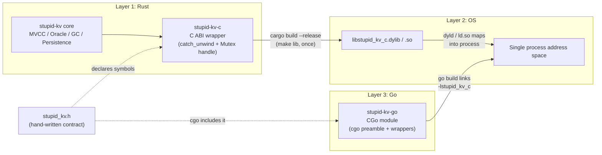
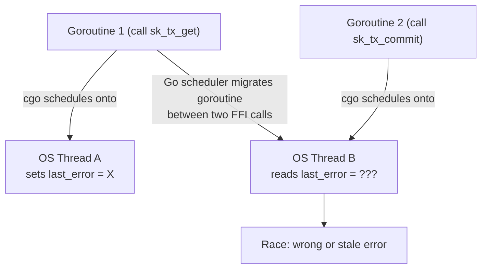
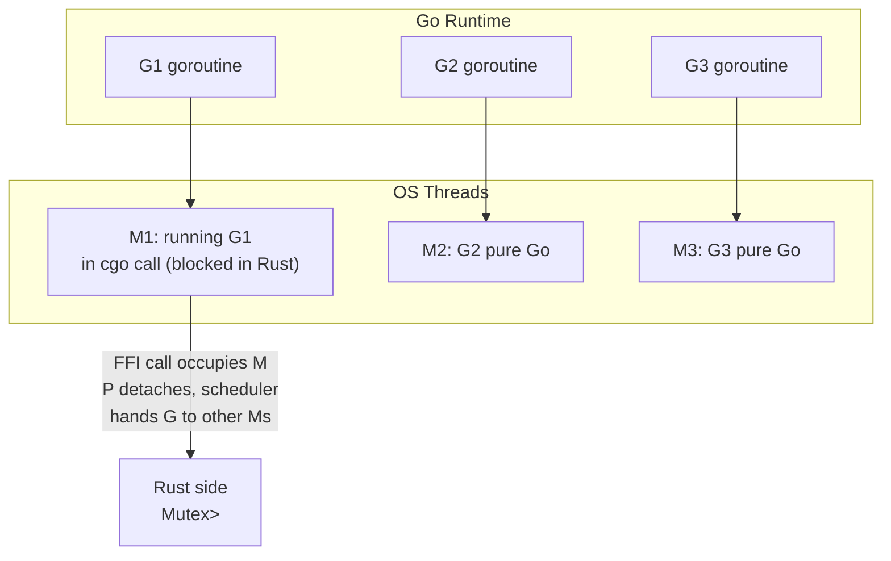

# 番外篇 · 三：用 CGo 把 stupid-kv 暴露给 Go

> 本文是 stupid-kv 系列教程的番外篇，配套阅读文件：
> - [`stupid-kv-c/`](../../stupid-kv-c/)：C ABI FFI crate（本次新增的 workspace member）
> - [`stupid-kv-c/include/stupid_kv.h`](../../stupid-kv-c/include/stupid_kv.h)：手写 C 头文件（FFI 契约）
> - [`stupid-kv-c/src/lib.rs`](../../stupid-kv-c/src/lib.rs)：C ABI 实现主文件
> - [`stupid-kv-go/`](../../stupid-kv-go/)：Go 绑定模块（CGo）
> - [`stupid-kv-go/stupidkv.go`](../../stupid-kv-go/stupidkv.go)：Database / Transaction 封装
> - [`src/db/db.rs`](../../src/db/db.rs) / [`src/lib.rs`](../../src/lib.rs)：为了让绑定能触发手动快照、命名压缩模式而做的最小上游改动

上一篇番外用 PyO3 解决了 Python 侧的嵌入需求，并立了个 flag：「如果有 Go binding、Node binding 的需求，把模板套上去就能再写一篇」。真动手才发现 **Go 是三条路里最特殊的一条**——它没有解释器、没有 C 扩展机制、没有 FFI 生成器生态，甚至连「对象回收时跑一段 Rust Drop」都要自己想办法。本文把 CGo 路线从原理到坑点完整拆开，读完你可以判断「我的 Rust 库要不要给 Go 写绑定、写的时候要提前避什么」。

---

## 1. 为什么需要 Go 绑定

主线完成后，stupid-kv 的对外暴露方式已经有三条：

| 方式 | 形态 | 痛点 |
|------|------|------|
| Rust lib | `use stupid_kv::Database` | 调用方必须是 Rust 项目 |
| HTTP server | `axum` 起的 REST API | 进程间网络往返 + JSON 序列化开销；没有进程内事务语义 |
| Python | PyO3 扩展模块 | 只服务 Python 生态 |

Go 云原生生态（K8s operator、agent、sidecar）几乎人人都在写，但 HTTP 那条路对「Go 服务里嵌一个本地 KV」的场景太重。理想状态是：

```go
db := stupidkv.New()
tx := db.Transaction(true)
tx.Set([]byte("hello"), []byte("world"))
tx.Commit()
```

这就要靠 **Rust ↔ Go 的 FFI**。而 Go 的 FFI 只有一条正路：**cgo**。

---

## 2. 技术选型：为什么是 CGo + C ABI

Rust → Go 绑定在 2026 年实际可选的路：

| 方案 | 原理 | 选不选 |
|------|------|--------|
| **CGo + Rust C ABI** | Rust 编译成 cdylib，cgo 链接，进程内直接调用 | ✅ |
| purego（dlopen） | 不用 cgo 工具链，运行时 `dlopen` + `dlsym` | 受限于 C ABI 之外还多一层运行时查找；回调/错误处理更别扭；性能略差 |
| HTTP Client SDK | Go 侧只是 REST client | 跨进程、无事务语义，不是"绑定" |
| 生成器（uniffi 等） | IDL 生成多语言 glue | Go 支持质量参差，手写反而可控 |

CGo 方案拿下的原因：
- **进程内零序列化**：调用就是一次函数调用，字节缓冲直接传指针
- **真实 MVCC 语义**：事务、冲突检测全在同一个地址空间里发生
- **C ABI 是通用货币**：写一层 `stupid-kv-c`，未来 Node（N-API 引 C）、Java（JNI 引 C）、Ruby 都能复用同一份 cdylib + 头文件
- cgo 是 Go 官方工具链自带，无第三方运行时依赖

代价也明确：**构建复杂度**（需要 C 工具链、需要预编译 dylib）和 **跨边界只能交换 C 类型**。后者的工程应对是本文的主线。

---

## 3. 总体架构：三层穿透



三层各司其职：

1. **Rust 侧 wrapper（stupid-kv-c）**：把 Rust 类型系统「降维」成 C 类型系统
2. **动态库（cdylib）**：编译产物，遵循 C 调用约定，由 OS 动态加载器映射进进程
3. **Go 侧封装（stupid-kv-go）**：把 C 类型系统「升维」成符合 Go 习惯的 API（error、[]byte、finalizer）

**没有重新编译这回事**：`go build` 不会碰 Rust 代码，只是链接；Rust 代码只在 `make lib` 时编译一次。

---

## 4. workspace 结构

```text
stupid-kv/
├── Cargo.toml                  # workspace.members += "stupid-kv-c"
├── src/...                     # lib crate（两处最小上游改动）
├── stupid-kv-c/                # NEW：C ABI crate
│   ├── Cargo.toml              # crate-type = ["cdylib", "staticlib"]
│   ├── include/stupid_kv.h     # 手写头文件 = FFI 契约
│   └── src/lib.rs              # C ABI 实现（~600 行）
└── stupid-kv-go/               # NEW：Go 绑定（不是 Cargo member）
    ├── go.mod                  # 独立 Go module
    ├── ffi.go                  # cgo preamble + 返回码镜像
    ├── errors.go               # sentinel errors + 错误映射
    ├── options.go              # DatabaseOptions / PersistenceOptions
    ├── stupidkv.go             # Database / Transaction 封装
    ├── stupidkv_test.go        # 12 个测试用例
    ├── examples/               # 001_basic / 002_ssi
    ├── lib/                    # gitignored：make lib 拷入的 dylib
    └── Makefile                # cargo build + cp dylib + go test
```

一个结构性差异：**stupid-kv-go 不在 Cargo workspace 里**。它是纯 Go module，只通过「文件系统里的动态库」跟 Rust 产生关系，Cargo 不需要知道它存在。

---

## 5. 上游改动：为 FFI 打通两个小口子

跟 Python 篇一样，绑定前先检查主 crate 有没有「外部不可命名」的东西。这次有两处：

| 文件 | 问题 | 改动 |
|------|------|------|
| `src/db/db.rs` | `persistence` 字段私有，外部只能靠后台线程周期触发快照，绑定方无法「提交后立刻落盘再关闭」 | 新增 `pub fn snapshot()`：手动触发一次全量快照（与后台 worker 同一套 tmp → rename → sync_all 原子协议），未启用持久化时返回 `Ok(())` |
| `src/lib.rs` | `mod compression` 是私有模块，但 `PersistenceOptions.compression_mode` 是 pub 字段——外部拿到了值却叫不出类型名 | `pub use self::compression::CompressionMode;` 提升到 crate root |

第二条很有代表性：**pub 字段的类型也必须 pub**，否则绑定方根本无法构造这个值。Rust 编译器会用 `private_interfaces` warning 提醒你，别忽略它。

---

## 6. 第一层：C ABI 设计（stupid-kv-c）

这一层的全部工作，可以概括为一句话：**在 Rust 类型系统和 C 类型系统之间，手工搭建一条只经过「C 公共子集」的通道**。四个核心设计决策：

### 6.1 对象 = 不透明指针

C 端不认识 `Database` / `Transaction`，头文件里只声明两个空 struct：

```c
/* include/stupid_kv.h */
typedef struct sk_database sk_database;   /* opaque: C 端永远只知道这是个指针 */
typedef struct sk_tx sk_tx;
```

Rust 侧用 `Box::into_raw` 把堆上的实例「交出去」：

```rust
// stupid-kv-c/src/lib.rs
pub unsafe extern "C" fn sk_db_tx_begin(db: *mut kv::Database, write: i32) -> *mut TxHandle {
    let handle = catch_unwind(AssertUnwindSafe(|| {
        let tx = (*db).transaction(write != 0);
        TxHandle(Mutex::new(Some(tx)))
    }));
    handle.map(|h| Box::into_raw(Box::new(h))).unwrap_or(std::ptr::null_mut())
}
```

释放时 `Box::from_raw` 拿回所有权，Rust 的 Drop 自然触发（事务未提交则自动 cancel，跟 Python 篇的语义对齐）。**内存归属规则：谁分配谁释放**——`sk_db_free` / `sk_tx_free` 必须在 Rust 侧释放，C/Go 端绝不能对句柄做 `free()`，否则两套 allocator 交叉释放直接 heap corruption。

### 6.2 错误模型：(code, message) 二元组

每个可能失败的函数签名末尾都挂一个 `char **err_out`：

```c
int32_t sk_tx_get(sk_tx *tx, const uint8_t *key, size_t key_len,
                  uint8_t **val_out, size_t *val_len, char **err_out);
```

返回值是机器可判定的错误码（`SK_WRITE_CONFLICT` / `SK_TX_CLOSED` / …），`err_out` 带人类可读消息。Go 侧把错误码映射成 sentinel error 支持判等，消息透传给用户。

**为什么不用 thread-local last_error？** 这是 FFI 错误处理的经典模式（errno 风格），但在 cgo 下有坑：



Go 调度器随时可能把 goroutine 迁到另一个 OS 线程，**两次 FFI 调用之间线程不保证一致**，thread-local 会读到别人线程的错误。errno 模式成立的前提是「POSIX 线程 + 调用即返回」，Go 的 M:N 调度恰好破坏这个前提。出参传回是唯一稳妥的做法。

消息缓冲的生命周期也要说清楚：Rust 用 `CString::into_raw` 分配，Go 用 `C.GoString` **拷贝**成 Go string 后立刻调 `sk_free_string` 释放。一次数据两份内存，边界处不共享。

### 6.3 panic 屏障：catch_unwind 是硬要求

Rust panic 跨越 FFI 边界展开到 C 栈帧是 **undefined behavior**（panic=abort 下直接进程崩溃，unwind 下 GC/malloc 状态损坏）。所以所有入口都包屏障：

```rust
fn guard<F>(err_out: *mut *mut c_char, f: F) -> i32
where
    F: FnOnce() -> Result<i32, (i32, String)>,
{
    match catch_unwind(AssertUnwindSafe(f)) {
        Ok(Ok(code)) => code,
        Ok(Err((code, msg))) => { set_err(err_out, msg); code }
        Err(_) => {
            set_err(err_out, "rust panic escaped the FFI boundary".into());
            SK_PANIC
        }
    }
}
```

细节：`AssertUnwindSafe` 是必须的——`*mut Database` 背后的 `Inner` 含 `RwLock` / `UnsafeCell`，不满足 `RefUnwindSafe`，直接 `catch_unwind(|| (*db).transaction(...))` 编译不过。这里「裸指针 + 我们信任库自身的不变量」是合理的信任决策，断言它即可。

### 6.4 句柄内部：`Mutex<Option<Transaction>>`

这是整个 FFI 层最有意思的类型：

```rust
pub struct TxHandle(Mutex<Option<kv::Transaction>>);
```

两层包裹各有用途：

- **`Mutex`**：Go 侧一个 `Transaction` 可能被多个 goroutine 并发调（Go 没有「对象归属线程」的概念），Rust 侧必须自己保证线程安全。锁的粒度是单方法级——`get` 和 `set` 串行，但事务语义本来就要求如此。
- **`Option`**：Rust 端的隔离级别切换是消耗型 builder（`fn with_snapshot_isolation(mut self) -> Self`），FFI 无法「消耗」一个别人持有的句柄。`Option` 让我们可以 `take()` 出来、调 builder、再 `Some()` 塞回去，**就地完成所有权旋转**——跟 Python 篇的 `std::mem::take` 模式同源。

还有一个边界情况：锁被毒化（持有锁的线程 panic 过）。此时守卫已由 panic 屏障报告过 `SK_PANIC`，事务内部状态本身没坏，直接解毒继续用：

```rust
fn lock_tx(tx: &TxHandle) -> MutexGuard<'_, Option<kv::Transaction>> {
    tx.0.lock().unwrap_or_else(std::sync::PoisonError::into_inner)
}
```

> 对照 Python 篇的 `Option<Transaction>`（无 Mutex）：Python 的 GIL 免费提供了单线程访问保证，Go 没有 GIL，这把 Mutex 是**并发模型差异的具象化**。

### 6.5 C 头文件：手写契约

头文件是纯手写的（没有用 cbindgen 生成），因为表面积只有 20 个函数。它同时是给编译器的声明和给人看的文档，注释里写明每个返回码的含义、每个指针的归属规则。`#[repr(C)]` 的 options 结构体与 C struct 字段一一对应：

```rust
// stupid-kv-c/src/lib.rs
#[repr(C)]
pub struct SkPersistOptions {
    pub base_path: *const c_char,
    pub snapshot_path: *const c_char,
    pub aol_path: *const c_char,
    pub snapshot_mode: i32,
    pub snapshot_interval_ms: u64,
    // ...
}
```

字段顺序、对齐、类型宽度必须与头文件严格一致，**改任何一边都要同步另一边**——这是手写 FFI 的固有维护成本，也是表面积必须克制的理由。

---

## 7. 第二层：Go 侧封装（stupid-kv-go）

### 7.1 cgo preamble

每个 `.go` 文件顶部：

```go
/*
#cgo LDFLAGS: -L${SRCDIR}/lib -lstupid_kv_c      // link: search lib/ for the dylib
#cgo CFLAGS:  -I${SRCDIR}/../stupid-kv-c/include // compile: header search path

#include <stdlib.h>
#include "stupid_kv.h"
*/
import "C"
```

`${SRCDIR}` 是 cgo 的路径展开变量，保证无论从哪个目录 `go build` 都能找到库。`go build` 的实际流程：

1. cgo 把含 `import "C"` 的文件翻译成两个 Go 文件（一个调 C 的 stub，一个被 C 调的 stub）
2. 调系统 C 编译器把 preamble 编译成目标文件
3. 链接器按 `LDFLAGS` 把 `libstupid_kv_c.dylib` 记录为动态依赖——**运行期由 dyld/ld.so 加载，Rust 代码不参与 Go 编译**

### 7.2 数据搬运：get 的一次拷贝

```go
func (tx *Transaction) Get(key []byte) ([]byte, error) {
    var valOut *C.uint8_t
    var valLen C.size_t
    var errOut *C.char
    rc := C.sk_tx_get(tx.ptr, (*C.uint8_t)(cBytes(key)), C.size_t(len(key)),
        &valOut, &valLen, &errOut)
    switch {
    case rc == C.SK_OK:
        out := C.GoBytes(unsafe.Pointer(valOut), C.int(valLen)) // copy into Go heap
        C.sk_free_value(valOut, valLen)                         // release Rust-owned buffer
        return out, nil
    case rc == C.SK_NOT_FOUND:
        return nil, nil   // missing key: (nil, nil), mirroring Python's None
    default:
        return nil, takeError(rc, errOut)
    }
}
```

**不能把 Rust 分配的 buffer 直接包装成 Go slice 返回**——Go GC 不知道这块内存的存在，也不会保活它，Rust 侧一释放就是悬垂指针。`C.GoBytes` 的一次拷贝是正确性的价格，跟 Python 篇 `Bytes::to_vec()` 的拷贝同价。

`SK_NOT_FOUND` 单列一个分支值得注意：它不是错误，返回 `(nil, nil)`，让 Go 侧可以 `if v == nil` 判断缺失，语义对齐 Python。

### 7.3 生命周期兜底：finalizer

Go 没有 RAII，用户忘了调 `Close()` 是常态。用 `runtime.SetFinalizer` 挂兜底：

```go
func NewWithOptions(opts *DatabaseOptions) *Database {
    ptr := C.sk_db_new_with_options(opts.toC())
    db := &Database{ptr: ptr}
    runtime.SetFinalizer(db, (*Database).Close) // GC fallback
    return db
}
```

- `Database` 的 finalizer：GC 回收时释放 Rust 句柄（关停后台线程）
- `Transaction` 的 finalizer：释放句柄，Rust `Drop` 自动 cancel 未提交事务——**不会丢数据，最坏是这批写没提交**

finalizer 的定位要说清楚：它是**防泄漏的最后防线，不是正常退出路径**。finalizer 执行时机不确定（下次 GC 才跑），资源敏感场景必须显式 `defer tx.Close()`。这跟 `os.File` 的 finalizer 是同一个设计哲学。

### 7.4 错误体系：sentinel error + errors.Is

Rust 的 `Result<_, Error>` 枚举映射成 Go 的 sentinel error：

```go
var (
    ErrWriteConflict    = errors.New("stupidkv: write-write conflict, retry the transaction")
    ErrReadConflict     = errors.New("stupidkv: read-write conflict, retry the transaction")
    ErrKeyAlreadyExists = errors.New("stupidkv: key already exists")
    // ...
)
```

调用侧用标准库惯用法判等：

```go
if errors.Is(err, stupidkv.ErrWriteConflict) {
    // retry the transaction
}
```

IO 类错误（`TxCommitNotPersisted`）没有稳定的错误码语义，映射成携带 Rust 原始消息的普通 error。异常继承（Python 的 `StupidKvError` 基类）在 Go 里没有对应物，sentinel + `errors.Is` 就是 Go 的「异常层级」。

### 7.5 CString 泄漏防范

`C.CString` 底层是 `malloc`，Go GC **不管它**。`NewWithPersistence` 要传三个路径字符串，逐个 `defer free` 很容易漏，封装成 keep-list：

```go
func (o *PersistenceOptions) toC() (*C.sk_persist_options, []*C.char) {
    var keep []*C.char
    add := func(s string) *C.char {
        cs := C.CString(s)
        keep = append(keep, cs)
        return cs
    }
    c := &C.sk_persist_options{}
    c.base_path = add(o.BasePath)
    // ...
    return c, keep
}
// caller: cp, cstrs := popts.toC(); defer freeCStrings(cstrs)
```

规则很简单：**凡是 crossing 边界的分配，都要在同一个函数里看到它的释放**。

### 7.6 options 的 tri-state 编码

Go 侧的 `DatabaseOptions` 用「指针表达 optional」不现实（FFI 结构体是平铺字段），采用数值编码约定：

- 数值字段：`0` = 用 Rust 默认值（`gc_interval_ms: 0` → 500ms 默认）
- 布尔字段：`-1` 默认 / `0` off / `1` on（`triBool` helper）

这让 Go 结构体可以零值安全使用——`&DatabaseOptions{}` 意味着「全默认」，跟 Python 篇用 `None` 判空是同一个问题的两种解法。

---

## 8. 并发模型：cgo 调用与 Go 调度器

这是 Go 绑定区别于 Python 的核心。Go 的 GMP 模型下，**每次 cgo 调用会占住一个 OS 线程（M）直到返回**：



关键性质：

- cgo 调用期间，G 的 P（逻辑处理器）会被**摘下来交给其他 M**，Go 侧其他 goroutine 不受阻塞影响——比 Python 的「忘释放 GIL 就卡死整个解释器」健壮得多
- 但被阻塞的调用**占用一个真实 OS 线程**。大量 goroutine 同时打进 Rust 且都撞锁，线程数会膨胀
- 所以 Rust 侧的锁必须保持**短临界区**。好消息是 stupid-kv 的事务路径全是内存操作（skiplist 写入、Bloom 比对、队列扫描），commit 里的 AOL 写盘有独立后台线程，主路径无 IO 阻塞

`TxHandle` 上的 `Mutex` 粒度也配合这一点：单方法级加锁，`get` 之间不会长时间互持，并发提交的测试（8 goroutine × 25 commits）压不出线程饥饿。

---

## 9. 与 Python 绑定的对照表

同一个核心库、同一套事务语义，两种绑定的工程决策差异全在运行时模型上：

| 维度 | Python（PyO3） | Go（CGo） |
|------|----------------|-----------|
| 桥接层 | PyO3 自动生成 glue | 手写 C ABI（~600 行）+ cgo 声明 |
| 编译产物 | Python 扩展模块（解释器 import） | cdylib（Go 二进制链接，OS 加载） |
| 类型降维 | PyO3 抽取器/转换器自动处理 | 手写 `slice::from_raw_parts` ↔ `GoBytes` |
| 「已关闭」表达 | `Option<Transaction>` + `std::mem::take` | `Mutex<Option<Transaction>>`（多一层 Mutex） |
| 并发安全来源 | GIL + `allow_threads` 释放 | Rust 侧 Mutex（Go 无 GIL） |
| 错误映射 | `create_exception!` 异常类 | sentinel error + `errors.Is` |
| 缺失 key | `None` | `(nil, nil)` |
| 自动清理 | Python GC 触发 Rust Drop | finalizer + 显式 `Close()` |
| 阻塞的影响 | 占用解释器（除非释放 GIL） | 占用一个 OS 线程（P 会被摘走） |
| 错误传递 | `PyErr` 对象直接返回 | 返回码 + err_out 出参（线程漂移问题） |
| 构建链 | maturin 一条命令 | cargo build + cp dylib + cgo |

一个共同点值得强调：**两个绑定都受益于主线的一个设计决策——`Transaction` 是 owned 类型、无生命周期参数**。如果当年事务句柄是 `Transaction<'db>`，PyO3 要上 ouroboros 体操，FFI 这边根本无法用不透明指针表达「引用了 Database 的借用」。主线 API 的「ownership 简单性」是所有跨语言绑定的地基。

---

## 10. 构建工作流

```bash
# 1. build the Rust cdylib and copy it into stupid-kv-go/lib/
cd stupid-kv-go && make lib
#    = cargo build -p stupid-kv-c --release
#    + cp ../target/release/libstupid_kv_c.dylib lib/

# 2. test / vet / run examples
make test      # go test ./...
make example   # go run ./examples/001_basic && go run ./examples/002_ssi
```

- `stupid-kv-go/lib/` 已 gitignore：二进制不进版本库，CI 上先跑 `make lib` 即可
- macOS 产物是 `.dylib`，Linux 是 `.so`，Windows 是 `.dll`，Makefile 里按平台 fallback 拷贝
- 分发思路（未来）：Linux/macOS 提供 cdylib 预编译产物，Go 用户把库放到模块目录或用 linker flags 指定路径；这一点比 Python 的 wheel 生态原始，是 Go FFI 的普遍现状

---

## 11. 验证

**Rust 端（确认上游改动没破坏 lib）：**

```bash
cargo test   # 53 lib + 12 server + 14 integration 全绿
```

**Go 端 12 个用例**（`stupid-kv-go/stupidkv_test.go`），按事务语义分组：

| 组 | 用例 | 验证点 |
|----|------|--------|
| 基础 CRUD | `TestBasicCrud` | set/get/update/delete 全链路，缺失 key `(nil, nil)` |
| 冲突语义 | `TestWriteConflict` | 两个写事务撞 key，后者 `ErrWriteConflict`，胜者值落地 |
| SSI | `TestReadConflictSSI` | 复刻 Python 002 示例的写倾斜场景：双事务互读互写，恰好一个提交成功 |
| 权限 | `TestReadOnlyNotWritable` | 只读事务上写 → `ErrTxNotWritable` |
| 生命周期 | `TestClosedTransaction` / `TestCancel` | 已关闭事务的错误语义、cancel 回滚不可见 |
| builder | `TestIsolationSwitch` | 链式切换 SI → SSI（FFI 层的 take/rebuild 路径） |
| 并发 | `TestConcurrentCommits` | 8 goroutine × 25 提交，验证 Mutex 句柄 + 无丢失写 |
| options | `TestWithOptions` | tri-state 编码全字段生效 |
| 持久化 | `TestPersistenceRoundTrip` / `TestPersistenceLz4` | 手动 snapshot → 关库 → 重开恢复，LZ4 magic 自动探测 |

运行：

```bash
cd stupid-kv-go && make test
```

---

## 12. 限制 / 已知坑

| 项 | 现状 | 影响 |
|----|------|------|
| `Get` 一次拷贝（`GoBytes`） | 每次 ~O(n) | 大 value 有开销；zero-copy 需要自定义 allocator + finalizer 体系，暂不做 |
| 头文件手写 | header 与 `#[repr(C)]` 结构体需人工同步 | 表面积再扩大 2~3 倍时应引入 cbindgen |
| cgo 调用占线程 | 长阻塞调用会堆积 OS 线程 | 当前事务路径无 IO 阻塞，安全；未来若加同步网络接口需重新评估 |
| Windows 支持未验证 | 理论可用（staticlib + MinGW），未跑 CI | 首个 Windows 用户可能踩链接细节 |
| `Database`/`Transaction` 无 `String` 便捷 API | 全 `[]byte` | 与核心库语义一致；字符串场景用户自行转换 |
| 无跨平台预编译分发 | 用户需装 Rust 工具链跑 `make lib` | Go FFI 生态普遍现状，后续可挂 GitHub Releases |
| dylib 版本漂移 | `lib/` 里的库与 Go 源码无版本绑定 | 严格场景应给 cdylib 加版本化 soname + 符号版本 |

---

## 13. 小结

把这篇对照 Python 篇读，能看到「同一个库、两种宿主运行时」的绑定工程全景：

- **选型**：Go 只有 cgo 一条正路；C ABI 层独立成 crate（stupid-kv-c）而非塞进主 lib，主 crate 保持纯 Rust 清爽，且这层 C ABI 未来可复用给 Node/Java。
- **错误传递用出参不用 thread-local**：Go 的 M:N 调度让线程不保证跨调用一致，errno 模式天然失效。
- **catch_unwind 是硬要求**：panic 跨 FFI 是 UB；`AssertUnwindSafe` 处理裸指针不满足 `RefUnwindSafe` 的编译问题。
- **`Mutex<Option<Transaction>>` 是并发模型差异的具象化**：Go 没 GIL，Rust 侧必须自证线程安全；`Option` 支撑就地 builder 旋转。
- **内存归属单向：谁分配谁释放**。Rust 分配的 buffer/value/string 全部配对 free 函数，Go 侧一律拷贝后立即释放。
- **finalizer 是兜底不是退路**：资源敏感路径必须 `defer Close()`。
- **cgo 阻塞占线程但 P 可摘**：只要 Rust 侧锁临界区短（本库如此），Go 侧不会被拖垮。
- **上游改动坚持最小**：`Database::snapshot()` 和 `CompressionMode` re-export 都是「本来就该有」的能力，绑定只是推手。

三条暴露路径（Rust lib / HTTP / FFI 绑定）现在都齐了。如果未来出现第四种宿主（Node、Java），模板已经验证过两轮：先盘点「外部不可命名」的类型，再设计错误传递模型，最后补宿主运行时特有的并发与生命周期语义——剩下的都是体力活。
